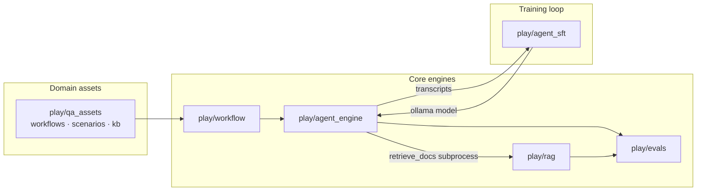

# alchemy

[](https://github.com/AndyUneducated/alchemy/actions/workflows/ci.yml)
[](https://codecov.io)
[](LICENSE)
[](https://github.com/AndyUneducated/alchemy)

[](https://www.python.org/downloads/)
[](https://docs.pytest.org/)
[](https://pytorch.org/)
[](https://huggingface.co/)
[](https://www.sbert.net/)
[](https://www.trychroma.com/)
[](https://github.com/dorianbrown/rank_bm25)
[](https://ollama.com/)
[](https://github.com/ml-explore/mlx-lm)
[](https://github.com/artidoro/qlora)
[](https://docs.ragas.io/)
[](https://numpy.org/)
[](https://pandas.pydata.org/)

> 个人的 **vibe-coding 沙盒**，用来做 LLM 工程相关的实验 —— 本地 RAG、多 Agent 场景、声明式 workflow、
> 以及一个 lm-evaluation-harness 风格的评测栈，最后接进一条闭环 SFT 实验里。
> 这里不是单一可交付的产品，而是许多放在 `play/` 下、彼此通过稳定契约连起来的小实验。

## 为什么有这个仓库

LLM 工程其实是五个戴着同一顶帽子的不同问题。每个问题都倾向于一种不同的工具，
一刀切的框架要么过度抽象（LangChain），要么让你永远在写胶水（裸脚本）。
这个沙盒把这些问题拆开做，但用稳定契约把它们串起来，所以一处的改动可以在下一处看到效果。

| 现实里的工程需求 | `play/` 给出的实现 | 为什么单一现成工具不够 |
|---|---|---|
| *"跑一个带工具、带 memory、有产物的多轮 Agent"* | [`agent_engine`](play/agent_engine/) —— markdown 场景 + step 驱动循环 | LangChain 的 agent loop 不透明也不好做单测；一次性 eval 抓不住规划 / nudge 失败。 |
| *"在几百份本地文档里做 hybrid + rerank 检索，无云"* | [`rag`](play/rag/) —— Chroma + BM25 RRF + 可选 cross-encoder | 纯 dense 漏关键词命中；托管服务沙盒一上就要出网和信用卡。 |
| *"跨任务、跨 adapter 一致地抓 eval 回归"* | [`evals`](play/evals/) —— task-declarative harness、JSONL 运行记录、IAA + Ragas + IR 指标 | `lm-eval` 对自定义任务太死板；notebook 打分不可复现也接不进 CI。 |
| *"把确定性 hook 和 Agent 阶段拼到一条 pipeline 上"* | [`workflow`](play/workflow/) —— 线性 YAML runner | LangGraph 对线性计划太重；bash 胶水没法测试；Airflow 是另一个世界。 |
| *"挖 trace → 微调 → 上线 → 再测一遍，端到端跑通"* | [`agent_sft`](play/agent_sft/) —— nudge 挖掘 + QLoRA + Ollama + eval 复跑 | 现成 SFT 配方往往跳过轨迹挖掘和闭环 eval delta —— 而后者才是唯一能证明这个闭环真的有用的部分。 |

参考实现 [`qa_assets/`](play/qa_assets/) 是一条垂直切片，一次性练到上面五条里的四条，
所以契约不是只在单测里被验证，而是在被使用时就在被验证。

## 它到底做什么

一些有"上线感"的小尖端实验，组合在一起会变成一个故事：

1. **跑 Agent** —— 用 Markdown 场景驱动多轮对话，含工具、memory、产物（[`play/agent_engine/`](play/agent_engine/)）。
2. **本地检索** —— hybrid dense + BM25 + 可选 rerank，跑在一个自描述的本地 VDB 上（[`play/rag/`](play/rag/)）。
3. **评测** —— 任务声明式 harness，`score` / `run` 行为对齐，JSONL 运行记录，分阶段的指标族（[`play/evals/`](play/evals/)）。
4. **编排** —— 线性 YAML pipeline，把确定性 hook 和 Agent 阶段串起来（[`play/workflow/`](play/workflow/)）。
5. **闭环** —— 从 engine 挖 `require_tool` nudge 轨迹，QLoRA 微调一个 7B 模型，通过 Ollama 部署，再用 evals 复测（[`play/agent_sft/`](play/agent_sft/)）。

一条参考垂直切片把它们串起来：QA 测试计划生成（[`play/qa_assets/`](play/qa_assets/)）通过
`qa_supervisor.yaml` 走 workflow → agent_engine → rag。



## 仓库结构

|路径|用途|
|---|---|
|[`play/`](play/)|默认放尖端实验、脚本和 demo 的地方（每个子项目自带 README）|
|[`grow/`](grow/)|从 `play/` 提拔出来、生命周期更长的小应用|
|[`stash/`](stash/)|暂停的进行中工作|
|[`refs/`](refs/)|从外面拷过来的参考片段 —— 不是一等公民的产品代码|
|[`_archive/`](_archive/)|退役的实验|
|[`AGENTS.md`](AGENTS.md)|给写代码的 Agent 看的备忘（Cursor 规则、文档约定）|

如果没有特别理由，新实验都先扔到 `play/` 下。

## 项目列表

|目录|一句话|文档|
|---|---|---|
|[`play/agent_engine/`](play/agent_engine/)|step 驱动的多 Agent 引擎（场景 = YAML frontmatter + markdown 正文）|[README](play/agent_engine/README.md)|
|[`play/rag/`](play/rag/)|本地优先的 hybrid RAG（Chroma + BM25 RRF，可选 cross-encoder rerank）|[README](play/rag/README.md)|
|[`play/evals/`](play/evals/)|lm-eval 风格的评测 harness（tasks / adapters / JSONL runs）|[README](play/evals/README.md)|
|[`play/workflow/`](play/workflow/)|声明式线性 pipeline runner（hooks + agent 阶段）|[README](play/workflow/README.md)|
|[`play/agent_sft/`](play/agent_sft/)|基于 nudge 的 Agent 轨迹 SFT（挖掘 → QLoRA → Ollama → 复测）|[README](play/agent_sft/README.md)|
|[`play/qa_assets/`](play/qa_assets/)|QA 领域素材（workflows / scenarios / hooks / kb / 示例 CSV / PRD）|[README](play/qa_assets/README.md)|
|[`play/sft_hello/`](play/sft_hello/)|一次性的 MLX-LM hello-world 微调（pipeline 烟测）|[README](play/sft_hello/README.md)|

设计上有不平凡决策的子项目，会在 README 旁额外保留 append-only 的
[`DECISIONS.md`](play/evals/DECISIONS.md)（ADR 风格）和 [`JOURNAL.md`](play/evals/JOURNAL.md)（里程碑）
—— 凡是出现这两份文件的 `play/<name>/` 都是这个模式。

## 快速开始

仓库 **没有 monorepo 全局 `pip install`**。每个子项目自带 `requirements.txt`，
并且默认从 `play/` 启动（模块路径都假设 cwd 是 `play/`）。

**例：跑 QA supervisor workflow**（需要 Ollama 提供 embedding + 在 agent_engine 里配好 LLM backend）：

```bash
cd play/
python -m venv .venv && source .venv/bin/activate
pip install -r workflow/requirements.txt -r agent_engine/requirements.txt -r rag/requirements.txt -r qa_assets/requirements.txt

# 可选：如果场景里要用 retrieve_docs，先建 qa_kb VDB
cd rag && python ingest.py --docs ../qa_assets/kb --output ../qa_assets/vdb/qa_kb && cd ..

python -m workflow run qa_assets/workflows/qa_supervisor.yaml \
  --vars csv_path=qa_assets/examples/req_tracker.csv \
  --vars output_dir=/tmp/qa_out
```

**例：列出 eval 任务并对预测打分**：

```bash
cd play/
pip install -r evals/requirements.txt
python -m evals list-tasks
python -m evals score --task <name> --predictions path/to/preds.jsonl
```

每个子项目的 README 里有完整的 CLI 表面、环境变量和硬件备注
（SFT 路径需要 Apple Silicon + MLX；RAG 的 embedding / 推理需要本地 Ollama）。

### 在本地跑测试

需要 **Python 3.12+**、安装了 `qwen3.5:9b`（或设 `EVALS_TEST_OLLAMA_MODEL`）和 `qwen3-embedding:8b` 的 [Ollama](https://ollama.com/)、
以及在 `play/rag/vdb/` 下 ingest 好的 VDB（步骤见 [CI workflow](.github/workflows/ci.yml) 中的 ingest 步骤）。

```bash
python -m venv .venv && source .venv/bin/activate
pip install -r requirements-ci.txt
# 一次性构建 VDB（在 play/rag 下跑）：test_vdb + panel —— 跟 CI 同步
python -m pytest -v
```

CI 用 `requirements-ci.txt`（不装 `mlx-lm`，因为后者只跑 Apple Silicon；`play/agent_sft` 的测试不依赖它）。

## 设计原则（仓库级）

|#|原则|
|---|---|
|1|**实验优先于产品** —— 优先优化"学到东西"和"组合性"，不追求统一发布|
|2|**只在边界上有契约** —— 比如 RAG 的 `--json` envelope 被 agent_engine 子进程消费，evals `api.py` 的 dataclass 在多层之间复用|
|3|**YAGNI** —— 仓库 CI 在 push / PR 上跑完整 `pytest`；lint / format 等到子项目真的需要再加|
|4|**记录决策** —— 重要技术选择写到子项目的 `DECISIONS.md`；阶段性进展写到 `JOURNAL.md`|

Cursor 的写作规则放在 [`.cursor/rules/workshops.mdc`](.cursor/rules/workshops.mdc)。

## 这个仓库不是什么

- 不是带 semver、有稳定公开 API 的框架发布
- 不是托管服务，也不是 Terraform stack
- 不保证在没有本地模型（Ollama tag、HF 缓存）和云端 API key 的情况下可复现

体积大的生成产物（VDB 目录、eval `runs/`、绝大多数训练 checkpoint）都被 gitignore 了，详见 [`.gitignore`](.gitignore)。

## 贡献

这个仓库主要是个人沙盒，但欢迎以下类型的 issue / PR：修 bug、把子项目之间的契约收紧、补可复现的 benchmark。
完整流程见 [CONTRIBUTING.md](./CONTRIBUTING.md)。

## License

[Apache License 2.0](LICENSE)。
