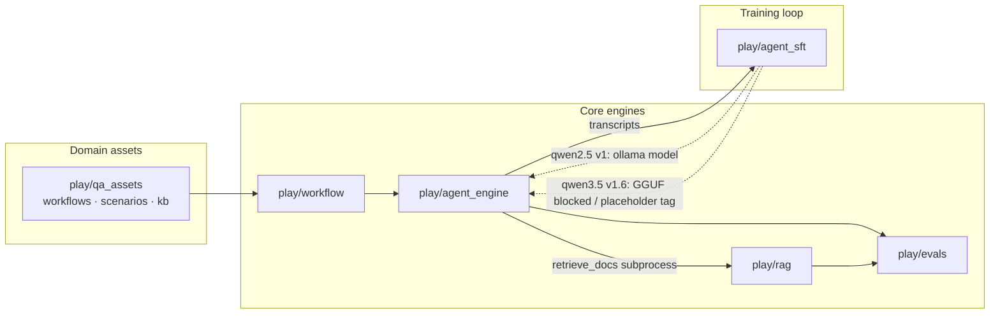

# alchemy

[](https://github.com/AndyUneducated/alchemy/actions/workflows/ci.yml)
[](https://codecov.io)
[](LICENSE)
[](https://github.com/AndyUneducated/alchemy)

[](https://www.python.org/downloads/)
[](https://docs.pytest.org/)
[](https://pytorch.org/)
[](https://huggingface.co/)
[](https://www.sbert.net/)
[](https://www.trychroma.com/)
[](https://github.com/dorianbrown/rank_bm25)
[](https://ollama.com/)
[](https://github.com/ml-explore/mlx-lm)
[](https://github.com/artidoro/qlora)
[](https://docs.ragas.io/)
[](https://numpy.org/)
[](https://pandas.pydata.org/)

> A personal **vibe-coding sandbox** for LLM engineering experiments — local RAG, multi-agent scenarios, declarative workflows,
> and an lm-evaluation-harness-style eval stack, ultimately wired into a closed-loop SFT experiment.
> This is not a single shippable product, but many small experiments under `play/` connected through stable contracts.

## Why this repo exists

LLM engineering here is broken into five problem classes: Agent, RAG, eval, workflow, and SFT.
Each class gets a minimal, readable local implementation first; cross-project integration happens only at data boundaries (contracts),
so results from one experiment can be reused by the next without introducing a monolithic framework.

|Real-world engineering need|`play/` implementation|Why a single off-the-shelf tool falls short|
|---|---|---|
|*"Run a multi-turn Agent with tools, memory, and artifacts"*| [`agent_engine`](play/agent_engine/) — markdown scenarios + step-driven loop | LangChain agent loops are opaque and hard to unit-test; one-shot evals miss planning / nudge failures. |
|*"Hybrid + rerank retrieval over hundreds of local docs, no cloud"*| [`rag`](play/rag/) — Chroma + BM25 RRF + optional cross-encoder | Pure dense misses keyword hits; hosted services require outbound network and a credit card once you leave the sandbox. |
|*"Catch eval regressions consistently across tasks and adapters"*| [`evals`](play/evals/) — task-declarative harness, JSONL run records, IAA + Ragas + IR metrics | `lm-eval` is too rigid for custom tasks; notebook scoring is non-reproducible and doesn't plug into CI. |
|*"Stitch deterministic hooks and Agent stages into one pipeline"*| [`workflow`](play/workflow/) — linear YAML runner | LangGraph is heavy for linear plans; bash glue isn't testable; Airflow is a different world. |
|*"Mine traces → fine-tune → deploy → re-evaluate"*| [`agent_sft`](play/agent_sft/) — nudge mining + QLoRA + eval re-run; qwen3.5 GGUF/Ollama deploy still blocked | Off-the-shelf SFT recipes often skip trace mining and closed-loop eval delta; here training gains and deployment issues are tracked separately. |

The reference implementation [`qa_assets/`](play/qa_assets/) is a vertical slice that exercises four of the five areas above in one pass,
so contracts are validated in use, not only in unit tests.

## What it actually does

Several small experiments with a "production-ish" feel, combined into a learning path:

|Order|Capability|Sub-project|Start here|
|---|---|---|---|
|1|Run Agent (agent)|[`play/agent_engine/`](play/agent_engine/)|Markdown scenario, tools, memory, artifacts|
|2|Local retrieval (RAG)|[`play/rag/`](play/rag/)|hybrid dense + BM25 + optional rerank|
|3|Evaluation (eval)|[`play/evals/`](play/evals/)|`score` / `run` isomorphic API, JSONL run records, phase roadmap|
|4|Orchestration (workflow)|[`play/workflow/`](play/workflow/)|Linear YAML pipeline: hooks + agent stages|
|5|Closed-loop training (SFT)|[`play/agent_sft/`](play/agent_sft/)|Mine data from `require_tool` nudges, QLoRA fine-tune, re-test|

A reference vertical slice ties them together: QA test plan generation ([`play/qa_assets/`](play/qa_assets/)) runs through
`qa_supervisor.yaml` via workflow → agent_engine → rag.



### Cross-project contract cheat sheet

|Producer|Consumer|Contract|Why it matters|
|---|---|---|---|
|`rag/query.py --json`|`agent_engine` / `evals`|`{query, data, meta}` JSON envelope|RAG callable via subprocess — no Python import coupling|
|`agent_engine --save-result-json`|`evals` / `agent_sft`|`Result` envelope: `transcript / artifact / warnings / success / usage`|Eval and data mining read the same typed schema — no reverse-engineering transcripts|
|`evals/api.py`|`evals` internal layers|`Doc / Request / Response / SampleResult / EvalResult` dataclasses|Shared vocabulary across tasks, LM adapters, runners, and storage|
|`workflow` state|`qa_assets` hooks|`state["stages"][name]["output"]`|Deterministic hooks and Agent stages connect through explicit state|

## Repository layout

|Path|Purpose|
|---|---|
|[`play/`](play/)|Default home for spikes, scripts, and demos (each sub-project has its own README)|
|[`grow/`](grow/)|Longer-lived mini-apps promoted from `play/`|
|[`stash/`](stash/)|Paused work in progress|
|[`refs/`](refs/)|Reference snippets copied from elsewhere — not first-class product code|
|[`_archive/`](_archive/)|Retired experiments|
|[`AGENTS.md`](AGENTS.md)|Notes for coding agents (Cursor rules, doc conventions)|

Unless there's a specific reason, new experiments go under `play/`.

## Project list

|Directory|One-liner|Docs|
|---|---|---|
|[`play/agent_engine/`](play/agent_engine/)|Step-driven multi-agent engine (scenario = YAML frontmatter + markdown body)|[README](play/agent_engine/README.md)|
|[`play/rag/`](play/rag/)|Local-first hybrid RAG (Chroma + BM25 RRF, optional cross-encoder rerank)|[README](play/rag/README.md)|
|[`play/evals/`](play/evals/)|lm-eval-style eval harness (tasks / adapters / JSONL runs)|[README](play/evals/README.md)|
|[`play/workflow/`](play/workflow/)|Declarative linear pipeline runner (hooks + agent stages)|[README](play/workflow/README.md)|
|[`play/agent_sft/`](play/agent_sft/)|Nudge-based Agent trace SFT (mine → QLoRA → re-test; qwen3.5 GGUF deploy currently blocked)|[README](play/agent_sft/README.md)|
|[`play/qa_assets/`](play/qa_assets/)|QA domain assets (workflows / scenarios / hooks / kb / sample CSV / PRD)|[README](play/qa_assets/README.md)|
|[`play/sft_hello/`](play/sft_hello/)|One-off MLX-LM hello-world fine-tune (pipeline smoke test)|[README](play/sft_hello/README.md)|

Sub-projects with non-trivial design decisions also keep append-only
[`DECISIONS.md`](play/evals/DECISIONS.md) (ADR-style) and [`JOURNAL.md`](play/evals/JOURNAL.md) (milestones)
alongside their README — any `play/<name>/` that has both files follows this pattern.

## Quick start

The repo has **no monorepo-wide `pip install`**. Each sub-project ships its own `requirements.txt`,
and defaults to launching from `play/` (module paths assume cwd is `play/`).

**Example: run the QA supervisor workflow** (requires Ollama for embeddings + LLM backend configured in agent_engine):

```bash
cd play/
python -m venv .venv && source .venv/bin/activate
pip install -r workflow/requirements.txt -r agent_engine/requirements.txt -r rag/requirements.txt -r qa_assets/requirements.txt

# Optional: build qa_kb VDB first if the scenario uses retrieve_docs
cd rag && python ingest.py --docs ../qa_assets/kb --output ../qa_assets/vdb/qa_kb && cd ..

python -m workflow run qa_assets/workflows/qa_supervisor.yaml \
  --vars csv_path=qa_assets/examples/req_tracker.csv \
  --vars output_dir=/tmp/qa_out
```

**Example: list eval tasks and score predictions**:

```bash
cd play/
pip install -r evals/requirements.txt
python -m evals list-tasks
python -m evals score --task <name> --predictions path/to/preds.jsonl
```

Each sub-project README has the full CLI surface, environment variables, and hardware notes
(SFT path requires Apple Silicon + MLX; RAG embedding / inference requires local Ollama).

### Running tests locally

Requires **Python 3.12+**, [Ollama](https://ollama.com/) with `qwen3.5:9b` (or set `EVALS_TEST_OLLAMA_MODEL`) and `qwen3-embedding:8b`,
and ingested VDBs under `play/rag/vdb/` (ingest steps in the [CI workflow](.github/workflows/ci.yml)).

```bash
python -m venv .venv && source .venv/bin/activate
pip install -r requirements-ci.txt
# One-time VDB build (run under play/rag): test_vdb + panel — matches CI
python -m pytest -v
```

CI uses `requirements-ci.txt` (excludes `mlx-lm`, which runs only on Apple Silicon; `play/agent_sft` tests don't depend on it).

## Design principles (repo-level)

|#|Principle|
|---|---|
|1|**Experiments over product** — optimize for learning and composability, not a unified release|
|2|**Contracts only at boundaries** — e.g. RAG's `--json` envelope consumed by agent_engine subprocess; evals `api.py` dataclasses reused across layers|
|3|**YAGNI** — repo CI runs full `pytest` on push / PR; add lint / format only when a sub-project actually needs it|
|4|**Record decisions** — important technical choices go in sub-project `DECISIONS.md`; milestone progress goes in `JOURNAL.md`|

Cursor writing rules live in [`.cursor/rules/workshops.mdc`](.cursor/rules/workshops.mdc).

## What this repo is not

- Not a framework release with semver and a stable public API
- Not a hosted service or Terraform stack
- Not guaranteed reproducible without local models (Ollama tags, HF cache) and cloud API keys

Large generated artifacts (VDB directories, eval `runs/`, most training checkpoints) are gitignored — see [`.gitignore`](.gitignore).

## Contributing

This is primarily a personal sandbox, but issues / PRs are welcome for: bug fixes, tightening contracts between sub-projects, and reproducible benchmarks.
See [CONTRIBUTING.md](./CONTRIBUTING.md) for the full process.

## License

[Apache License 2.0](LICENSE).
