# Journal

> Note: Before 2026-04-26 the project was named `play/multiagent`; old name kept so git history aligns with this journal timeline; DECISIONS §10 / 2026-04-26 milestone explains the rename. Dates follow actual commit history.

## 2026-04-14 — Multiagent PoC: two agents conversing on a topic

The milestone at this stage is to run the issue of "multiple agents coming and going on a topic" through the terminal.Fixed agents, round-robin speakers, and hard-coded topics are a minimal but complete closed loop.The most noteworthy thing is not the multi-agent itself, but the drop-in pattern of the 4 backend clients (ollama / openai / anthropic / gemini) + the one-line `BACKEND` switch in `config.py` - making "will you connect to OpenAI or local ollama in the future" become a replaceable part from the beginning, rather than a coupling that requires reconstruction to solve.

### Framework changes

|Change|Purpose|
|---|---|
|Single file `run.py` + 4 backend client drop-in|Make the LLM provider a drop-in from the start|
|`config.py` Single `BACKEND` switch |Switch backend without changing business code|
|Share history `list[{role, content}]`|The simplest form of the first version, leaving room for problems to be exposed later|

### New scenarios

|Scenario|Purpose|Demonstrates|
|---|---|---|
| (hard-coded) | There is no scenario abstraction in the first version | Two agents take turns speaking around the hard-coded topic |

### New / changed tools

|Tool|Notes|
|---|---|
|—|No tools in this issue, only LLM dialogue|

## 2026-04-14 — Phase-driven scenario: extract participants + flow to config

This stage extracts the process from the code: a single file of YAML frontmatter + markdown body is a scene.When changing the topic, `run.py` is no longer changed, only `.md` is changed.The 4 examples cover the (moderator / no moderator) × (open / goal-oriented) 2×2 matrix, emphasizing that the process abstraction holds true in four typical forms.This milestone is the starting point for agent_engine to truly become a "declarable conference engine": processes, roles, topics, and prompts all enter the data, and the at runtime is just "expansion in the order of declaration."

### Framework changes

|Change|Purpose|
|---|---|
|YAML frontmatter + MD body single file scenario|Each meeting is a readable and changeable document|
|`phases:` List declaration opening / main / closing|Process structure dataization|
|`members:` + optional `moderator:` top-level block |explicit modeling of roles|
|at startup schema verification + `who` field verification of participant name|mismatch fail-fast, error will not occur until at runtime|

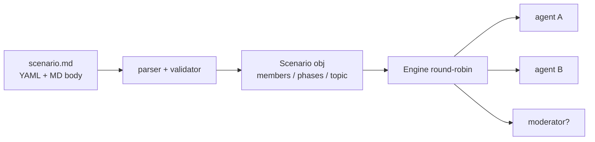

### New scenarios

|Scenario|Purpose|Demonstrates|
|---|---|---|
|4 examples|Covering (moderator / no moderator) × (open / goal-oriented) 2×2|Process abstraction works in four typical forms|

### New / changed tools

|Tool|Notes|
|---|---|
|—|No tools in this issue|

## 2026-04-15 — Per-agent message projection: shared transcript + per-agent view

This milestone solves the fundamental tensions of single history and multiple agents at once: ① the agent cannot distinguish between "what I said" and "what others said"; ② the system prompt priority is distorted; ③ Anthropic / Gemini API does not accept consecutive messages with the same role.The paradigm is established - **Discussion maintains a shared transcript (the only authority), and each agent projects it into its own perspective** when `respond()`: cast as `assistant` when speaker == owner, others wrap it into `<message from="X">...</message>` and wrap it into user, and the metadata goes into `<tag>...</tag>`.This paradigm is the foundation on which all subsequent memory/artifact/tracer systems stand.

### Framework changes

|Change|Purpose|
|---|---|
|Discussion holds a single shared transcript (SoT)|Eliminates truth inconsistencies from multiple agent perspectives|
|Each agent `respond()` projects its own perspective|solve the confusion of "what I said vs what others said"|
|history entry changed from `role/content` to `speaker/type`|Make "speaker" and "message form" first-class citizens|
|system prompt uses client independent parameters|No longer mixes messages and user content to compete for priority|
|Anthropic/Gemini client automatically merges consecutive same role|aligned multi-provider API compatible|

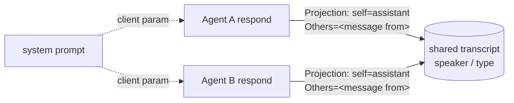

### New scenarios

|Scenario|Purpose|Demonstrates|
|---|---|---|
|`debate.md` / `panel.md` and other 4 copies|Replace the old scaffolding scene|Multi-agent dialogue form under the new paradigm|

### New / changed tools

|Tool|Notes|
|---|---|
|—|No tools in this issue|

## 2026-04-16 — Per-round phases + instruction-as-arg: fix two bugs, unlock capability

This milestone is the fixing of two bugs and the unlocking of an ability: ① **instruction leaked** - the "name and questionCorrection: instruction is not entered into history and passed in as `Agent.respond(instruction=...)` parameter; `main` adds `round: <int> | "default"` to each phase, and the engine matches according to the current round + fallback.This moment established the invariant of **instruction-as-arg** - history no longer assumes the dual responsibility of "control flow + dialogue content". Later, the flat steps reconstruction (§9) also retained this line.

### Framework changes

|Change|Purpose|
|---|---|
|`phases` is split into three sections: `opening/main/closing`|The process semantics are clearer, and main can be expanded individually by round|
|`main.<phase>.round` field (int or `"default"`)|Let "the 1st round of free discussion → the Nth round of forced expression" be expressed|
|Engine matching order: `round == N` → `round == "default"` → Everyone speaks | Robust fallback path |
|instruction-as-arg invariant|history only carries dialogue, no longer control flow|

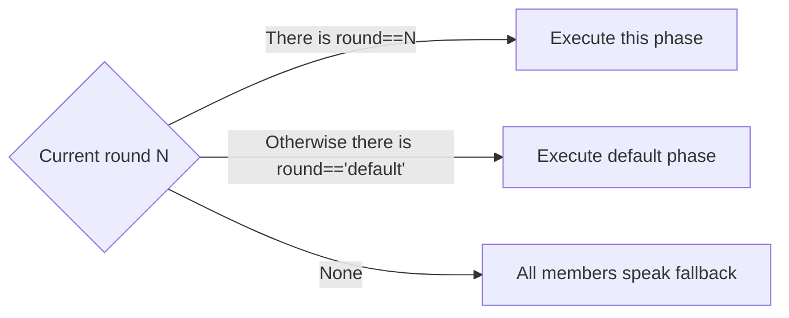

### New scenarios

|Scenario|Purpose|Demonstrates|
|---|---|---|
|—|Inherit the existing scenario|Typical usage of round differentiation instructions|

### New / changed tools

|Tool|Notes|
|---|---|
|—|No tools in this issue|

## 2026-04-16 — Subprocess-isolated RAG toolThis milestone connects to the first tool `retrieve_docs`, but it does not connect `play/rag` through Python import, but `subprocess.run(["python", "rag/query.py", "--json", ...])`**.The reason is that each of the two sub-projects has its own `config.py`, and `sys.path.insert` directly imports the second one to get the module cache of the first one - relying on the OS-level process boundary to ensure isolation.This step also establishes the form of all subsequent cross-subproject docking: subprocess + JSON envelope.Later, `play/evals` phase 4 (rag)/phase 5 (agent_engine) were reused as they were.

### Framework changes

|Change|Purpose|
|---|---|
|Tools go subprocess + JSON envelope|Zero Python import coupling across sub-projects|
|`rag/query.py` Add `--json` output mode|Special channel for machine consumptionretained|
|LLM tool schema strips off scenario-pinned parameters (`_path_params`) |LLM only looks at the fields it wants to fill in and is not interfered with by default values|
|`OLLAMA_BASE_URL` unified across multiagent + rag|Multiple sub-projects sharing the same local LLM|

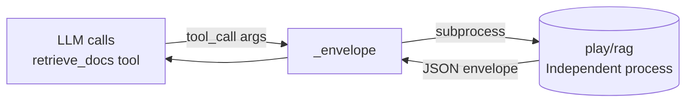

### New scenarios

|Scenario|Purpose|Demonstrates|
|---|---|---|
|`brainstorm.md`|Home of RAG-backed tool use|agent calls the search tool in the discussion|
|`vdb_test.md`|Minimum regression probe (~5 lines of facts, seconds)|Smoke verification of subprocess wrapper|

### New / changed tools

|Tool|Notes|
|---|---|
|`retrieve_docs`|The first tool, subprocess calls `play/rag` to retrieve; scenario-pinned default parameters are hidden from LLM|

## 2026-04-20 — Per-agent conversation memory: full / window / summary

The actual test of `panel` hit the performance wall: 4 members + 1 host × 3 rounds, a single speech at the end was 111s (4.5 times the opening 24s), and the entire session was 1398s.The root cause is that all agents share the entire history, and the input token grows linearly at the end of each round.This milestone introduces `ConversationMemory` ABC + three implementations: `FullHistory` (default backward compat), `WindowMemory` (latest N + pinned), `SummaryMemory` (stale collapsed into `<summary>`).**pinned types will never be cut** (`topic / round / phase / artifact_event`) are meeting minutes level information, which will be broken if the conversation is lost.On the same day, the opening / closing phase was also injected into the `<phase>` marker, allowing the agent to sense its own phase.

### Framework changes

|Change|Purpose|
|---|---|
|`ConversationMemory` ABC + 3 implementation |memory strategy is pluggable, scenario/agent double-layer coverage|
|The shared transcript remains unchanged, each agent maintains its own memory instance|Continues the "sharing + projection" foundation of §3 without destroying the SoT|
|pinned types cannot be cut (`topic / round / phase / artifact_event`) |retained meeting minutes level information|
|summary trigger: stale will be folded when it reaches the threshold|When it does not reach the threshold, "no information will be lost if it does not move"|
|opening / closing phase injects `<phase>` marker|agent self-sensing phase, without relying on prompt engineering implicit expression|

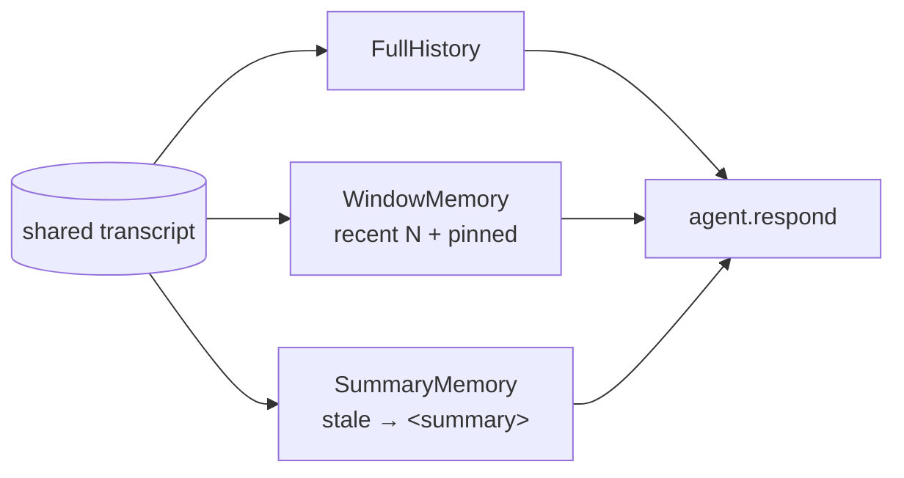

### New scenarios

|Scenario|Purpose|Demonstrates|
|---|---|---|
|`phase_test.md`|`<phase>` The minimum regression of marker existence probe|opening / closing phase is really "seen" by the agent|

### New / changed tools

|Tool|Notes|
|---|---|
|—|No tools in this issue|

## 2026-04-21 — Shared artifact + structured voting: discussion → decision machine-verifiable

The `panel` type scenario requires "one side to win" but only produces a series of statements, and the final decision relies on implicit inference.This milestone introduces `ArtifactStore` to structure decisions: 6 tools (`read_artifact / write_section / append_section / propose_vote / cast_vote / finalize_artifact`).The section is explicitly declared in the `initial_sections` of the scenario, each section is marked with `mode: replace | append`, and the store is mandatory; if the mode does not match, it returns `{"error": ...}`, and LLM self-corrects in the same tool loop.Two key designs: **out-of-band artifact view** - Inject `artifact.render()` as `<artifact>` user message **out-of-band** before each agent speaks (without going into history, memory clipping will never hide it); **artifact_event into history** (pinned, not cut) - "Events can be played back, status has no history" is the basic distinction of event sourcing.`finalize_artifact` is a sealing step and returns an idempotent error to prevent reentrancy.

### Framework changes

|Change|Purpose|
|---|---|
|`ArtifactStore` internal state + 6 artifact tools|Make decisions machine-verifiable objects|
|section.mode force + error → tool loop self-correct|Constrain writing semantics, but don’t let errors blow up the whole scene|
|out-of-band `<artifact>` rendering (without entering history) |memory cropping will not hide the artifact status|
|artifact_event enters history (pinned) |Events can be played back, and the status is held by the store to avoid double SoT|
|`finalize_artifact` sealing idempotent|align workflow terminal state model|
|The scenario default value in the tool handler overrides the parameters provided by LLM|Prevent the hallucination of `vdb_dir` from stealing the scenario parsing path|

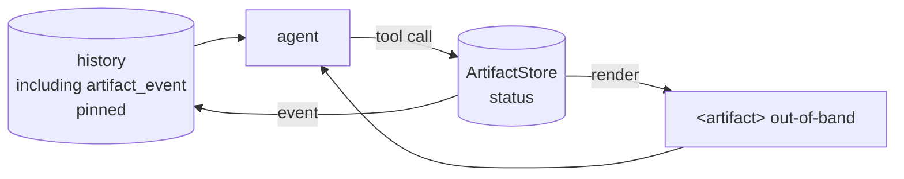

### New scenarios

|Scenario|Purpose|Demonstrates|
|---|---|---|
|`panel.md`|End-to-end enabled artifact + voting|Complete run-through of structured decision-making links|
|`test_artifact.md`|Six tool coverage + mode conflict self-correction|Tool protocol robustness on wrong paths|

### New / changed tools

|Tool|Notes|
|---|---|
|`read_artifact`|Read current artifact status|
|`write_section`|Press mode=replace to write section|
|`append_section`|Press mode=append to append section|
|`propose_vote`|Propose a vote vote_id|
|`cast_vote`|Vote for vote_id|
|`finalize_artifact`|sealing step, idempotent to prevent reentrancy|

## 2026-04-21 — Phase-assert (`require_tool`): make silent violations visiblePanel closing actual test bug: The instruction requires "call `cast_vote(...)` after everyone speaks", but two members only spoke but did not vote, the engine fire-and-forget.This milestone adds `phase.require_tool: <tool_name> + max_retries: N` (default 1): miss → append nudge instruction (per-call parameter, **do not enter history**, other agents cannot see this tutorial) → retry exhaustion → stderr `WARNING` + terminal `🔁` emoji.**The core goal is not to "force the agent to adjust the tool" (LLM essentially cannot force it), but to make silent violations visible** - detect-and-nudge-and-audit mode.At the same time, add `propose_vote` to `MODERATOR_ONLY_TOOLS` to eliminate the bug class where member randomly proposes and misplaces vote_id.

### Framework changes

|Change|Purpose|
|---|---|
|`phase.require_tool` + `max_retries`|Make assertions about tool call compliance|
|nudge instruction takes per-call parameters, does not enter history|does not pollute other agent perspectives, retain instruction-as-arg invariant|
|Failure: stderr `WARNING` + terminal `🔁` emoji|Make the violation visible for workshop viewers and subsequent audits|
|`artifact_event` adds `tool` / `caller` structured fields | programmatically checks compliance and no longer parses free-form text |
|`run.py` line-buffer stdout/stderr, `2>&1 \| tee` ensures chronological|Log order is consistent with the timeline|

```mermaid
flowchart LR
P[phase end] -->|require_tool detection| C{hit?}
C -- yes --> OK[continue]
C -- no, retries left --> N[nudge instruction<br/>per-call arg]
N --> P
C -- retries exhausted --> W[stderr WARNING<br/>+ &#x1F501; emoji]
```

### New scenarios

|Scenario|Purpose|Demonstrates|
|---|---|---|
|`test_phase_assert.md`|smoke end-to-end|retry + warning path complete runthrough|

### New / changed tools

|Tool|Notes|
|---|---|
|`propose_vote`|Add `MODERATOR_ONLY_TOOLS` to eliminate the bug class of members randomly proposing|

## 2026-04-22 — Tool observability: ToolTracer makes non-artifact tool calls visible

Observability blind spots are exposed: artifact tools already have complete observability (events + terminal emoji), but non-artifact tools (only `retrieve_docs` at the time) are completely silent - the terminal cannot be seen, the transcript cannot be played back, and during the workshop demonstration, the audience has no idea whether the agent has checked or what it has checked.This milestone introduces `ToolTracer`, **dual sink** corresponding to OpenTelemetry's live exporter + batch exporter: stderr line `🔧` (visible on site) + transcript event with `visible=False` (not entered into memory, can be played back offline).Fixed the moderator-first bug with the same commit: `who: all` allows the moderator to speak first in each round on certain phases, changed to `who: members`.**Explicitly not done**: Let tool_call go into memory (cost: 4 backend clients + memory rendering branch + summary strategy + extra tokens per round). The artifact already carries the strongest use case of "stateful cross-agent sharing".

### Framework changes

|Change|Purpose|
|---|---|
|`ToolTracer` class (`drain() -> list[event]`)|Centralized collection of non-artifact tool calls|
|Double sink: stderr `🔧` (live) + transcript `visible=False` (batch) | align OTel double exporter semantics |
|`tools.is_error` public function|stderr tripwire has the same definition of "failure" as tracer `ok` field|
|All entries plus `ts` (ISO timestamp) |The timing is complete and the playback can be accurately aligned|
|`--save-transcript` persist to disk structured history|Offline playback becomes a first-class citizen|

```mermaid
flowchart LR
T[tool call] --> TT[ToolTracer]
TT -->|live| ER[stderr<br/>&#x1F527; one-liner]
TT -->|batch| TR[transcript event<br/>visible=False]
```

### New scenarios

|Scenario|Purpose|Demonstrates|
|---|---|---|
|—|Inherit the existing scenario|tracer’s live visibility/offline playback dual perspective|

### New / changed tools

|Tool|Notes|
|---|---|
|`ToolTracer`|Infrastructure, not exposed to LLM; serves both stderr live and transcript batch|

## 2026-04-25 — Flat step list replaces phase × round 2D structure

This milestone is a major rewrite of the schema.**The mental model is compressed from "phase × round two-dimensional" to "steps one-dimensional sequence expansion into turns"**.Removed: `opening / main / closing` three sections, `rounds` / `phase.round`, top-level `moderator:` block, `members:` alias, `MODERATOR_ONLY_TOOLS` hardcoded, CLI `--rounds`.New: flat `steps:` list; `agents:` unified list + mandatory `role: moderator | member`; `artifact.tool_owners` explicit ACL; at runtime `<turn>turn X of N</turn>` pinned marker.`tool_owners` is adjustable by all members by default (including `finalize` / `propose_vote`); if you want to retain it exclusively for the host, you must **explicitly declare** - align with "explicit over implicit".For breaking changes, all old scenarios must be migrated; the workshop project has no external consumers and is controllable.

### Framework changes

|Change|Purpose|
|---|---|
|flat `steps:` list (replaced by phase × round two-dimensional)|The mental model is compressed from "two-dimensional matrix" to "sequential turn string"|
|`agents:` Unified list + mandatory `role`|Conformate actor modeling, delete redundant top-level blocks|
|`artifact.tool_owners` Explicit ACL|Permissions data driven, delete `MODERATOR_ONLY_TOOLS` hardcoded|
|`<turn>turn
|`who` is simplified to `moderator` / `member` / `all` + `[name1, name2]`|Addressing form converges, deletes `role:` prefix and dynamic `by:` stub|

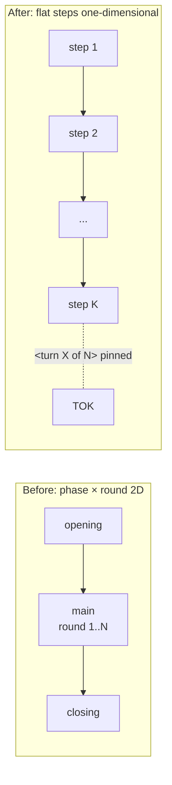

### New scenarios

|Scenario|Purpose|Demonstrates|
|---|---|---|
|—|Old scenarios are fully migrated to the new schema|The one-dimensional mental model is established in all existing scenarios|

### New / changed tools

|Tool|Notes|
|---|---|
|—|No new tools, but artifact tool permissions changed to data-driven ACL|

## 2026-04-25 — Hybrid retrieval integrated into retrieve_docs toolThis milestone upgrades `retrieve_docs` from "black box retrieval" to "LLM tunable retrieval".Expose `mode` + `rerank` to LLM through OpenAI tool schema; scenario `tools:` default value can still be pinned.`_retrieve_docs` unpacks the rag CLI envelope into slim `{data, meta:{mode, reranked, top_k}}` for LLM - HTTP envelope ↔ SDK two-layer division of labor in unpacking tables, aligned with OpenAI SDK style.ToolTracer preview has also been upgraded: from "three-key dict" to `[N items, mode=..., reranked]`, with higher information density.Merged with commit and rag side hybrid + reranker implementation.

### Framework changes

|Change|Purpose|
|---|---|
|`retrieve_docs` schema exposes `mode` + `rerank`|LLM can adaptively select based on query ambiguity|
|Slim envelope unpacking: rag CLI envelope → `{data, meta}`|LLM only looks at the form it needs, meta is used for observation|
|ToolTracer preview upgraded to `[N items, mode=..., reranked]`|Observation readability improvement|

### New scenarios

|Scenario|Purpose|Demonstrates|
|---|---|---|
|`test_vdb.md`|prompt nudge LLM on ambiguous query `rerank=true`|Tool adaptive capability|

### New / changed tools

|Tool|Notes|
|---|---|
|`retrieve_docs`(upgrade)|Add `mode` + `rerank` parameters; return slim envelope|

## 2026-04-26 — Rename + tools/ package split (prelude to Engine.invoke library)

This milestone does a mechanical rename + file splitting with zero behavioral changes, but is narratively critical.`play/multiagent/` → `play/agent_engine/`: The project name is changed from "implementation means" (multi-agent) to "capability description" (agent engine), aligning with the future as a library surface that can be embedded in workflow.`tools.py` single file → `tools/` package: `retrieve_docs.py` + `_envelope.py` + `_subprocess.py` three files, the public surface (`TOOL_DEFINITIONS / dispatch / is_error / warn_if_error`) remains unchanged, and all import lines do not change.This step is to prepare for the Engine.invoke library-ization of the next commit - tools cannot be disassembled too finely before they can be imported cleanly.

### Framework changes

|Change|Purpose|
|---|---|
|`play/multiagent/` → `play/agent_engine/`|The project name fits the "capability description" and is a priori naming for library-ization|
|`tools.py` single file → `tools/` package (3 files) |Prepare for clean import during Engine.invoke library-ization|
|Public surfaces all remain compatible |Zero behavioral changes, zero migration downstream|
|`DESIGN_DECISIONS.md` Add "historical name" |Name migration can be traced|

### New scenarios

|Scenario|Purpose|Demonstrates|
|---|---|---|
|—|This issue is renamed + split|—|

### New / changed tools

|Tool|Notes|
|---|---|
|—|Zero changes to tool behavior, only file location adjustments|

## 2026-04-26 — Library split: Scenario / Engine / CLI replace monolithic run.py

This milestone is to upgrade agent_engine from a "CLI program" to an "embeddable library".`Engine` (library SoT) + `cli.py` (thin adapter, `python -m agent_engine`) dual surface, sharing the same assembly path.`Engine.invoke(*, initial_artifact, transcript_path, artifact_path, callbacks, print_stream) -> Result`: LangChain Runnable style API; `ainvoke` / `stream` / `astream` Explicit `NotImplementedError` Leave a message and maintain discipline on the principle of "abstraction lags are introduced in the second concrete case".`Result` dataclass holds `artifact / transcript / success / warnings`; when require_tool is exhausted, in addition to stderr WARNING, `.warnings` is also written, so that the caller can make programmatic judgment.`print_stream` defaults to False (library boundary) / True (CLI boundary), allowing the same engine to have different quietness in script and terminal contexts.Following the same commit, `d2c4598` also merged 4 standalone smoke scenarios (`test_artifact / test_memory / test_phase_assert / test_vdb`) into `example.md` single kitchen-sink; the ADR archive was moved from `DESIGN_DECISIONS.md` to the project level aligned with the `play/rag` / `play/workflow` system`CHANGELOG.md` (later renamed `DECISIONS.md`).

### Framework changes

|Change|Purpose|
|---|---|
|`scenario.Scenario.from_yaml() + assemble()`|Extract parsing/verification/assembly from `run.py` composition root|
|`engine.Engine.invoke()`|Library SoT, a single assembly path serves both the library and CLI|
|`Result` frozen dataclass|`artifact / transcript / success / warnings` is a single point SoT|
|`events.py` + `callbacks.py` 5 subcategories pre-wired|Only `RunFinished` is implemented today, the rest are left open|
|`tracer.ToolTracer` becomes a separate module|Discussion no longer references the CLI module in `TYPE_CHECKING`|
|`print_stream` Default False (library)/True (CLI)|The same engine has different quietness in both script and terminal contexts|
|`ainvoke` / `stream` / `astream` `NotImplementedError`|abstraction lags introduced in second concrete case|

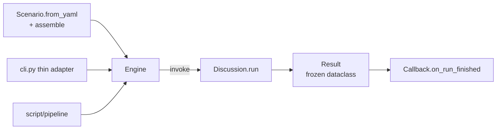

### New scenarios

|Scenario|Purpose|Demonstrates|
|---|---|---|
|`example.md` kitchen-sink|Merge 4 smoke scenarios|memory + artifact + phase_assert + retrieve_docs and run them together|

### New / changed tools

|Tool|Notes|
|---|---|
|—|The tool set remains unchanged, mainly assembly path reorganization|

## 2026-05-04 — Phase 5 evals interface: `--save-result-json` envelope + artifact_event `arguments`This milestone provides the machine consumption interface for `play/evals` phase 5 (agent_traj task).Added CLI flag `--save-result-json PATH`: Use `dataclasses.asdict` to serialize `Result` into a JSON envelope (`{transcript, artifact, warnings, success}`) persist to disk, parallel to `--save-transcript` (human JSON list) / `--save-artifact` (human markdown), and is a dedicated channel for machine consumption format.**envelope uses file instead of stdout**: The entire discussion of agent_engine will brush stdout (streaming + tool feedback). Envelope cannot parasitize stdout - this is the fundamental reason for the divergence from `play/rag/query.py --json` (short query output) form.At the same time, the 5 artifact_event handlers now retain the original `arguments`, allowing the transcript to permanently hold a complete snapshot of "what the agent called at that time" - pre-phase 5 only leaves the human-readable `content` string and the information loss caused by it is compensated.The `evals` side of the `argument_correctness` metric relies on this field having true data in the run path.

### Framework changes

|Change|Purpose|
|---|---|
|`--save-result-json PATH` file flag|machine consumption exclusive channel, does not pollute stdout|
|envelope = `dataclasses.asdict(Result) → json.dump(...)`|`Result` itself is a single point SoT, no need to add `to_dict()`|
|envelope goes to file instead of stdout|agent_engine stdout has been occupied by streaming|
|5 artifact_event handler retained `arguments`|transcript permanently holds a complete snapshot of what the agent called at that time|
|envelope schema self-describing by `dataclasses.fields(Result)` |cross-project contract monitoring cost is close to zero|

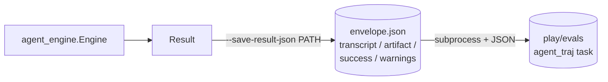

### New scenarios

|Scenario|Purpose|Demonstrates|
|---|---|---|
|—|Using the existing scenario|envelope can produce stable schema on example/panel/brainstorm|

### New / changed tools

|Tool|Notes|
|---|---|
|artifact_event handler (5)|Event dict adds `arguments` field; old consumers ignore unknown keys, evals side `argument_correctness` gets real data|

## 2026-05-09 — require_tool observation extended + 2 require_tool-dense scenarios

This milestone paves the way for the `play/agent_sft` Phase 1 baseline.`require_tool` historically only observes artifact events (`artifact.drain_events()`), causing non-artifact tools such as `retrieve_docs` to always be judged as "silent" - nudge must trigger + warning must fall, allowing the measurement signal to be constant.In this issue, the check surface of `_run_turn` is merged into tracer + artifact two-way events, and 3 lines of changes are made so that `require_tool: retrieve_docs` can finally work normally (DECISIONS §12, supersede §7 scope limitation at the end).At the same time, two require_tool-intensive scenarios of `code_review.md` and `tool_chain.md` are added: the former has multiple agents/complex contexts (4 agents 8 require_tool turns — retrieve ×2 + append ×3 + cast_vote ×3), the latter has a single-agent strong tool chain (5 require_tool turns — retrieve ×2 + append ×2 + cast_vote ×1), and the nudge-eligible turn is mentioned from 7 (panel + example)20, providing sufficient statistical power for the actual running of the N=10 seed × 2 model of `play/agent_sft` Phase 1.

### Framework changes

|Change|Purpose|
|---|---|
|`_run_turn` require_tool inspection surface = tracer_events ∪ artifact_events|Enables require_tool behavior of non-artifact tools to be measured; purely additive, old scenario byte-identical|
|`tracer_events` and `artifact_events` still extend to history in batches|Event source semantic boundary Unchanged — artifact is the real change of the shared document, and tracer is the tool call observation record|

### New scenarios

|Scenario|Purpose|Demonstrates|
|---|---|---|
|`code_review.md`|Multi-agent/complex context require_tool intensive scenario|3 senior + 1 main reviewer PR; 2 retrieve_docs + 3 append_section + 3 cast_vote = 8 require_tool turn / run|
|`tool_chain.md`|Single agent strong tool chain require_tool compliance test|The executor strictly adjusts the tool according to the 5-step checklist: retrieve → append → vote → retrieve → append|

### New / changed tools

|Tool|Notes|
|---|---|
|—|The tool collection remains unchanged; `require_tool` now covers all tools (including non-artifacts) and is a wiring fix, not a new tool|

## 2026-05-11 — Result/Scenario typed views: reclaim transcript interpretation

What this milestone does is a vertical extension of §11.§11 Establish `Result` is a cross-projectmachine consumption SoT, but only covers the envelope **field** schema; **Field interpretation** (how to turn the transcript / how to draw the tool call / how to staticexpansion the scenario) has been rewritten by each consumerreverse-engineer: `play/evals` `_resolve_who + _expand_steps`, `play/agent_sft` simply`sys.path.insert + from evals.metrics.nudge import _private_4_pieces`. DECISIONS §13 Take back this interpretation authority agent_engine: `Result.tool_calls() / .turns() / .speakers() / .find_finalize_decision()` + `Scenario.expanded_turns()` exposed typedview (`ToolCall / TurnView / ExpandedTurn` three frozen dataclasses), the same spirit as OpenAI Agents SDK `RunResult.new_items` / Anthropic `Message.content[ToolUseBlock]` / inspect_ai `ChatMessageTool`.At the same time, this issue has launched the first test directory (36 tests) of `play/agent_engine/tests/`, which contains a key invariant: `Scenario.expanded_turns()` length / (agent, step_id) sequence and `Discussion._expand_steps()` byte-identical on 7 live network scenarios - lock "staticexpansion == runtime expansion" to allow future reconstruction`_resolve_who_names` does not deviate secretly when sharing pure functions.**PR-1 public signature with zero damage**: evals/agent_sft existing pytest is all green (465 + 89), the shim layer allows `nudge.py / agent_traj.py` to internally modify the new API but the caller has zero modification; PR-2 deletes shim + agent_sft and directly connects to agent_engine to finish.

### Framework changes

|Change|Purpose|
|---|---||`Result.from_dict / load_json` + 4 view method (`tool_calls / turns / speakers / find_finalize_decision`)|envelope ↔ Result bidirectional IO + transcript interpretation SoT; missing fields are downgraded and compatible with old envelope|
|`ToolCall(frozen)` + `TurnView(frozen, start_offset)`|typed view, aligned with the OpenAI Agents SDK / inspect_ai style; `start_offset` is used by agent_sft turn-indexed to cut context |
|`Scenario.expanded_turns()` + `ExpandedTurn(frozen)`|staticexpansion `steps:` is a linear turn sequence and does not instantiate Agent; eval / training data miningconsumers no longer reproduce expansion logic|
|Pump `_resolve_who_names(who, declared_order, role_by_name)` pure function |`Discussion._resolve_who` runtime path + `Scenario.expanded_turns()` static path **shared** - guarantee the expansion order of the two paths byte-identical|
|`play/agent_engine/tests/` First test directory (36 tests)|The project has no tests before, this issue is the bottom; it contains 7 expanded_turns on the live network scenario ≡ Discussion._expanded invariant lock|
|Public surface through `__init__.py` re-export `ExpandedTurn / Result / Scenario / ToolCall / TurnView`|consumers `from agent_engine import ToolCall, TurnView, ExpandedTurn` just|

```mermaid
flowchart LR
subgraph AE[agent_engine (schema + schema interpretation SoT)]
RES[Result]
RES -->|.tool_calls| TC[list[ToolCall]]
RES -->|.turns| TV[list[TurnView]]
RES -->|.find_finalize_decision| DEC[str?]
SCN[Scenario] -->|.expanded_turns| ET[list[ExpandedTurn]]
end
EV[play/evals] -. import .-> RES & SCN
SFT[play/agent_sft<br/>PR-2 onwards] -. import .-> RES & SCN
```

### New scenarios

|Scenario|Purpose|Demonstrates|
|---|---|---|
|—|Use the existing 7 scenarios (brainstorm/debate/roundtable/panel/code_review/tool_chain/example) |invariant test is locked on all live network scenarios expanded_turns ≡ Discussion._expanded|

### New / changed tools

|Tool|Notes|
|---|---|
|—|This issue is the implementation of view API + testing, and the toolset remains unchanged|

## 2026-05-11 — Transcript schema typed + token usage landed

§13 Returns the transcript interpretation authority to agent_engine, but the transcript entry is still `list[dict]` - 5 writing points are scattered, `SpeakerEntry` has no `type` tag, `Result` has no `usage` field, and the cost/efficiency measurement must be inferred from stderr. This issue is the field layer extension of §13: `TopicEntry / TurnEntry / SpeakerEntry / ToolCallEntry /ArtifactEventEntry / SummaryEntry` 6 frozen dataclasses form `TranscriptEntry` typed union (`SpeakerEntry` is mandatory with `type="speaker"`), `Result` adds `usage: list[TokenUsage]`, 4 LLM client (`openai/anthropic/gemini/ollama`) `chat()` changes back to `(text,TokenUsage)` tuple, `Agent.respond / Discussion / Engine` is strung to `Result.usage`. **forward-only upgrade**——`Result.from_dict` missing fields directly `KeyError`, old envelope unreadable; this warehouse has no external consumers, the migration script injects evals predictions JSONL × 46 + agent_sft mined envelope JSON × 500 at one time`type:"speaker"` + `usage: []`. `agent_sft` deletes `_split_turns_indexed / _index_steps_by_turn`, a total of 2 shim functions (typed `Result.turns()` can no longer be directly given to `start_offset`, shim loses its meaning of existence). Three projects pytest are all green (agent_engine 42 /evals 456 / agent_sft 87 = 585) + evals smoke `agent_traj` / `nudge_fire_rate` passed.

### Framework changes

|Change|Purpose|
|---|---|
|6 `frozen=True` entry dataclass + `TranscriptEntry` Union|schema itself typed; same spirit as OpenAI Agents SDK / inspect_ai / LangChain typed message union|
|`SpeakerEntry.type: Literal["speaker"]`|Fix historical omissions; transcript interpretation 100% follows the type tag path|
|`TokenUsage` frozen + `Result.usage: list[TokenUsage]`|cost/efficiency metric is back-upgraded from stderr to envelope field level|
|4 LLM client `chat(...)` signature plus `caller: str` + return `(text, TokenUsage)`|Smooth out SDK usage field differences across OpenAI / Anthropic / Gemini / Ollama |
|`ConversationMemory.drain_usage()`|The usage generated by the summarizer call inside SummaryMemory is also recycled into the envelope|
|`Result.from_dict` strictified(missing fields `KeyError`)|forward-only schema; old envelope one-time migration script processing|
|Delete `agent_sft.data.extractor._split_turns_indexed / _index_steps_by_turn` 2 shims in total|`Result.turns()[i].start_offset` has been directly given to turn-indexed global offset|
|`engine.py` before writing to disk `[dataclasses.asdict(e) for e in history]`|typed entry → JSON serialization|

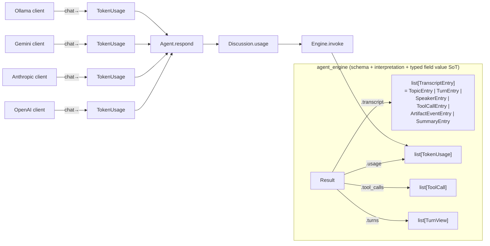

### New scenarios

|Scenario|Purpose|Demonstrates|
|---|---|---||—|Inherit the existing 7 scenarios|schema upgrade and decouple the scenario collection|

### New / changed tools

|Tool|Notes|
|---|---|
|—|This issue is the implementation of schema typed + token usage envelope, and the tool set remains unchanged|