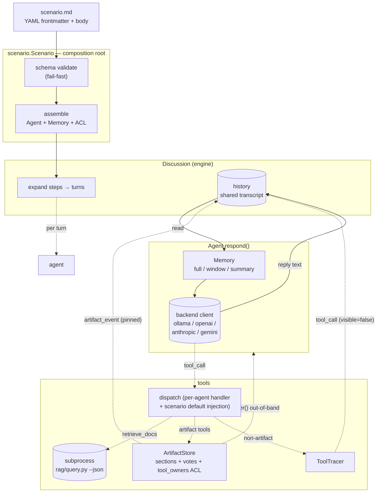
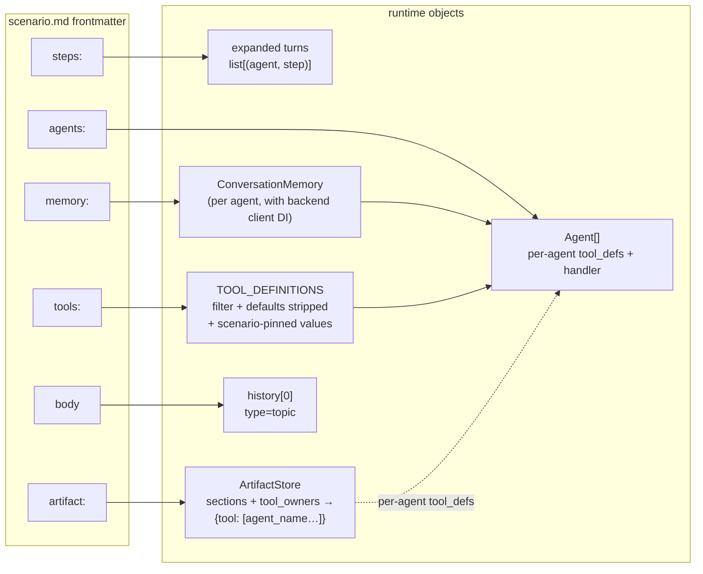

# play/agent_engine

Step-driven multi-agent discussion engine: scenario = one markdown file; YAML frontmatter declares participants / flow / tools / memory / artifact; body is the topic. Shared transcript + per-agent projection; supports ollama / openai / anthropic / gemini backends; [`play/rag/`](../rag/) feeds data via subprocess.

## Features

- **Scenario as configuration**: YAML frontmatter + markdown body, one file one scene; startup schema validation; authors change scenes zero code
- **Flat step list**: `steps:` sequentially declares all turns; `who` flexibly addresses via role/all/name list; each turn injects pinned `<turn>turn X of N</turn>` so agents sense position
- **Shared transcript + per-agent projection**: one authoritative history; each agent at `respond()` projects `speaker == owner` → `assistant`, others → `<message from="X">`, control flow (`topic / turn / artifact_event`) → tagged user messages
- **Per-agent memory**: swappable `full / window / summary` strategies — see [§Memory strategies](#memory-strategies)
- **Shared artifact + structured voting + ACL**: sectioned markdown + `replace / append` mode + voting + `finalize`; view injected out-of-band; `tool_owners` limits artifact tool callers (same syntax as `who`); see [§Artifact tools](#artifact-tools)
- **Step assert (require_tool)**: step must call a tool; miss → nudge retry, finally stderr WARNING — **makes silent violations visible**, not forced
- **Tool observability**: `ToolTracer` dual sink — stderr live 🔧 emoji + transcript event (`visible=False`, offline replay)
- **Subprocess-isolated tools**: `retrieve_docs` via `subprocess.run(python rag/query.py --json)`; process boundary isolates subproject `config.py` / deps; passes rag hybrid (dense + BM25 RRF) + optional cross-encoder rerank; LLM may choose `mode` / `rerank`
- **Pluggable multi-backend**: change one line `BACKEND` in `config.py` for ollama / openai / anthropic / gemini

## Guiding principles

Five principles throughout:

|#|Principle|Notes|
|---|---|---|
|1|**Shared transcript + per-agent projection**|one authoritative history, each agent projects per need (see [§History projection rules](#history-projection-rules))|
|2|**Explicit over implicit**|declare in config what can be declared; structure-constrain LLM behavior where possible|
|3|**Accept LLM uncertainty**|don't treat LLM as deterministic; tolerance design (retry / self-correct / audit) over force|
|4|**Assembly points centralized**|`Scenario.assemble()` + `Engine.invoke()` sole assembly/orchestration entry; `cli.py` only argparse → same API; discussion kernel independent of CLI|
|5|**Abstraction lags second concrete case**|no abstractions for future needs; extract when second consumer appears|

## Architecture

> Industry 5-layer mapping: UI = `cli.py` + scenario `.md`; Orchestration = `scenario.Scenario` / `engine.Engine` / `discussion.Discussion`; Capabilities = `agent.Agent` + `memory.*` + `tools/` + `artifact.ArtifactStore`; LLM Core = 4 pluggable backend clients; Infrastructure = `play/rag/` subprocess + `tracer.ToolTracer` + JSON persistence. Four diagrams below: components, scenario→runtime mapping, single-turn sequence, history projection.

### Component overview

`scenario.Scenario` as composition root assembles scenario.md into runtime object graph (`Assembly`), wired by `engine.Engine` to `Discussion`; `Discussion` holds sole authoritative `history`; `Agent` reads via `Memory` projection; `ArtifactStore` / `ToolTracer` write events back to `history`.



### Scenario → runtime assembly

YAML fields map 1:1 to runtime objects; `scenario.py` is the only place knowing these mappings.



### Single-turn data flow

Execution order within each turn — especially out-of-band artifact view, tool_call events before speech in history, `require_tool` nudge loop — in one diagram.

```mermaid
sequenceDiagram
    autonumber
    participant D as Discussion
    participant H as history
    participant AG as Agent.respond
    participant M as Memory
    participant CL as backend client
    participant AS as ArtifactStore
    participant TR as ToolTracer

    D->>H: append &lt;turn X of N&gt; (pinned)
    D->>AS: render() → markdown view
    D->>AG: respond(history, instruction, artifact_view)
    AG->>M: build_messages(history, owner)
    M-->>AG: messages (per-agent projection)
    Note over AG,CL: artifact_view as &lt;artifact&gt; user message<br/>out-of-band; not in history
    AG->>CL: chat(system, messages + view + instruction, tools)

    loop tool-use loop
        alt artifact tool
            CL->>AS: dispatch(name, args, caller)
            AS-->>CL: result (+ enqueue artifact_event)
        else non-artifact tool
            CL->>TR: dispatch via tracer
            TR-->>CL: result (+ stderr 🔧 + enqueue tool_call)
        end
    end

    CL-->>AG: final reply text
    AG-->>D: reply

    D->>TR: drain() tool_call events
    D->>H: append tool_call events (visible=false)
    D->>H: append speaker turn
    D->>AS: drain_events() artifact events
    D->>H: append artifact_event (pinned)

    alt require_tool miss and attempt &lt; max_retries
        D->>D: generate nudge instruction, re-enter turn
    else require_tool hit or retries exhausted
        D-->>D: next turn (exhausted → stderr WARNING)
    end
```

### History projection rules

One history; each agent in `Memory.build_messages(history, owner)` folds it into own `messages`:

|Source entry|Projection rule|
|---|---|
|`type=topic / turn / artifact_event / summary`|wrap as `<tag>...</tag>` user message|
|`speaker == owner`|`assistant` message|
|`speaker != owner`|wrap as `<message from="X">...</message>` user message|
|`visible=False` (`tool_call` from `ToolTracer`)|skipped by all agents in projection; visible only in `--save-transcript` disk export|

> Pinned types (`topic / turn / artifact_event`) never trimmed by any memory strategy — meeting-minutes-level info; losing them breaks the session. `<artifact>` view injected out-of-band each turn, not in history — always fresh without memory quota.

## Environment setup

- Python 3.12+
- `pip install -r requirements.txt` (`anthropic / google-genai / openai / pyyaml`)
- Pick a backend (default ollama):

```bash
# local ollama (default)
ollama pull qwen3.6:27b
# or change BACKEND in config.py and set corresponding *_API_KEY
```

`retrieve_docs` requires [`play/rag/`](../rag/) VDB built.

## Quick start

### As Python library (source of truth)

Paths below assume cwd **`play/`** (`import agent_engine` resolves).

```python
from agent_engine import Engine, Scenario

scenario = Scenario.from_yaml("agent_engine/scenarios/roundtable.md")
engine = Engine(scenario)
result = engine.invoke(
    initial_artifact={"PRD": "..."},          # optional; pre-seed artifact section
    transcript_path="/tmp/transcript.json",   # optional; persist structured history
    artifact_path="/tmp/artifact.md",         # optional; persist rendered markdown
    print_stream=False,                       # library default quiet; CLI default True
)
result.artifact     # dict[section_name, content]
result.transcript   # list[Entry]
result.success      # bool (True iff no warnings)
result.warnings     # require_tool exhausted etc. soft failures
```

#### Result / Scenario typed views (DECISIONS §13)

`Result` is both `Engine.invoke()` return value and `--save-result-json` envelope schema source. From §13, transcript/scenario interpretation also lives in agent_engine — eval/training consumers need not reverse-engineer transcript shape or replicate step expansion:

```python
from agent_engine import Result, Scenario, ToolCall, TurnView, ExpandedTurn

# restore from persisted envelope
result = Result.load_json("/tmp/result.json")
# or from dict (any source)
result = Result.from_dict(some_envelope_dict)

# transcript views
calls: list[ToolCall] = result.tool_calls()       # tool_call ∪ artifact_event merge convention
turns: list[TurnView] = result.turns()            # split by <turn> marker; includes start_offset
result.speakers()                                  # set[str]: agents who actually spoke
result.find_finalize_decision()                    # str | None: finalize_artifact decision

# further split within segment: attempts / tool calls
for tv in turns:
    for attempt_events in tv.attempts(agent="Moderator"):
        ...
    tv.tool_calls()                                # tool calls within segment

# scenario static expansion (no Agent instantiation / no LLM)
scn = Scenario.from_yaml("agent_engine/scenarios/panel.md")
expanded: list[ExpandedTurn] = scn.expanded_turns()
for e in expanded:
    e.turn_idx, e.agent, e.step_id, e.require_tool, e.max_retries
```

`ToolCall` / `TurnView` / `ExpandedTurn` are frozen dataclasses; same spirit as OpenAI Agents SDK `RunResult.new_items` / Anthropic `Message.content[ToolUseBlock]` / inspect_ai `ChatMessageTool`, lighter weight.

#### Transcript entry typed union + token usage (DECISIONS §14)

`Result.transcript` is internally a typed union — 6 `frozen=True` dataclasses cover all entry shapes; `Result.usage` is per-LLM-call token list. **Forward-only schema**: `Result.from_dict` missing fields → `KeyError`; old envelopes unreadable.

```python
from agent_engine import (
    Result,
    TranscriptEntry,           # = TopicEntry | TurnEntry | SpeakerEntry
                                #   | ToolCallEntry | ArtifactEventEntry | SummaryEntry
    TopicEntry, TurnEntry, SpeakerEntry,
    ToolCallEntry, ArtifactEventEntry, SummaryEntry,
    TokenUsage,
)

result = Result.load_json("/tmp/result.json")

# typed dispatch (IDE inference + static check friendly)
for entry in result.transcript:
    if isinstance(entry, SpeakerEntry):
        # entry.speaker / entry.content / entry.ts / entry.type == "speaker"
        ...
    elif isinstance(entry, ToolCallEntry):
        # entry.tool / entry.caller / entry.arguments / entry.ok / entry.visible
        ...
    elif isinstance(entry, ArtifactEventEntry):
        # entry.tool / entry.caller / entry.arguments / entry.content
        ...

# token usage: raw per-LLM-call list (cost/efficiency aggregation in evals/metrics/efficiency.py)
for u in result.usage:
    u.model            # "qwen3.5:9b" / "claude-3-5-sonnet-20241022" / ...
    u.caller           # caller agent name (includes SummaryMemory summarizer hidden calls)
    u.input_tokens
    u.output_tokens
    u.cached_tokens    # OpenAI prompt_tokens_details.cached / Anthropic cache_read_input_tokens
    u.duration_ms
    u.ts
```

| Entry type | When produced | Key fields |
|---|---|---|
| `TopicEntry` | once at run start | `content` (scenario body = topic) |
| `TurnEntry` | each turn start | `content` (e.g. `"turn 5 of 26"`), pinned marker |
| `SpeakerEntry` | agent reply | `speaker`, `content`; `type` mandatory tag since §14 |
| `ToolCallEntry` | non-artifact tool (from `ToolTracer`) | `caller`, `tool`, `arguments`, `result`, `ok`, `visible` (default False) |
| `ArtifactEventEntry` | 6 artifact tools | `caller`, `tool`, `arguments`, `content` (human-readable summary) |
| `SummaryEntry` | `SummaryMemory` fold product | `content` |

`TokenUsage` captured inside 4 backend clients (OpenAI `usage.prompt_tokens` / Anthropic `usage.input_tokens` / Gemini `usage_metadata.prompt_token_count` / Ollama `prompt_eval_count`); cross-backend field normalization; streaming without usage fills 0 (no exception; evals cost auto-degrades).

### As CLI (thin adapter)

From **`play/`** (`python -m agent_engine` resolves package; scenario paths relative to cwd):

```bash
# 1. classic roundtable (moderator + 2 guests)
python -m agent_engine agent_engine/scenarios/roundtable.md

# 2. decision meeting (moderator + 4 members, 11 steps 26 turns, artifact + vote + finalize)
python -m agent_engine agent_engine/scenarios/panel.md --save-artifact /tmp/panel.md

# 3. integration smoke + CI single file (who four forms + artifact + retrieve_docs + memory + require_tool)
python -m agent_engine agent_engine/scenarios/example.md
```

Expected output fragment:

```
============================================================
  Participants: Moderator, Guest A, Guest B
  Steps: 3  |  Total turns: 4
============================================================

🗣  [Moderator] (step=open): Hello guests, today we discuss ...
🗣  [Guest A] (step=discuss): From a technical perspective ...
🔧 [Guest A] retrieve_docs(query='AGI path', vdb_dir='...') → [3 items, mode=hybrid]
...
```

## CLI quick reference

> Full help: `python -m agent_engine --help`.

|Arg|Required|Default|Description|
|---|---|---|---|
|`scenario`|yes|—|scenario `.md` path|
|`--no-stream`|flag|`False`|disable streaming (CLI default on; library default off)|
|`--save-artifact`|no|—|persist final artifact markdown (only when `artifact.enabled`)|
|`--save-transcript`|no|—|persist structured history JSON (topic/turn/speaker/tool_call/artifact_event)|
|`--save-result-json`|no|—|persist full `Result` envelope (`{transcript, artifact, warnings, success, usage}`, `dataclasses.asdict`, typed transcript serialization + `usage: list[TokenUsage]`). Machine format alongside human JSON/markdown exports; `play/evals` phase 5 trajectory eval / `play/agent_sft` mining use this flag (see [`DECISIONS §11`](DECISIONS.md) / [§14](DECISIONS.md))|

## Scenario schema

YAML frontmatter fields:

|Field|Type|Description|
|---|---|---|
|`agents`|list|required, ≥1; each `{name, role, prompt}`, optional `model / temperature / max_tokens / memory`; `role` ∈ {moderator, member}|
|`steps`|list|required, ≥1; each `{who, instruction, id?, require_tool?, max_retries?}`; list order expands to turns|
|`memory`|dict|scenario-level default memory; agent `memory` overrides|
|`tools`|list|each `{name: <tool>, ...defaults}`; scenario defaults hidden from LLM schema and injected at dispatch|
|`artifact`|dict|`{enabled, initial_sections?, tool_owners?}`; sections declare `mode: replace\|append`; `tool_owners` limits callers|

`who` forms (four total):

|Form|Meaning|
|---|---|
|`moderator`|scalar role: all role=moderator agents, declaration order|
|`member`|scalar role: all role=member agents, declaration order|
|`all`|scalar keyword: everyone, declaration order|
|`[name1, name2]`|explicit list: list order; each name must exist; single name still `[name]`|

`<artifact>` view injected out-of-band before each speech (not in history). `<turn>turn X of N</turn>` pinned before each turn so agents sense position.

### Memory strategies

|`type`|Required fields|Behavior|
|---|---|---|
|`full`|—|default; keep full history|
|`window`|`max_recent`|keep all pinned markers + last N speeches|
|`summary`|`max_recent` + optional `model / max_tokens / temperature / summarizer_prompt / summarize_instruction`|fold stale speech into `<summary>`; client injected at `Engine.invoke()` assembly|

### Artifact tools

|Tool|Default visibility|Role|
|---|---|---|
|`read_artifact`|all (unless tool_owners restricts)|return current markdown view|
|`write_section`|all (mode limited)|overwrite section; `append` sections return error|
|`append_section`|all (mode limited)|append entry; `replace` sections return error|
|`propose_vote`|all (unless tool_owners restricts)|register structured vote, return `vote_id`|
|`cast_vote`|all (unless tool_owners restricts)|record one vote (overwrite by `caller`)|
|`finalize_artifact`|all (unless tool_owners restricts)|seal; idempotent error on re-entry|

`require_tool: <tool>` after step scans `artifact.drain_events()` for call; miss → nudge instruction retry; exhausted → stderr WARNING.

## Tests

Test suite landed from DECISIONS §13 (project had no tests before). Current 36 tests cover `Result` / `Scenario` view layer + `expanded_turns ≡ Discussion._expanded` invariant on 7 live scenarios; no ollama/VDB/external services; pure function level, seconds to run.

```bash
# from play/
python -m pytest agent_engine/tests/ -v
```

View contract behavior in `tests/test_result_views.py` and `tests/test_scenario_static.py`; engine e2e live tests in [`play/evals`](../evals/) (agent_traj / nudge_fire_rate).

## Scenario library

|File|Purpose|
|---|---|
|`example.md`|**integration smoke + CI**: six artifact tools + `retrieve_docs` + window/full/summary + `require_tool` nudge; `ci_who_*` two steps cover `who: member` / `who: all` scalar addressing; field docs in this README|
|`roundtable.md`|moderator + 2 guests, simplest flow smoke (3 steps)|
|`debate.md`|no moderator, 2-position debate (2 steps)|
|`brainstorm.md`|no moderator, demonstrates `who: [name, ...]` explicit list addressing (2 steps)|
|`panel.md`|decision meeting: moderator + 4 members, 11 steps / 26 turns, artifact + vote + finalize (most complete)|

## Project structure

```
play/agent_engine/
├── README.md                   # this file
├── DECISIONS.md                # ADR archive (Status / Date / trade-offs per entry)
├── JOURNAL.md                  # milestone progress (≤2/day, Functional + Technical, cross-link DECISIONS §N)
├── requirements.txt            # anthropic / google-genai / openai / pyyaml
├── config.py                   # BACKEND + model/key/defaults per provider
├── __init__.py                 # exports Engine / Scenario / Result / Callback
├── __main__.py                 # python -m agent_engine entry
├── cli.py                      # zero-logic CLI: argparse → Engine.invoke
├── engine.py                   # Engine class (invoke / ainvoke* / stream* / astream*)
├── result.py                   # Result dataclass + 6 entry dataclasses + TokenUsage
├── events.py                   # Event base + 5 subclasses (streaming placeholder; only RunFinished today)
├── callbacks.py                # Callback base (on_xxx methods)
├── scenario.py                 # Scenario.from_yaml + Assembly
├── tracer.py                   # ToolTracer (non-artifact tool events + stderr 🔧)
├── discussion.py               # Discussion engine: flat steps → linear turns
├── agent.py                    # Agent.respond() + memory projection entry
├── memory.py                   # FullHistory / WindowMemory / SummaryMemory
├── artifact.py                 # ArtifactStore + 6 tools + voting + finalize
├── tools/                      # reasoning tool package (_envelope / _subprocess / retrieve_docs / __init__)
├── anthropic_client.py         # backend client (tool_handler loop)
├── openai_client.py            #
├── gemini_client.py            #
├── ollama_client.py              #
└── scenarios/                  # scenario library (table above)
```

Architecture decisions: [`DECISIONS.md`](DECISIONS.md); milestone progress: [`JOURNAL.md`](JOURNAL.md).
