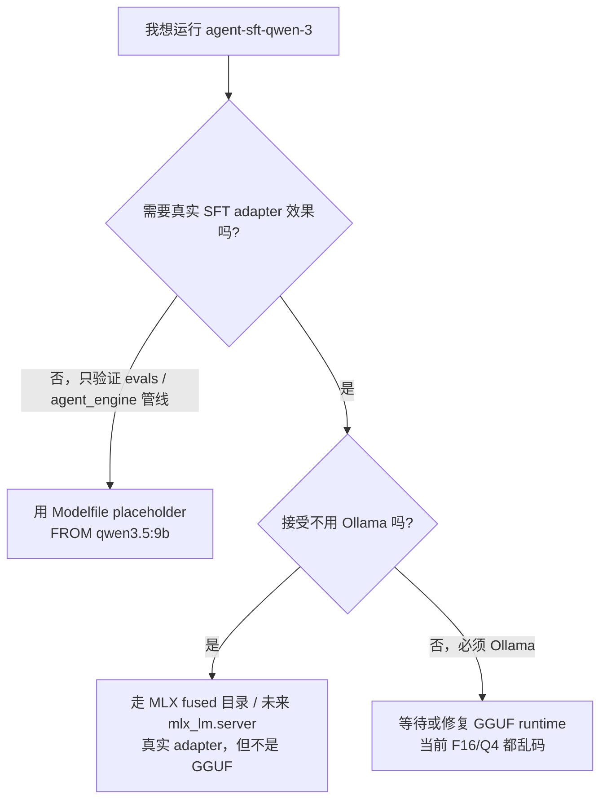
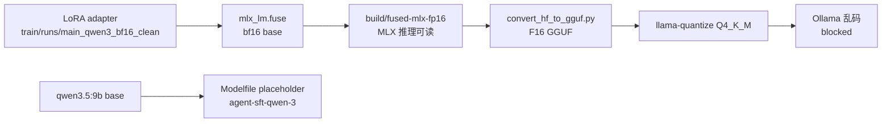

# `agent_sft/deploy/` — 部署状态与重生指南

本目录负责把 LoRA adapter 变成 `agent_engine` 可调用的本地模型 tag。**先看状态：v1 的 Qwen2.5 GGUF 路径曾经跑通；当前 qwen3.5:9b 路径仍 blocked。** `agent-sft-qwen-3` 目前是 placeholder（`FROM qwen3.5:9b`），可用于验证评测管线，但不能代表新 adapter 的效果。

## 状态表

|路线|底座|结果|证据 / 位置|读者应如何理解|
|---|---|---|---|---|
|v1 GGUF deploy|Qwen2.5-7B|✅ 成功|[`DECISIONS §6`](../DECISIONS.md)|历史可复现路径；不再是当前默认|
|v1.5 qwen3.5 4-bit|qwen3.5:9b|⚠️ 训练成功，GGUF 乱码|[`DECISIONS §10`](../DECISIONS.md)|adapter 效果看 MLX `eval_smoke`，不要看 placeholder tag|
|v1.6 qwen3.5 bf16 clean-data|qwen3.5:9b|⚠️ bf16 仍乱码|[`DECISIONS §11`](../DECISIONS.md)|问题更像 `convert_hf_to_gguf.py` / Ollama runtime 兼容，而不是 4-bit dequantize|

## 决策树

## 当前文件清单

|文件|职责|当前注意点|
|---|---|---|
|`Modelfile`|Ollama placeholder 配方：`FROM qwen3.5:9b`|用于保持 tag 名与评测管线可用；不是 adapter 部署|
|`Modelfile.gguf-broken`|保留损坏 GGUF 配方|debug / 上游修复后对照用|
|`build.sh`|`mlx_lm.fuse` → `convert_hf_to_gguf.py` → `llama-quantize`|能产 F16/Q4 GGUF，但 qwen3.5 路径当前输出乱码|
|`deploy.sh`|历史 GGUF deploy 脚本|仍会检查 `build/agent-sft-qwen-3-q4.gguf`；只想建 placeholder tag 时可直接用 `ollama create`|
|`smoke_test.py`|直接调 Ollama `/api/chat` 做 tool-call smoke|只能证明当前 tag 可响应 tool-call，不能证明 SFT adapter 生效|
|`build/`|gitignored；中间产物 + 最终 GGUF / fused MLX|`fused-mlx-fp16/` 是当前最有价值的真实 adapter artifact|

## qwen3.5 当前数据流

## 常用命令

|目标|命令|说明|
|---|---|---|
|只注册 placeholder tag|`ollama create agent-sft-qwen-3 -f Modelfile`|不需要 `build/`；tag 等价于 base `qwen3.5:9b`|
|重跑 GGUF 构建实验|`bash build.sh --force`|用于 debug；当前预期仍是 F16/Q4 乱码|
|跑当前 tag smoke|`python smoke_test.py`|验证 Ollama tag 与 tool-call parser 可用|
|改 llama.cpp 路径|`LLAMA_CPP_DIR=/path/to/llama.cpp bash build.sh`|需要 `convert_hf_to_gguf.py`、`.venv`、`llama-quantize`|

## 已知问题

|症状|原因判断|下一步|
|---|---|---|
|F16 GGUF / Q4 GGUF 在 Ollama 输出乱码|qwen3.5 hybrid（attention + SSM）在转换或 runtime 层不兼容|优先尝试 `mlx_lm.server` 直连真实 adapter；其次试 transformers + PEFT merge 后再转 GGUF|
|`agent-sft-qwen-3` 指标看起来和 base 接近或随机波动|当前 tag 是 placeholder，采样方差会让同 base 双跑数字不同|不要把它当 adapter 效果；真实训练信号看 `train/eval_smoke.py` 或未来 MLX server 路径|
|`deploy.sh` 要求存在 q4 GGUF|脚本仍沿用历史 GGUF deploy sanity check|placeholder 直接跑 `ollama create agent-sft-qwen-3 -f Modelfile`|

## 不在当前范围

|项|去向|
|---|---|
|把损坏 GGUF 强行注册为线上 tag|不做；会污染 eval 结论|
|多量化等级对比 (Q5_K_M / Q8_0)|等 F16 GGUF 可读后再谈|
|HF Hub 公开发布|需要真实可用 artifact + Model Card 后再启动|
