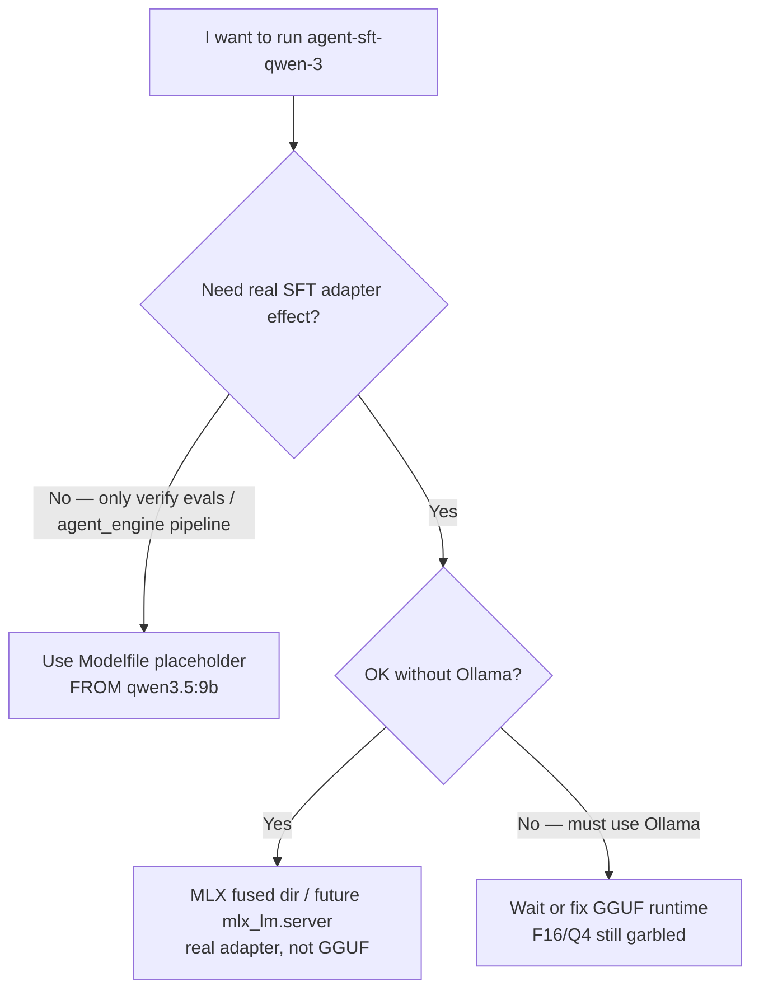
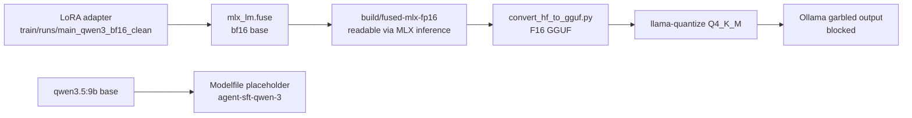

# `agent_sft/deploy/` — Deployment status and respawn guide

This directory is responsible for turning the LoRA adapter into a callable local model tag of `agent_engine`. **Look at the status first: the Qwen2.5 GGUF path of v1 once ran through; the current qwen3.5:9b path is still blocked. ** `agent-sft-qwen-3` is currently the placeholder (`FROM qwen3.5:9b`) and can be used to verify the evaluation pipeline, but it cannot represent the effect of the new adapter.

## Status table

|route|base|results|evidence/location|how the reader should understand|
|---|---|---|---|---|
|v1 GGUF deploy|Qwen2.5-7B|✅ Success|[`DECISIONS §6`](../DECISIONS.md)|Historical reproducible path; no longer the current default|
|v1.5 qwen3.5 4-bit|qwen3.5:9b|⚠️ Training successful, GGUF garbled|[`DECISIONS §10`](../DECISIONS.md)|For the adapter effect, please see MLX `eval_smoke`, do not look at the placeholder tag|
|v1.6 qwen3.5 bf16 clean-data|qwen3.5:9b|⚠️ bf16 still garbled|[`DECISIONS §11`](../DECISIONS.md)|The problem is more like `convert_hf_to_gguf.py` / Ollama runtime compatibility rather than 4-bit dequantize|

## Decision tree

## Current file list

|Documents|Responsibilities|Current points of attention|
|---|---|---|
|`Modelfile`|Ollama placeholder recipe: `FROM qwen3.5:9b`|Used to keep tag names and evaluation pipelines available; not adapter deployment|
|`Modelfile.gguf-broken`|Keep the broken GGUF recipe|debug / for comparison after upstream repair|
|`build.sh`|`mlx_lm.fuse` → `convert_hf_to_gguf.py` → `llama-quantize`|Can produce F16/Q4 GGUF, but the qwen3.5 path currently outputs garbled characters|
|`deploy.sh`|History GGUF deploy script|will still check `build/agent-sft-qwen-3-q4.gguf`; when you just want to create a placeholder tag, you can use `ollama create`|
|`smoke_test.py`|Directly adjust Ollama `/api/chat` to do tool-call smoke|It can only prove that the current tag can respond to tool-call, but it cannot prove that the SFT adapter is effective|
|`build/`|gitignored; intermediate + final GGUF / fused MLX|`fused-mlx-fp16/` is currently the most valuable real adapter artifact|

## qwen3.5 current data stream

## Common commands

|Target|Command|Description|
|---|---|---|
|Only register placeholder tag|`ollama create agent-sft-qwen-3 -f Modelfile`|No need for `build/`; tag is equivalent to base `qwen3.5:9b`|
|Rerun the GGUF build experiment|`bash build.sh --force`|for debugging; the current expectation is still F16/Q4 garbled code|
|Run current tag smoke|`python smoke_test.py`|Verify that Ollama tag and tool-call parser are available|
|Change llama.cpp path|`LLAMA_CPP_DIR=/path/to/llama.cpp bash build.sh`|Requires `convert_hf_to_gguf.py`, `.venv`, `llama-quantize`|

## Known issues

|Symptoms|Cause judgment|Next step|
|---|---|---|
|F16 GGUF / Q4 GGUF outputs garbled characters in Ollama|qwen3.5 hybrid (attention + SSM) is incompatible at the conversion or runtime layer|First try `mlx_lm.server` to directly connect to the real adapter; secondly try transformers + PEFT merge and then convert to GGUF|
|`agent-sft-qwen-3` indicator looks close to base or fluctuates randomly|The current tag is a placeholder, and the sampling variance will be different from the base double running number|Don't treat it as an adapter effect; for the real training signal, see `train/eval_smoke.py` or the future MLX server path|
|`deploy.sh` requires the existence of q4 GGUF|The script still uses the history GGUF deploy sanity check|placeholder directly runs `ollama create agent-sft-qwen-3 -f Modelfile`|

## Not in the current scope

|item|destination|
|---|---|
|Force the damaged GGUF to be registered as an online tag|Don't do it; it will pollute the eval conclusion|
|Multi-quantization level comparison (Q5_K_M / Q8_0)|We will talk about it after F16 GGUF is readable|
|HF Hub public release|requires real available artifact + Model Card before starting|
