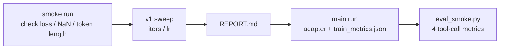

# `agent_sft/train/` — Phase 3+ LoRA training

This encapsulates MLX-LM LoRA/QLoRA training. v1 uses Qwen2.5-7B 4-bit to run through the complete closed loop; currently it has been switched to `mlx-community/Qwen3.5-9B-4bit` by default, and there are also v1.6 bf16 clean-data main training results. The goal remains the same: reduce `require_tool` nudge-fire rate.

## Version quick check

|Version|Default Base|Training Data|Status|Primary Evidence|
|---|---|---|---|---|
|v1|`mlx-community/Qwen2.5-7B-Instruct-4bit`|`train_7b_1k.jsonl` / `val_7b_1k.jsonl`|History closed|[`runs/sweeps/`](runs/sweeps/) + [`DECISIONS §9`](../DECISIONS.md)|
|v1.5|`mlx-community/Qwen3.5-9B-4bit`|`train_qwen3.jsonl` / `val_qwen3.jsonl`|Retraining completed|[`DECISIONS §10`](../DECISIONS.md)|
|v1.6|`mlx-community/Qwen3.5-9B-bf16`|`train_qwen3_clean.jsonl` / `val_qwen3_clean.jsonl`|clean-data retraining completed|[`DECISIONS §11`](../DECISIONS.md)|

## One-line process



> v1 originally planned to scan 4 dimensions (iters / lr / layers / rank), but actually only scanned iters / lr: fast proxy is already 100% in the baseline configuration, and the amount of information continued to be scanned is low. The measured gap in Phase 5 is closed by 57.3%, and no retrace condition is triggered ([`DECISIONS §5`](../DECISIONS.md), [`§9`](../DECISIONS.md)). After the migration of qwen3.5, priority is given to solving data cleaning, NaN, and GGUF deploy instead of continuing to expand sweep.

## File list

|Documents|Responsibilities|
|---|---|
|`lora_config.yaml`|LoRA structure definition (rank/scale/dropout/target keys); CLI flag fields that cannot be passed|
|`train.py`|Single training thin wrapper: `mlx_lm.lora --train --mask-prompt ...` + log parsing + `train_metrics.json`|
|`eval_smoke.py`|After training, lightweight verification: val set generation → parsing `<tool_call>` block → 4 indicators → `eval_smoke.json`|
|`sweep.py`|controlled-variable method sweep: clone [`play/sft_hello/sweep.py`](../../sft_hello/sweep.py) skeleton, up to 4 dim × 3-4 values ​​(v1 only runs iters/lr), produces `runs/sweeps/REPORT.md`|
|`runs/sweeps/`|v1 sweep experimental evidence (tracked, ~150 KB metadata + `iters/200/adapters.safetensors` 22 MB is v1 adapter body)|
|`runs/<Other>`|One-time/smoke/overnight main run product (gitignored; see the local run directory and ADR number for qwen3 main training results)|

## Industry alignment

|Dimensions|Configuration of this directory|Alignment|
|---|---|---|
|Data schema|OpenAI `tool_calls` + top-level `tools`; Qwen2.5 uses JSON string, Qwen3.5 uses dict arguments|xLAM / ToolACE / Hermes-Function-Calling / [MLX-LM `tools` format](https://github.com/ml-explore/mlx-lm/blob/main/mlx_lm/LORA.md)|
|loss masking|`--mask-prompt` (assistant-only loss)|Only let the model learn the assistant tool-call output, and the prompt will not enter loss|
|LoRA target keys|q/k/v/o full attention proj|Hermes-Function-Calling V3 / Watt-Tool actual configuration|
|Base|The current default is `mlx-community/Qwen3.5-9B-4bit`; v1.6 uses bf16|Follow the warehouse qwen3.x by default; 48GB relies on batch=1 / grad checkpoint to run stably|
|adapter products|HF safetensors|MLX-LM default; fully TRL/Unsloth compatible ([`DECISIONS §2`](../DECISIONS.md) Portability Statement)|

## Starting command

```bash
# Install training dependencies
pip install -r ../requirements.txt

# 1. smoke: verify pipeline; loss drops + tool_call_emit_rate sane
python train.py \
  --data ../data/triples/ --train-file train_qwen3_clean.jsonl --valid-file val_qwen3_clean.jsonl \
  --model mlx-community/Qwen3.5-9B-4bit \
  --iters 100 --batch-size 1 --learning-rate 1e-4 --num-layers 4 \
  --grad-checkpoint --max-seq-length 1500 --clear-cache-threshold 1 \
  --adapter-path runs/smoke

python eval_smoke.py --adapter-path runs/smoke --valid-file ../data/triples/val_qwen3_clean.jsonl

# 2. sweep: v1 actually runs only iters / lr (layers / rank deferred — see DECISIONS §5 / §9)
python sweep.py iters lr

# 3. Read report
$EDITOR runs/sweeps/REPORT.md
```

## Not within Phase 3 scope

|item|destination|
|---|---|
|`mlx_lm.fuse` / GGUF conversion / `ollama create`|[`deploy/`](../deploy/); current qwen3.5 GGUF path blocked|
|End-to-end nudge-fire-rate eval (agent_engine multiple rounds)|Phase 5 retest; `eval_smoke.py` just fast proxy|
|14B upgrade / DPO / on-policy distill|v2/v3 candidate, see [`README.md`](../README.md) for trigger conditions §v1/v2/v3|
