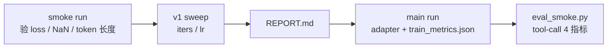

# `agent_sft/train/` — Phase 3+ LoRA 训练

这里封装 MLX-LM LoRA / QLoRA 训练。v1 用 Qwen2.5-7B 4-bit 跑通完整闭环；当前默认已切到 `mlx-community/Qwen3.5-9B-4bit`，另有 v1.6 bf16 clean-data 主训结果。目标不变：降低 `require_tool` nudge-fire rate。

## 版本速查

|版本|默认底座|训练数据|状态|主要证据|
|---|---|---|---|---|
|v1|`mlx-community/Qwen2.5-7B-Instruct-4bit`|`train_7b_1k.jsonl` / `val_7b_1k.jsonl`|历史结案|[`runs/sweeps/`](runs/sweeps/) + [`DECISIONS §9`](../DECISIONS.md)|
|v1.5|`mlx-community/Qwen3.5-9B-4bit`|`train_qwen3.jsonl` / `val_qwen3.jsonl`|重训完成|[`DECISIONS §10`](../DECISIONS.md)|
|v1.6|`mlx-community/Qwen3.5-9B-bf16`|`train_qwen3_clean.jsonl` / `val_qwen3_clean.jsonl`|clean-data 重训完成|[`DECISIONS §11`](../DECISIONS.md)|

## 一行流程



> v1 原计划扫 4 个维度（iters / lr / layers / rank），实际只扫 iters / lr：fast proxy 在 baseline 配置上已经 100%，继续扫信息量低。Phase 5 实测 gap 关闭 57.3%，没有触发回扫条件（[`DECISIONS §5`](../DECISIONS.md)、[`§9`](../DECISIONS.md)）。qwen3.5 迁移后优先解决数据清洗、NaN、GGUF deploy，而不是继续扩大 sweep。

## 文件清单

|文件|职责|
|---|---|
|`lora_config.yaml`|LoRA 结构定义（rank / scale / dropout / target keys）；CLI flag 不能传的字段|
|`train.py`|单次训练 thin wrapper：`mlx_lm.lora --train --mask-prompt ...` + log 解析 + `train_metrics.json`|
|`eval_smoke.py`|训完轻量验证：val set 生成 → 解析 `<tool_call>` 块 → 4 项指标 → `eval_smoke.json`|
|`sweep.py`|控制变量法 sweep：克隆 [`play/sft_hello/sweep.py`](../../sft_hello/sweep.py) 骨架，最多 4 dim × 3-4 值（v1 仅跑 iters / lr），产 `runs/sweeps/REPORT.md`|
|`runs/sweeps/`|v1 sweep 实验证据（tracked，~150 KB metadata + `iters/200/adapters.safetensors` 22 MB 是 v1 adapter 本体）|
|`runs/<其他>`|一次性 / smoke / overnight 主跑产物（gitignored；qwen3 主训结果见本地 run 目录与 ADR 数字）|

## 行业对位

|维度|本目录配置|对位|
|---|---|---|
|数据 schema|OpenAI `tool_calls` + 顶层 `tools`；Qwen2.5 用 JSON string，Qwen3.5 用 dict arguments|xLAM / ToolACE / Hermes-Function-Calling / [MLX-LM `tools` format](https://github.com/ml-explore/mlx-lm/blob/main/mlx_lm/LORA.md)|
|loss masking|`--mask-prompt`（assistant-only loss）|只让模型学习 assistant tool-call 输出，prompt 不进 loss|
|LoRA target keys|q/k/v/o 全 attention proj|Hermes-Function-Calling V3 / Watt-Tool 实战配置|
|底座|当前默认 `mlx-community/Qwen3.5-9B-4bit`；v1.6 用 bf16|跟随仓库 qwen3.x 默认；48GB 下靠 batch=1 / grad checkpoint 稳定跑|
|adapter 产物|HF safetensors|MLX-LM 默认；TRL / Unsloth 全兼容（[`DECISIONS §2`](../DECISIONS.md) 可移植性声明）|

## 起步命令

```bash
# 装训练侧依赖
pip install -r ../requirements.txt

# 1. smoke：打通管线，验 loss 下降 + tool_call_emit_rate 不离谱
python train.py \
  --data ../data/triples/ --train-file train_qwen3_clean.jsonl --valid-file val_qwen3_clean.jsonl \
  --model mlx-community/Qwen3.5-9B-4bit \
  --iters 100 --batch-size 1 --learning-rate 1e-4 --num-layers 4 \
  --grad-checkpoint --max-seq-length 1500 --clear-cache-threshold 1 \
  --adapter-path runs/smoke

python eval_smoke.py --adapter-path runs/smoke --valid-file ../data/triples/val_qwen3_clean.jsonl

# 2. sweep：v1 实际只跑 iters / lr（layers / rank 推迟，触发条件见 DECISIONS §5 / §9）
python sweep.py iters lr

# 3. 看报告
$EDITOR runs/sweeps/REPORT.md
```

## 不在 Phase 3 范围

|项|去向|
|---|---|
|`mlx_lm.fuse` / GGUF 转换 / `ollama create`|[`deploy/`](../deploy/)；当前 qwen3.5 GGUF 路径 blocked|
|端到端 nudge-fire-rate eval（agent_engine 多轮）|Phase 5 复测；`eval_smoke.py` 只是 fast proxy|
|14B 升级 / DPO / on-policy distill|v2/v3 候选，触发条件见 [`README.md`](../README.md) §v1/v2/v3|
