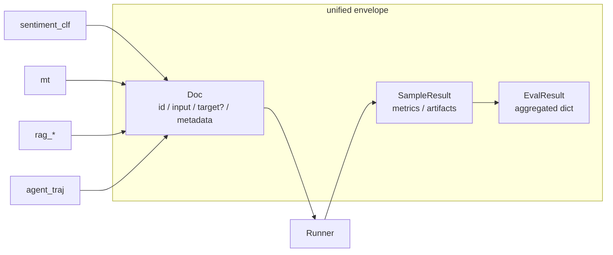
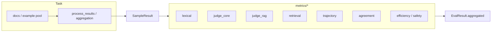
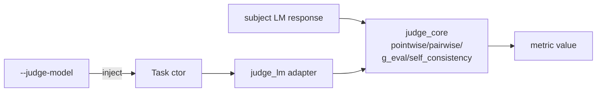
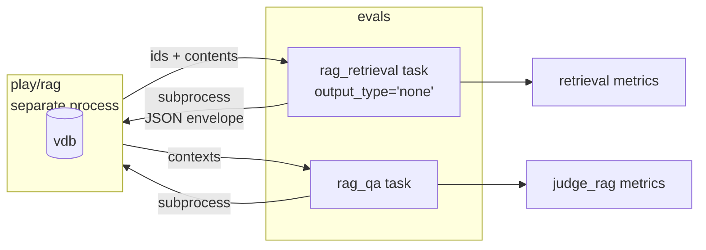
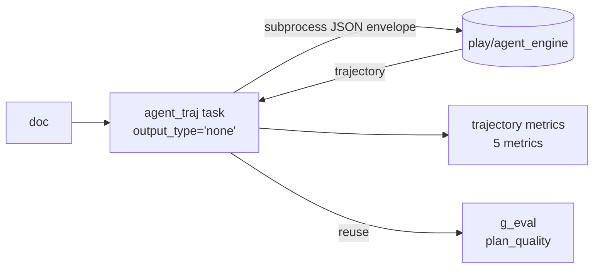
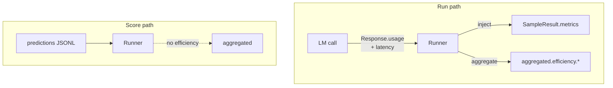
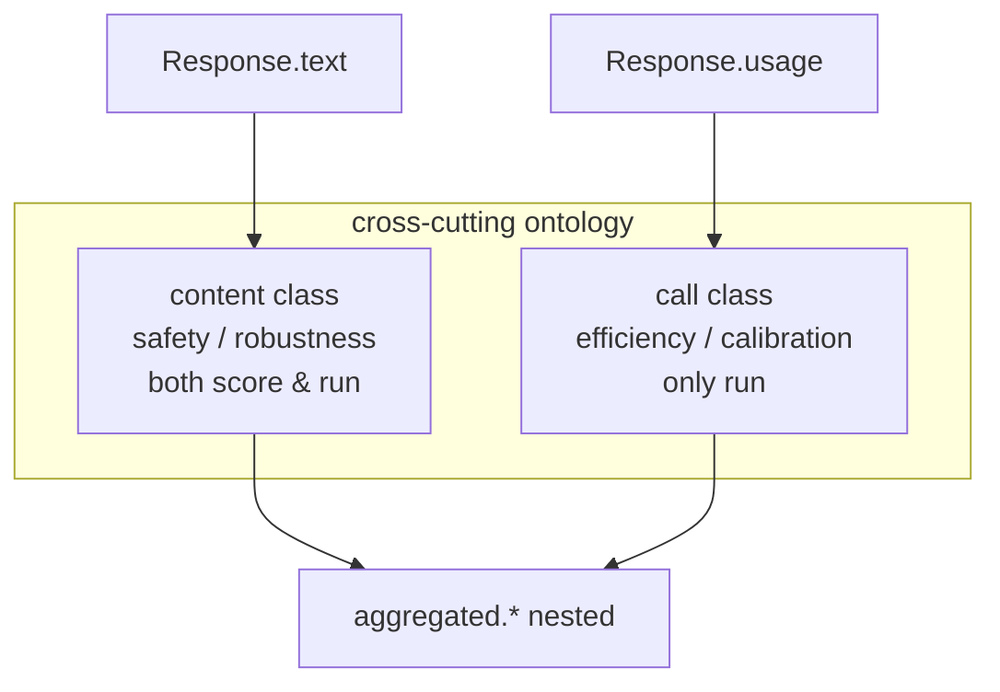
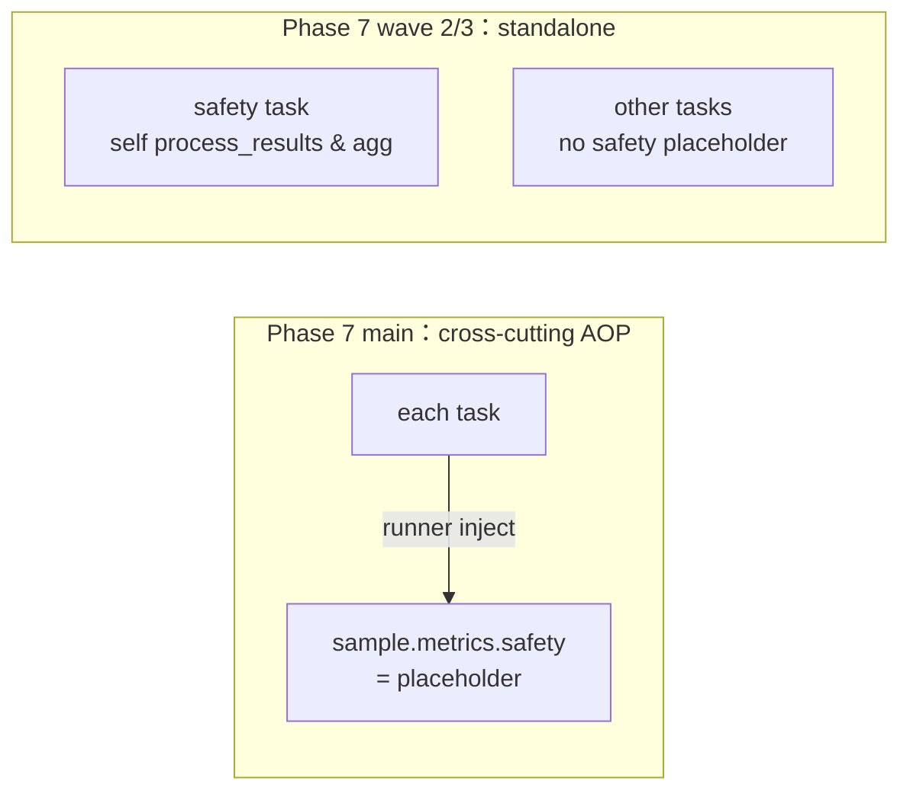
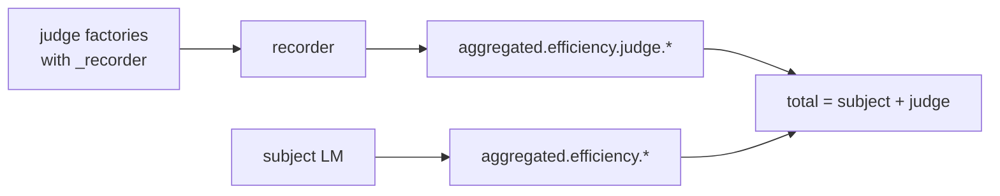
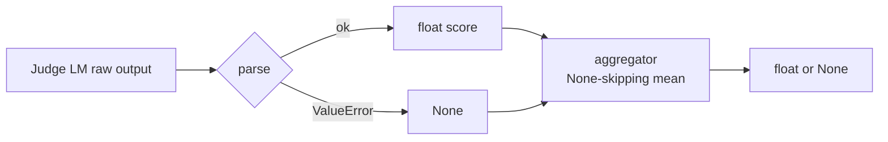

# Decisions

> Recording standards: Only retain decisions that have continued value for subsequent architecture evolution, evaluation reliability, cost management, and interview questions and answers.
> Deletion criteria: one-time troubleshooting process, implementation pipeline that can be restored directly from code/commit, and repeated supersession details.
> The date is based on git commit history.

## 1. Phase 1: The evaluation object uses a unified envelope contract (Doc/SampleResult/EvalResult)

- **Date**: 2026-05-02

### Context

`evals` also covers classification, generation, RAG, and Agent trajectory. If each type of task defines its own input and output, runner/metrics/storage will bifurcate linearly along the number of tasks, and the maintenance cost will be uncontrollable after several phases.

### Options considered

|Option|Description|Advantages|Risk/Cost|
|---|---|---|---|
|A. Customized structure for each task | Complete autonomy within the task | Quick to get started | Poor cross-task reuse, difficult to return |
|B. Unified envelope + task layer explanation|The underlying fields are stable and the tasks are semantically mapped|Reusable and auditable|Higher initial abstraction costs|

### Decision

Adopt **B**: `Doc` / `SampleResult` / `EvalResult` is the only runtime contract, and the task only does mapping and verification; all expansions in subsequent phases follow the method of "adding fields upwards and downwards without destroying the old parsing" (for example, in phase 4, relax `Doc.target` to `str | None` and add `SampleResult.artifacts`; in phase 6, `aggregated` relaxed to `dict[str, Any]`).

### Consequences

|Impact|Results|
|---|---|
|Extensibility|New tasks mainly change task/metric, and runner basically remains unchanged|
|Consistency|Cross-task indicators and log fields can be compared horizontally|
|Migration cost|Subsequent cross-project (such as `agent_engine`) docking is more stable|

### Example

|Scenario|How to deal with this decision|
|---|---|
|New `rag_retrieval` task|`Doc.target=None`, the results are hung in `SampleResult.artifacts`, and the runner is not changed|
|Access the `agent_engine` trajectory data|reuse the existing evaluation pipeline directly after mapping the envelope field|

### The interviewer may ask

|Question|Answer Points|
|---|---|
|Why not just set one per task? |It’s fast in the short term, but N sets of execution frameworks will be formed in the long term; a unified contract makes expansion costs controllable|
|Will unification sacrifice flexibility? |Flexibility is placed in the task interpretation layer (`load_prediction` / `process_docs`), not in the execution layer|

## 2. Phase 2: The evaluation architecture adopts "task producer + metric consumer"

- **Date**: 2026-05-02

### Context

Early implementations mixed "task logic + indicator calculation" together, making it awkward to do multiple indicators for the same task or the same indicator across tasks. The introduction of few-shot also requires the task to expose the example pool to the runner, and once again confirms that the responsibilities of "task" and "metric" must be separated.

### Options considered

|Option|Description|Advantages|Risk/Cost|
|---|---|---|---|
|A. Calculate indicators directly within the task | Centralized code | Fast development | Indicators are coupled tasks and cannot be combined |
|B. Tasks produce intermediate results, and indicators are consumed independently|Explicit middle layer|High reuse, easy to test|Need to stabilize the intermediate contract|

### Decision

Using **B**: the task only produces `SampleResult` (including `metrics` and `artifacts`), and the metrics are consumed as independent functions/modules; the few-shot assembly is handed over to the runner instead of the task itself.

### Consequences

|Impact|Results|
|---|---|
|Evolution efficiency|New indicators do not need to change the main task process|
|Quality Assurance|Indicators can be independently tested and regressed|
|Observability|Task output and indicator output can be troubleshooted separately|

### Example

|Scenario|How to deal with this decision|
|---|---|
|Add `bleu` to mt task|Only implement the metric and register it, without changing the mt task generation logic|
|Reuse the same metric into the rag task|Reuse the metric consumer and only align the task output fields|

### The interviewer may ask

|Question|Answer Points|
|---|---|
|Why emphasize the middle layer? |It is the boundary between reuse and testing, to avoid "changing tasks every time you add indicators"|
|Will it be over-designed? |In the multi-task evaluation platform scenario, this abstraction is necessary complexity, not a luxury |

## 3. Phase 3: LLM-as-judge is unified into adapter, judge_lm is injected through ctor

- **Date**: 2026-05-03

### Context

Judge indicators rely on multiple backend models, and the output is unstable (missing fields, wrong formats, empty tokens). If each judge directly adjusts the model, retry, parsing, and cost statistics will have multiple versions along different code paths.

### Options considered

|Option|Description|Advantages|Risk/Cost|
|---|---|---|---|
|A. Freely adjustable model for each indicator | Direct implementation | Flexible | Lots of repetitive logic, uncontrollable failure behavior |
|B. judge adapter unified encapsulation | Centralized management of calling, retrying, and parsing | High consistency, easy to replace | Adding a layer of abstraction |

### Decision

Using **B**: `metrics/judge_core.py` concentrates on 4 judge paradigms (pointwise / pairwise+swap / g_eval / self_consistency); judge_lm is injected through the task ctor, and score / run automatically reuses the same judge; no new ABC is introduced, and the Task signature is not destroyed.

### Consequences

|Impact|Results|
|---|---|
|Consistency|Different judge indicators share the same failure strategy and statistical caliber|
|Replaceability|The model backend switching has little change (phase 8 wave 4 has been used)|
|Operationability|Token / cost / latency collection is more standard (phase 6 / 7 wave 3 is directly continued)|

### Example

|Scenario|How to deal with this decision|
|---|---|
|Switch from `ollama` to cloud API|Mainly change the judge adapter and not change the indicator business logic|
|New retry strategy|Unified implementation in adapter, all judge indicators automatically inherited|

### The interviewer may ask

|Question|Answer Points|
|---|---|
|Why not adjust each indicator freely? |Free calling will lead to repeated repairs of similar problems in multiple places|
|Adapter’s core value? |Constrain LLM uncertainty to the boundary layer and maintain determinism in the business layer|

## 4. Phase 4: RAG is split into retrieval + grounding dual tasks; envelope expands artifacts / hooks along the way.

- **Date**: 2026-05-03

### Context

There are two root causes for RAG failure: failure to recall and misaligned generation. Giving only a total score will neither locate bottlenecks, nor will "retrieval improvement" and "generation improvement" obscure each other. At the same time, we must also solve: there is no string gold for retrieval tasks (empty strings are forced to pollute the semantics), the retrieval results are lists (scalar metrics cannot be inserted), and pure retrieval tasks should not be generated by LM.

### Options considered

|Option|Description|Advantages|Risk/Cost|
|---|---|---|---|
|A. Total score of a single RAG|Simple display|Intuitive to the outside|Poor diagnostic ability|
|B. retrieval/grounding layering|Root cause separation|Diagnosable and optimizable|Indicator interpretation is more complex|

### Decision

Adopt **B**: layered evaluation + envelope extension three-piece set: `Doc.target: str | None`, `SampleResult.artifacts: dict`, `output_type='none'` + `load_prediction` / `process_docs` hook; simultaneously establish the monorepo decoupling principle - evals does not directly import `play/rag`, but is connected through subprocess + JSON envelope.

### Consequences

|Impact|Results|
|---|---|
|Positioning speed|Can quickly determine "recall problem" or "alignment problem"|
|Optimize efficiency|Retrieval and generation can be iterated independently|
|Architecture by-product|The envelope three-piece set is directly reused by phase 5 with zero redesign|

### Example

|Scenario|How to deal with this decision|
|---|---|
|`retrieval_recall` is declining, `grounding` is stable|Prioritize the vector index and recall parameters|
|`retrieval` is stable, `grounding` is declining|Prioritize troubleshooting to generate prompt or answer constraint strategy|

### The interviewer may ask

|Question|Answer Points|
|---|---|
|Why not just look at the final accuracy rate? |The final accuracy rate cannot guide which layer to change|
|Why doesn't evals import rag directly? |Decoupling across sub-projects: keep import boundaries and use envelope across processes|

## 5. Phase 5: Agent evaluation "trajectory first, results supplemented", zero ABC changes

- **Date**: 2026-05-04

### Context

In the Agent scenario, "the answer is right" does not mean "the behavior can be put online". Furthermore, phase 4 already provides a three-piece set of `output_type='none'` + `process_docs` + envelope. If the agent evaluation further expands ABC, it will be overly abstract.

### Options considered

|Option|Description|Advantages|Risk/Cost|
|---|---|---|---|
|A. Only comment on final answer|Simple implementation|Intuitive display|Ignore behavioral risks|
|B. trajectory + final, reuse phase 4 three-piece set|No new ABC, zero runner changes|Consistent with phase 4 form|Teaching narrative is more complex|
|C. trajectory + final, introduce new ABC (such as `process_trajectory`) |More explicit structure|Excessive abstraction|High long-term maintenance cost|

### Decision

Using **B**: start `play/agent_engine` through subprocess, envelope writes back to `Doc.metadata.trajectory`; use closure factory on indicator side; `plan_quality` directly reuses `g_eval`, without repeating the implementation of LLM evaluation paradigm.

### Consequences

|Impact|Results|
|---|---|
|Risk Identification|Discover samples with "correct results but dangerous processes"|
|Stable architecture| ABC is not introduced separately for the agent, and the phase 4 form is reused|
|Cross-project collaboration|The docking form with `agent_engine` can be reused by other sub-projects in the future|

### Example

|Scenario|How to deal with this decision|
|---|---|
|The final answer is correct but a dangerous tool is called |The final indicator passes, and the trajectory risk indicator triggers an alarm|
|Wrong answer but close to correct trajectory |Retain process score for strategy fine-tuning rather than wholesale overturning|

### The interviewer may ask

|Question|Answer Points|
|---|---|
|Why evaluate the process? |Agent’s core value and risk lie in the process, not just in the final text|
|Why not introduce new ABC to agent? |Phase 4 has given a general form, and reuse is more reliable than re-abstraction|

## 6. Phase 6: Efficiency as cross-cutting, runner is automatically injected; run path is exclusive

- **Date**: 2026-05-04

### Context

Cost and delay are constraints for evaluation implementation. If each task is allowed to collect by itself, N sets of calibers will appear; if efficiency is also written in the score path, the score becomes a pseudo-indicator that can be forged without LM calls.

### Options considered

|Option|Description|Advantages|Risk/Cost|
|---|---|---|---|
|A. Collect tasks by yourself|Simple structure|Free implementation|Inconsistent caliber and unreliable bills|
|B. Full runner injection, including score path | Kanban unified | Implementation of light | score path has no LM call but also carries efficiency value, which is semantically wrong |
|C. runner injection + run path exclusive + three-tier organization | Complete information, consistent caliber | Medium implementation complexity | Need to clarify the sample / run / metric three-tier relationship |

### Decision

Using **C**: runner automatically injects per-sample latency / usage; `aggregated["efficiency"]` subgroup is only hung out in run mode; price list + cost calculation is concentrated in `metrics/efficiency.py`; CLI uses dot-path rendering.

### Consequences

|Impact|Results|
|---|---|
|Budget management|can be positioned step by step from global to single sample|
|Semantic honesty|Do not write efficiency in the score path to avoid the pseudo data of "there is a delay even if there is no call"|
|Subsequent expansion|The ontology bisection of phase 7 directly uses this as the prior|

### Example

|Scenario|How to deal with this decision|
|---|---|
|Run cost increases but average sample is stable|Locate a small number of metric-level calls to skyrocket, rather than overall degradation|
|p95 Deterioration of latency | First check the long tail of the sample, and then drill down to the specific metric call chain |

### The interviewer may ask

|Question|Answer Points|
|---|---|
|Why not let the task be done by yourself? |Self-collection of tasks will result in N sets of calibers, and the bills are not comparable|
Why doesn't the score path write efficiency? |Without LM calls, there is no real cost, and writing it out is fake data|

## 7. Phase 7: cross-cutting ontology uses content vs call dichotomy

- **Date**: 2026-05-05

### Context

After efficiency is launched in phase 6, safety will be launched in phase 7. Both are "cross-task", but of different nature: efficiency comes from the LM call by-product, safety comes from the content evaluation of `Response.text`. If the ontology is not clearly distinguished, there will be semantic mismatches such as "safety is forcibly injected into all tasks" / "efficiency is injected into the score path".

### Options considered

|Option|Description|Advantages|Risk/Cost|
|---|---|---|---|
|A. All cross-cutting, unified AOP|Unified form|Easy to make Kanban|Semantic distortion, phase 7 wave 2 actual measurement was overturned|
|B. Content class vs call class dichotomy|Classification by source|Explainable and manageable|Need to maintain naming conventions|

### Decision

Using **B**:

|class|Source|When collected|Representative indicators|
|---|---|---|---|
|content|`Response.text` derives |score and run both |safety / robustness|
|call|LM call by-product|only run|efficiency/calibration|

`SampleResult.metrics` is synchronously unified into nested form: `dict[str, float \| dict[str, float]]`.

### Consequences

|Impact|Results|
|---|---|
|Clear semantics|Do not write efficiency in the score path. It is no longer a "concession after the fact" but an "explicit principle"|
|Evolutionary|Clearly clear when robustness/calibration needs to be added later|
|Kanban design|nested morphology provides stable schema for CLI/reports|

### Example

|Scenario|How to deal with this decision|
|---|---|
|New robustness indicator|Hang to content class, score path can also be calculated|
|I want to add cost to the score path|It is directly rejected by ontology to avoid false data|

### The interviewer may ask

|Question|Answer Points|
|---|---|
|Why do ontology? |After the number of indicators increases, there must be a return rule, otherwise the naming will get out of control|
|Is two points enough? |Currently enough, you can expand sub-levels under quality if necessary|

## 8. Phase 7 wave 2/3: Safety returns to standalone task from cross-cutting AOP

- **Date**: 2026-05-05 (supersedes phase 7 §7.A “content class cross-cutting” injection part of the main principle; still retain the ontology bisection)

### Context

The phase 7 main commit injects safety as content class cross-cutting AOP into all tasks. The 7-stage real ollama live audit exposed two problems: non-safety tasks were forced to carry `metrics["safety"]={0,0}` placeholders, which polluted the sample output; safety semantics had different meanings in different tasks, and the unified scoring semantics across tasks was distorted.

### Options considered

|Option|Description|Advantages|Risk/Cost|
|---|---|---|---|
|A. Global cross-cutting AOP (old) | Unified display | Neat form | Semantic distortion, placeholder pollution |
|B. Add "Enable or Not" gate to AOP|Keep unified architecture|Controllable|The architecture has not changed, the problem is just postponement|
|C. Completely withdraw AOP, safety returns to standalone task|Consistent with lm-eval / HELM / inspect_ai mainstream | Interpretable, zero footprint | Need to rewrite the safety task side process_results / aggregation|

### Decision

Adopt **C**: delete `inject_per_sample_safety` / `safety_aggregated` / FOLD traits; safety tasks are managed by themselves `process_results` + `aggregation`; non-safety tasks no longer carry `metrics["safety"]` placeholders. The ontology dichotomy remains as a naming a priori for the new principle.

### Consequences

|Impact|Results|
|---|---|
|Data quality|sample.metrics no longer memorize heterogeneous placeholders|
|Governance cost|safety semantics iterates independently according to scenarios|
|External comparability|Alignment with mainstream methods of lm-eval/HELM/inspect_ai|

### Example

|Scenario|How to deal with this decision|
|---|---|
|A "low safety score" dispute arises in a summary task|Switch to the exclusive safety rules for this task to avoid misjudgment by using general rules|
|Customer service tasks need to add a new sensitive word strategy|Only update the safety task configuration and do not affect the main indicators of other tasks|

### The interviewer may ask

|Question|Answer Points|
|---|---|
|Why abandon unified crosscutting? |Unification is a means, not a goal; semantic correctness is given priority|
|Why not add gates to preserve AOP? |That just postpones the problem, it is still structurally wrong|

## 9. Phase 7 wave 3: Reserve the `efficiency.judge.*` subgroup and separate the judge overhead

- **Date**: 2026-05-05

### Context

The judge LM call is an evaluation-tool call, which has different semantics from the business call of the subject LM. Phase 6 mixes them together in `efficiency.*` for statistics, resulting in optimization that is often misguided ("the total cost increases" actually means that the judge becomes more expensive).

### Options considered

|Option|Description|Advantages|Risk/Cost|
|---|---|---|---|
|A. Merge into unified efficiency|Simple structure|Easy to read|Cannot distinguish cost sources|
|B. Separate `efficiency.judge.*` subgroups|Explicitly distinguish judge overhead|More accurate governance|Deeper indicator tree|

### Decision

Adopt **B**: Through the `closure recorder` protocol (judge factory exposes `_recorder`, self_consistency transparently transmits), all judge factories share the same recorder; the runner hangs out `aggregated["efficiency"]["judge"]` in both the score and run paths; the CLI fold protocol sinks to the nested layer.

### Consequences

|Impact|Results|
|---|---|
|Bill can be divided|`total = efficiency.cost_usd + efficiency.judge.cost_usd`|
|Optimize correctness|Avoid treating judge costs as business costs Optimization|
|Experimental design|The ROI evaluation of "whether to enable judge" can be done separately|

### Example

|Scenario|How to deal with this decision|
|---|---|
|Total costs increased by 20%|Let’s first see if `efficiency.judge.cost_usd` dominates growth|
|Suppress the budget but retain the main indicators|Reduce the frequency of judge calls first, and do not immediately reduce the business evaluation samples|

### The interviewer may ask

|Question|Answer Points|
|---|---|
|Why split the judge cost separately? |Otherwise the optimization will point to the wrong layer and the ROI judgment will be distorted|
|Can this attribute be optimized or is it a product decision? |Both: do technical layering first, then support product trade-offs|

## 10. Phase 8: IAA dual task (nominal + ordinal), zero ABC change reuse phase 4 form

- **Date**: 2026-05-05

### Context

Just looking at nominal kappa will be distorted under a skewed distribution (kappa paradox), and a single indicator cannot explain the true situation of model/annotation quality. But at the same time, the IAA task is also the temptation point of "whether to expand ABC again" (multiple raters look like a new data form).

### Options considered

|Option|Description|Advantages|Risk/Cost|
|---|---|---|---|
|A. Only nominal|Simple implementation|Low communication cost|Not robust under skewed distribution|
|B. nominal + ordinal dual paths, and expanded ABC to support multiple raters|The clearest structure|Excessive abstraction|One more layer of ABC maintenance costs|
|C. nominal + ordinal dual path, reuse phase 4 existing schema|Dual perspective + zero ABC changes|Compact implementation|Teaching narrative needs clear reading rules|

### Decision

Use **C**: predictions JSONL with one more column `raters: list`, reuse the `load_prediction` hook; the hand calculation of indicators is controlled in 4 formulas (`scott_pi` / `gwet_ac1` / `lins_ccc` / `icc_1_1`), and the rest of the libraries are directly transferred into task aggregation; no dependency expansion such as irrCAC / pingouin is introduced.

### Consequences

|Impact|Results|
|---|---|
|Statistical robustness|Can verify each other on skewed data to avoid misreading of single indicators|
|Stable architecture|API/Task ABC/runner/CLI does not change a single line|
|Teaching value|kappa paradox + ordinal rescue scene can be used as an anchor point for external explanations|

### Example

|Scenario|How to deal with this decision|
|---|---|
|`constant_majority` acc=0.9 on 90/10 data|Look at cohens_kappa=0, gwet_ac1≈0.89 simultaneously to avoid misjudgment that the model is "good"|
|`off_by_one` prediction|nominal kappa distortion, see quadratic kappa / pearson / ccc pocket|

### The interviewer may ask

|Question|Answer Points|
|---|---|
|Why not stick to a unified indicator? |A single indicator will mislead decision-making under complex distribution|
|Why not expand ABC to support multiple raters? |Phase 4 schema is enough, expanding ABC is just for neatness and neatness|

## 11. Phase 8 hardening: storage full amount `allow_nan=False`, task three-piece set

- **Date**: 2026-05-05

### Context

NaN/Inf will cause `json.dumps` to output `NaN` literals by default, and jq/browser/DB/dashboard consumption will be broken, and will pollute cross-run indexes such as `runs/index.jsonl`. Also sklearn / scipy / krippendorff will raise or return NaN on degenerate input (pos_label absent, unique<2, N<2).

### Options considered

|Option|Description|Advantages|Risk/Cost|
|---|---|---|---|
|A. Let NaN write to the disk naturally|Simple implementation|No error reporting|The result file is not legal JSON, and downstream consumption fails randomly|
|B. fail-loud: storage refuses NaN/Inf to write disk + short circuit of degraded path in task|problem exposed on the spot|reliable|task side needs to be supplemented with helper|

### Decision

Using **B**: `storage.py` three `json.dumps` all `allow_nan=False`; task internal complement `_pos_label_present` / `_nan_to_zero` / unique<2 short circuit / N<2 short circuit; `--limit 0/1/2` Degenerate path lock return.

### Consequences

|Impact|Results|
|---|---|
|Result reliability|`runs/<id>/*.json` and `index.jsonl` are always valid JSON|
|Failure can be located|NaN will no longer propagate silently, and an error will be reported immediately|
|Stable across environments|Small limit/boundary data no longer crashes the entire round of evaluate|

### Example

|Scenario|How to deal with this decision|
|---|---|
|Future new tasks miss NaN|`storage.save()` immediately raise ValueError instead of polluting the index|
|jq reads result.json|Strictly legal JSON, the tool chain is not broken|

### The interviewer may ask

|Question|Answer Points|
|---|---|
|Why not let NaN pass by default? |The JSON standard does not allow NaN literals, and downstream consumption will randomly break|
|Is this overly defensive? |This is a contract boundary check, much cheaper than troubleshooting after the fact|

## 12. Phase 8 wave 3: OOV / invalid prediction enters explicit data contract

- **Date**: 2026-05-05

### Context

sklearn `cohen_kappa_score(..., labels=[1..5])` will silently drop OOV predictions, resulting in false `cohens_kappa=1.0` for mixed-invalid runs. If abnormal predictions are not expressed explicitly, the evaluation results are in a dangerous state of "looking stable but actually being swallowed up".

### Options considered

|Option|Description|Advantages|Risk/Cost|
|---|---|---|---|
|A. Implicit ignoring|Simple implementation|Clean reports|Poor auditability and distorted results|
|B. Explicit `_pred_invalid: bool` artifact + valid subset filter|Clear contract|Traceable and interpretable|Kanban needs and reads two numbers|

### Decision

Use **B**: Write `_pred_invalid: bool` in `SampleResult.artifacts`, and only look at the valid subset for OOV-sensitive indicators; accuracy / confusion_matrix / multi-rater are still counted according to the full amount, and N is stable to retain the teaching narrative; CLI displays the main score and invalid proportion at the same time.

### Consequences

|Impact|Results|
|---|---|
|Credibility|Evaluation scores and abnormal sample proportions can be explained simultaneously|
|Governance capabilities|Can develop special repairs for abnormal distribution|
|Auditability|Boundary sample processing process traceability|

### Example

|Scenario|How to deal with this decision|
|---|---|
| OOV skyrocketed after the new model was launched | Prioritize label mapping and output specifications instead of just looking at the main score |
|The main score remains the same but invalid increases|Determined as a quality risk and prevented from going online directly|

### The interviewer may ask

|Question|Answer Points|
|---|---|
|Why not filter out outliers? |Filtering will beautify the results but lose authenticity|
|How to avoid abnormal samples from dominating conclusions? |Hierarchical display: main score + abnormal proportion and read|

## 13. Phase 8 wave 4 E1: Judge closure parsing failed → `None` propagation

- **Date**: 2026-05-05

### Context

Phase 1-8 The full real LM test triggers `ValueError` in the `agent_traj` score+judge garbage.jsonl path: `parse_pointwise_score` is raised when the LM output has no int, and the two closures of judge_pointwise / g_eval are not captured, and ~140s of workload is lost. This behavior conflicts with the "None vs 0 semantic separation" principle established by phase 7 wave 2.

### Options considered

|Option|Description|Advantages|Risk/Cost|
|---|---|---|---|
|A. fail-fast throws an exception | Errors are exposed quickly | Troubleshooting is intuitive | The usability of the whole round of evaluation is poor |
|B. Failure propagation is `None` + warning|The main process can continue to run|High robustness|The type of `SampleResult.metrics` needs to be relaxed to `float \| None`|

### Decision

Using **B**: Judge closure layer `try/except ValueError → None`; aggregator naturally filters None and returns None when all is empty; expands in the same shape as phase 7 wave 2 P2 (from "slice is empty" to "parsing failed").

### Consequences

|Impact|Results|
|---|---|
|Availability|Single point parsing failure no longer interrupts the entire run|
|Explainability|warning + None can still locate the cause of the failure|
|Data Contract|Downstream statistics must handle missing values ​​explicitly|

### Example

|Scenario|How to deal with this decision|
|---|---|
|The judge output is missing the expected JSON field|The sample indicator = `None`, run continues, warning record|
|5% sample parsing failed in batch evaluation|aggregator returns effective mean and independently exposes `null_rate`|

### The interviewer may ask

|Question|Answer Points|
|---|---|
|Why not fail-fast? |The evaluation platform gives priority to ensuring that the entire round of signals is complete, and then performs auditable downgrades for partial failures|
|Will it hide the problem? |No, both warning and None are logged explicitly|

## 14. Phase 8 wave 4 E2: Explicit declaration of dependency boundaries (evals/requirements.txt overrides rag subprocess deps)

- **Date**: 2026-05-05

### Context

Phase 4's established monorepo decoupling principle is "Python import boundaries": evals not `from rag import ...`. But when evals calls `play/rag/query.py` through subprocess, the subprocess still needs chromadb / rank-bm25 / tokenizers / sentence-transformers. This is the "pip install boundary", which is orthogonal to the "import boundary" and should not be confused.

### Options considered

|Option|Description|Advantages|Risk/Cost|
|---|---|---|---|
|A. Make the rag sub-process lazy import|It seems to reduce dependencies|Does not solve the problem (1.2GB cross-encoder is loaded when `_model()` is called for the first time, which is orthogonal to the import timing) |Two onboarding commands|
|B. evals/requirements.txt explicit override subprocess deps|0 lines of code changes|onboarding one pip install|two requirements short-term redundancy|

### Decision

Adopt **B**: Append 4 lines at the end of `evals/requirements.txt`; `rag/requirements.txt` is still the source of truth for independent usage of rag; extract `requirements/common.txt` when the trigger condition (third sub-project reuse) is met.

### Consequences

|Impact|Results|
|---|---|
|Reproducibility|fresh checkout can be run once installed|
|Architecture Contract|Python import boundary maintenance, pip install boundary management separately|
|Evolution path|Accept redundancy in the short term, and have clear trigger conditions for extracting public items in the long term|

### Example

|Scenario|How to deal with this decision|
|---|---|
|The development machine can run, but CI fails|First check whether `evals/requirements.txt` covers the sub-process dependencies|
|Add a third sub-project to reuse rag|Extract `requirements/common.txt`, the trigger condition has been explicitly registered|

### The interviewer may ask

|Question|Answer Points|
|---|---|
|Is this considered "documentation work"? |It is a basic project for reproducibility, not a pure document|
|Why put in ADR? |Dependency boundaries are long-term engineering decisions, not temporary fixes|

## 15. The right to interpret transcript / scenario is transferred to agent_engine (the evals counterpart of agent_engine §13)

- **Date**: 2026-05-11

### Context

After phase 5 is implemented, there is a set of private helpers on the evals side to reverse engineer the transcript / scenario schema of agent_engine:

| module | private helper | what to do |
|---|---|---|
| `metrics/nudge.py` | `_FRONTMATTER_RE` / `_split_frontmatter` / `_resolve_who_to_agents` / `derive_expected_turns` / `split_turns` / `_split_attempts` / `_attempt_called_required` / `_attempt_called_any_tool` | scenario YAML → `[{turn_idx, agent, step_id, tool}, ...]`；transcript → segments → attempts |
| `tasks/agent_traj.py` | `_extract_tool_calls` / `_extract_decision` | transcript → `[{tool, caller, arguments}, ...]`；finalize args → decision str |

These functions are mirror images of `agent_engine.scenario._expand_steps` / `Discussion._resolve_who` / artifact_event / tool_call / finalize_artifact - changing the schema requires changing the evals as well. At the same time [`play/agent_sft/data/extractor.py`] simply `sys.path.insert + from evals.metrics.nudge import _4_private_function`, turning the private side into a de facto cross-project interface.

### Options considered

| Items | Practices | Trade-offs |
|---|---|---|
| A. Current situation | Each project reverse-engineers the schema | Schema changes → Three changes + agent_sft anti-pattern continues |
| **B. Take back interpretation rights to agent_engine, evals direct connection** (select) | `agent_engine.Result` / `Scenario` expose typed view (agent_engine §13); evals through new [`_ae_bridge.py`] in-process import | One schema = one interpretation; evals public signature (`compute_nudge_fire_rate / classify_failure_mode / FAILURE_MODES / nudge_fire_rate_metric / derive_expected_turns / _pin_trajectory / load_prediction`) Zero Breakage |
| C. Let agent_engine provide plain function helper module | Functional style is lighter | New module for each new view; rejected by agent_engine §13 option B vs C argument |

### Decision

**B**——After [`agent_engine §13`](../agent_engine/DECISIONS.md) is implemented, the evals side will be cleaned up:

| Moving point | Practice |
|---|---|
| `_ae_bridge.py` | Concentrate `sys.path.insert(play_dir)` + `from agent_engine import Result, Scenario, ToolCall, TurnView, ExpandedTurn`; each metric / task module directly imports the alias here |
| `metrics/nudge.py` | Delete `_FRONTMATTER_RE / _split_frontmatter / _resolve_who_to_agents / split_turns / _split_attempts / _attempt_called_required / _attempt_called_any_tool`; `derive_expected_turns` internally `Scenario.expanded_turns()`; `compute_nudge_fire_rate` internally `Result.turns()` + `TurnView.attempts()`; `classify_failure_mode` Inline "whether any tool has been adjusted" into 5 lines |
| `tasks/agent_traj.py` | Remove `_extract_tool_calls / _extract_decision`; `_pin_trajectory` inline `Result.from_dict + .tool_calls() + .find_finalize_decision()` |
| `tests/test_nudge_metric.py` | Delete `test_split_turns_*` (2 items); the other 11 items remain unchanged (compute_nudge_fire_rate public side remains unchanged); `split_turns` is removed from the import list |
| `tests/test_agent_traj_envelope.py` | Delete `test_extract_tool_calls_*` (4 items) + `test_extract_decision_*` (3 items); keep envelope schema homology + `_pin_trajectory` + `load_prediction` test; old `sys.path.insert` try/finally black magic replaced with `from evals._ae_bridge import Result` |
| Cross-project import health | `play/agent_sft` Delete the `sys.path.insert + from evals.metrics.nudge import _4_private` anti-pattern at the same time and change the direct connection to `from agent_engine import Result, Scenario, TurnView`; only retain `from evals.metrics.nudge import classify_failure_mode` (legal public side) |

Equivalent coverage after PR-2 is implemented:

| old evals test → new attribution |
|---|
| `test_split_turns_*` (2) → `agent_engine/tests/test_result_views.py::test_turns_*` |
| `test_extract_tool_calls_*` (4) → `agent_engine/tests/test_result_views.py::test_tool_calls_*` |
| `test_extract_decision_*` (3) → `agent_engine/tests/test_result_views.py::test_find_finalize_decision_*` |

### Consequences

| Impact | Results |
|---|---|
| Schema single source | agent_engine change transcript / scenario schema → Just change one place in the evaluation, not three places chase |
| Public face discipline | evals are still `compute_nudge_fire_rate / derive_expected_turns / nudge_fire_rate_metric / classify_failure_mode / FAILURE_MODES / AgentTraj` public face; downstream agent_sft only relies on `classify_failure_mode` (vs historical 4 private faces) |
| test size | evals 465 → 456 (-9 equivalent coverage migrated to agent_engine 36 test), agent_sft 89 flat, agent_engine 0 → 36 (PR-1 new) |
| Evolution-friendly | `agent_engine.Result` adds new fields / new views are automatically synchronized; the evals measurement layer only cares about `turns()` / `tool_calls()` / `find_finalize_decision()` three typed interfaces |
| Cross-project contract monitoring | `tests/test_agent_traj_envelope.py::test_envelope_field_names_match_result_dataclass` is still a single assertion point - agent_engine changed fields are visible in CI for the first time |

### Example

| Scenario | How to deal with this decision |
|---|---|
| agent_engine adds a new entry type to transcript (such as `system_event`) | Add to `agent_engine.Result.tool_calls()` specification; evals metrics are automatically received |
| Want to add `Result.tool_call_count_by_caller()` view | Add to `agent_engine.result.Result`; evals / agent_sft call it directly without copying |
| Want to add evals metric | `metrics/<name>.py` through `_ae_bridge` import `Result` / `Scenario`, no more sys.path black magic |

### The interviewer may ask

| Question | Answer Key |
|---|---|
| Why not provide plain function `agent_engine.transcript.tool_calls(transcript)` in agent_engine? | The OO style is aligned with OpenAI Agents SDK / Anthropic / inspect_ai; the view method is hung on the dataclass for better scalability; for details, see agent_engine §13 option comparison |
| Does schema evals measure become heavier after withdrawing agent_engine? | unchanged. The `Result` view method is an O(transcript) scan, which is the same overhead as evals itself split_turns; in-process import 0 subprocess overhead |
| Since the evaluation metrics are written by evals, why does the schema interpretation right lie with agent_engine? | Interpretation = "How to map entries in transcript to ToolCall" is part of the schema definition; evaluation = "How to calculate ToolCall sequence as F1" is the evaluation. The responsibilities of the two are orthogonal; this ADR completely returns the first category to agent_engine |

## 16. transcript schema typed upgrade + envelope `usage` consumption (the evals counterpart of agent_engine §14)

- **Status**: accepted (followed by [`agent_engine §14`](../agent_engine/DECISIONS.md))
- **Date**: 2026-05-11

### Context

[`agent_engine §14`](../agent_engine/DECISIONS.md) Upgrade `Result.transcript` from `list[dict]` to `list[TranscriptEntry]` (6 frozen dataclass typed union), `SpeakerEntry` is forced to have `type="speaker"`, `Result` adds `usage: list[TokenUsage]`, `Result.from_dict` is strict (missing fields directly raise `KeyError`). The evals side must consume the same envelope as the input of the two tasks of `agent_traj` / `nudge_fire_rate`:

| Old implementation | Problems |
|---|---|
| `metrics/nudge.py::compute_nudge_fire_rate(transcript)` Get `list[dict]` | `entry["type"]` / `entry.get("speaker")` String sniffing, change the schema and evals will follow the change |
| `metrics/trajectory.py` Same as above | Same as above |
| `tasks/agent_traj.py::_pin_trajectory(envelope)` Re-spell the dict field | The envelope field set assertion only locks the field name, not the value type; `usage` field is not detected even if it is missing |
| `tasks/nudge_fire_rate.py::_pin_envelope(envelope)` Same as above | Same as above |
| `evals/data/<task>/predictions/*.jsonl` test fixture without `type:"speaker"` / `usage: []` | `Result.from_dict` immediately after strictization `KeyError` |

### Options considered

| Items | Practices | Trade-offs |
|---|---|---|
| A. The evals side continues to eat `list[dict]`, and after solving the dataclass internally in `_pin_trajectory` / `_pin_envelope`, `dataclasses.asdict` returns dict | Consistent with the route of PR-1 §15 | dict sniffing still exists; schema changes must be pursued in both places |
| **B. Directly eat typed entry** (select) | `metrics/nudge.py` / `metrics/trajectory.py` internal `isinstance(e, SpeakerEntry/...)` is dispatched; envelope consumer first `Result.from_dict` takes the typed view and then takes the measurement | typed compile time error; schema changes one place and the evals view is automatically synchronized; `usage` field is in `_pin_trajectory` is also mirrored to doc.metadata |
| C. Write your own typed view for evals | Complete decoupling | Dual SoT, contradictory to §15 decision |

### Decision

**B**——The evals side is fully switched to typed access; envelope schema synchronization belt `usage`; test fixture / prediction JSONL one-time migration:

| Moving point | Practice |
|---|---|
| `_ae_bridge.py` | re-export `TokenUsage / TopicEntry / TurnEntry / SpeakerEntry / ToolCallEntry / ArtifactEventEntry / SummaryEntry` |
| `metrics/nudge.py::classify_failure_mode` | Formal parameters `first_attempt_events: list[TranscriptEntry]`; `isinstance(e, ArtifactEventEntry/ToolCallEntry)` Dispatch |
| `metrics/nudge.py::compute_nudge_fire_rate` | The formal parameter is changed from `transcript: list[dict]` to `envelope: dict`; the internal `Result.from_dict(envelope)` takes typed view, and the downstream is all typed |
| `metrics/nudge.py::nudge_fire_rate_metric` | doc.metadata takes the entire envelope of `trajectory` (no longer only takes the `transcript` subkey) |
| `metrics/trajectory.py::_score_speakers / predicate_speakers_covered` | `entry.get("type") == "speaker"` instead of `"speaker" in entry` (the task layer writes from `_pin_trajectory` to disk in dict form - see below) |
| `tasks/agent_traj.py::_pin_trajectory` | envelope 5 fields (`transcript / artifact / warnings / success / usage`) are strictly read; when constructing `doc.metadata["trajectory"]`, `Result.transcript` and `.usage` are flattened back to dict using `dataclasses.asdict` (the metric layer reads dict from `metadata`, across JSONL has the same shape after placement) |
| `tasks/agent_traj.py::load_prediction` | Strictly read 5 fields, if missing, `KeyError` |
| `tasks/nudge_fire_rate.py::_pin_envelope / load_prediction / process_results` | Same as above; `process_results` directly gives the trajectory dict taken out of doc.metadata to `compute_nudge_fire_rate(envelope)` |
| `models/agent_engine_run.py` documentation | envelope shape annotation plus `usage` field + description `transcript` element is a typed dataclass serialized dict |
| `evals/data/{agent_traj,nudge_fire_rate,...}/predictions/*.jsonl` × 46 files | One-time migration script injects `type:"speaker"` into speaker entry + `usage: []` into envelope; consistent with agent_engine §14 forward-only selection |
| `tests/test_agent_traj_envelope.py` / `test_nudge_metric.py` / `test_metrics_trajectory.py` etc. | Fixture uses typed entry helper instead (`SpeakerEntry / TurnEntry / ToolCallEntry / ArtifactEventEntry`) + `dataclasses.asdict` to drop envelope; envelope field collection assertion adds `usage` |

### Consequences

| Impact | Results |
|---|---|
| schema single source | agent_engine §14 Change entry / add fields → evals measurement layer is compatible without modification (typed dispatch is automatically received) |
| Test scale | evals is still 456. The test passed (fixture migration is a morphological change with equal coverage, neither increase nor decrease); the total of the three projects is 585 (agent_engine 42 / evals 456 / agent_sft 87) |
| Public side | `compute_nudge_fire_rate` formal parameter changed from `transcript: list[dict]` to `envelope: dict` - destructive, but evals is a terminal task rather than a long-term SDK, the caller only has `nudge_fire_rate_metric` in one place; the user has confirmed forward-only |
| envelope schema monitoring | `tests/test_agent_traj_envelope.py::test_envelope_field_names_match_result_dataclass` now locks `{transcript, artifact, warnings, success, usage}`——agent_engine adds field evals CI and fails immediately |
| `usage` consumption | Currently only `_pin_trajectory` is mirrored to metadata; subsequent `efficiency.py` can directly take typed `TokenUsage` from the envelope to calculate the cost, which is much more stable than stderr inversion (will be done in specific driving scenarios) |
| Old prediction JSONL | One-time migration script processing; no long-term compatible readers |

### Relation to §15 / §11 / agent_engine §14

| ADR | What is established |
|---|---|
| §11 | envelope SoT is a collection of dataclass fields of `Result` |
| §15 | transcript / scenario interpretation rights (`tool_calls / turns / expanded_turns`) live in agent_engine |
| §16 | The envelope field value itself (`TranscriptEntry` typed union + `TokenUsage`) also lives in the agent_engine; evals metric layer 100% typed consumption |

§11 → §15 → §16 is a three-layer tightening of the same chain: field name → field interpretation → field value type. All three are reverse-engineered from evals and handed back to the SoT of agent_engine.

## 17. History backward-compat legacy cleanup (cli alias / Namespace getattr / docstring wording)

- **Status**: accepted (follows §16; pure evals internal cleanup decoupled from schema transformation)
- **Date**: 2026-05-11

### Context

evals has evolved through a total of 8 phases from phase 1 → phase 8, and has accumulated some "evolution phase backward-compat traces" on the public surface (task / metric / EvalResult) - aliases / default values ​​/ wording left in order to prevent the expansion of phase N+1 from destroying the phase N caller. However, this warehouse has no external consumers, and the evolution of phase 5+ has made these traces pure cognitive noise rather than true compatibility support:

| Documentation | Current Status | Type |
|---|---|---|
| `cli.py:279-281` | `_build_task_with_optional_judge` is an alias of `_build_task_with_optional_deps`, only for phase 3 tests to use the old name | Really dead code |
| `cli.py:331` | `_should_fold_when_all_zero` docstring "Default True compatible with old dim" | Misleading wording ("old dim" no longer exists; currently "unregistered dim") |
| `cli.py:379` | `cmd_run` uses `getattr(args, "vdb", None)` "Compatible with old Namespace" | True support (`test_qa_open_live` hand-rolled Namespace without phase 4 RAG flag) |
| `runner.py:44` | `_load_predictions` docstring "Backward compatibility: default `Task.load_prediction` only takes `row['prediction']`" | Misleading wording (this is not compatible, this is the default behavior of Task ABC) |
| `api.py:143` | `EvalResult.num_fewshot=0` docstring "The default value ensures compatibility with old result.json deserialization" | Misleading wording (the default value is the minimally constructed form of the score path, not result.json compatible) |
| `tasks/base.py:104` | `aggregation()` docstring "Old tasks are still compatible with all floats (Optional is widening)" | Misleading wording (should be "It is also legal for subclasses to return pure floats") |
| `tests/test_api_contract_extension.py:38/79/139` | docstring recurring "backward compatibility base" language | Misleading language (these assertions are of the API contract itself, not compatibility support) |
| `tests/test_runner_task_hooks_compat.py:1` | Module docstring starts with "backward compatibility parity" | Misleading wording (actually locking Task ABC default hook, not compatibility) |
| `tests/test_cli_spec.py:67/363` | "Backward compatible with old spec" / "Compatible with old dim" wording | Misleading wording |

### Options considered

| Items | Practices | Trade-offs |
|---|---|---|
| A. Overall retention | 0 risk | Traces continue to mislead new readers; inconsistent with the "forward-only / explicit over implicit" project principle |
| **B. Divided into two categories: real code deletion; misleading wording rewritten** (selection) | Zero change in behavior + text consistent with reality | Public signature of one break (`_build_task_with_optional_judge` → `_build_task_with_optional_deps`), but only within evals + 1 test file |
| C. Overall rewrite README + DECISIONS to retell the narrative | Thoroughly done at one time | The workload is too large; the existing ADR should retain the "evolutionary history" as a decision-making timeline |

### Decision

**B**——Look at each item, and make different changes according to the three categories of "real dead code/real support/misleading wording":

| Documentation | Changes |
|---|---|
| `cli.py:279-281` | **Delete** `_build_task_with_optional_judge` alias 3 lines long (really dead code) |
| `cli.py:331` | **Rewritten** docstring: `Missing or unregistered → Default True Compatible with old dim` → `Unregistered dim → Default True (consistent with the default behavior of folding in phase 6 audit §1.7 - new cross-cutting dimensions must explicitly declare trait=False in their own modules if they want to exit folding)` |
| `cli.py:374-379` | `getattr(args, ..., default)` 4 changes to `args.x` for direct access; `tests/test_qa_open_live.py:93-97` Namespace construction adds 4 new fields (`vdb=None, retrieve_top_k=5, retrieve_mode="hybrid", rerank=False`), making "argparse the only source of Namespace" become a constraint rather than a suggestion |
| `runner.py:38-46` | **Rewrite** `_load_predictions` docstring: Change "Backward compatibility: Default Task.load_prediction only takes row['prediction']" to "`Task.load_prediction` The default implementation only takes `row['prediction']` - the minimum behavior of classification/translation tasks; when override, inject pipeline data in row into `doc.metadata` + Response" |
| `api.py:143` | **Rewritten** `EvalResult.num_fewshot=0` docstring: changed from "Default value ensures compatibility with old result.json deserialization" to "`= 0` defaults to score path construction to save fields" |
| `tasks/base.py:104` | **Rewritten** `aggregation()` docstring: from "Old tasks are still compatible with all floats (Optional is widening)" to "It is also legal for subclasses to return pure float (no untested scenarios) - Optional is just relaxing, not mandatory" |
| `tests/test_api_contract_extension.py:1, 38, 79, 139` | docstring Three "Backwards Compatibility Basics" → Describe what is actually locked (the schema does not lose fields when the schema is dropped / the minimum structure form / the nested form) |
| `tests/test_runner_task_hooks_compat.py:1` | Module docstring rewritten: from "backwards compatible parity" to "Task ABC default hook behavior lock" - the actual content (sentiment / mt default hook takes the score+run dual path) retained |
| `tests/test_cli_spec.py` | Synchronization: `_build_task_with_optional_judge` 3 places import / 3 test name call changed to `_build_task_with_optional_deps`; docstring wording cleanup |

### Consequences

| Impact | Results |
|---|---|
| Behavior change | 0 - The internal dispatch of `_build_task_with_optional_deps(qa_open, judge_model_spec="...")` is bytes the same as the original `_build_task_with_optional_judge(qa_open, "...")` |
| Public signature | One damage: `_build_task_with_optional_judge` was deleted; this warehouse has no external consumers, the caller only has one `tests/test_cli_spec.py`, which has been synchronized |
| Test scale | 456 test all green (already 456 in PR-1, PR-2 shape changes will not increase or decrease) |
| Cognitive noise | Significantly reduced - new readers will not be misled by "compatible with old X" when reading docstring Cognitive map |
| Evolution friendly | Upgrade - next time someone wants to add a new dim / new hook, they will not be tripped by the "compatibility" wording (the original wording will make people afraid to move) |

### Not in scope

| Item | Reasons for not moving |
|---|---|
| `run_fn=None` default of `tasks/agent_traj.py:32 / nudge_fire_rate.py:22 / rag_retrieval.py:25` | This is a run / score double hook design (task factory optionally injects retrieve_fn / run_fn), not backward-compat |
| `evals/runner.py:_build_request` NotImplementedError of non-`generate_until` | phase 1 placeholder, not a historical trace |
| `evals/cli.py::parse_model_spec` external provider NotImplementedError | phase 1 placeholder |
| `evals/models/base.py` loglikelihood NotImplementedError | phase 1 placeholder |
| `tests/test_runner_task_hooks_compat.py` file name | Renaming is a minute-level action but git history will lose blame; the module docstring has been rewritten to make it clear what is locked; next time someone grep "compat" finds this file and reads the docstring, he will know the original meaning |

### Relation to §15 / §16

| ADR | Nature |
|---|---|
| §15 | Transfer of schema interpretation rights (cross-project interface discipline) |
| §16 | Schema field values ​​are typed (cross-project interface form) |
| §17 | evals' own "evolution period backward-compat traces" cleanup (internal cognitive hygiene of the project) |

§15 + §16 are cross-project contract disciplines; §17 is the maintenance of narrative consistency within the project - the three were implemented at the same time (2026-05-11), but with different target domains, and each became an independent ADR.

## Non-target (continuously valid)

|item|description|
|---|---|
|Pursue a one-time perfect evaluation system|Prioritize scalability, diagnosability, and operability|
|Record implementation flow in ADR|ADR only retains high-leverage decisions and consequences|
|Sacrifice semantic accuracy for the sake of unification|Unification is the means, semantic correctness is the bottom line|
|Let a single score carry the entire truth|Preserve stratification and anomaly signals to avoid excessive compression of information|
