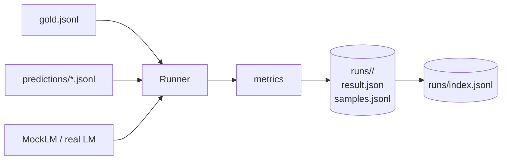
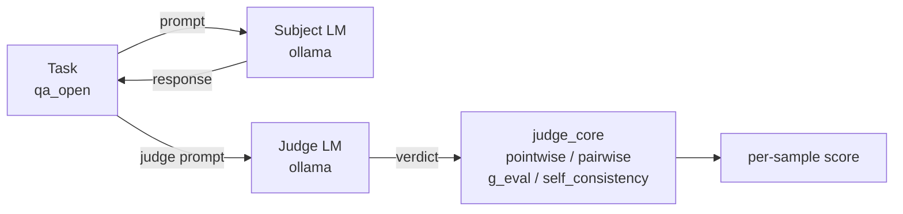
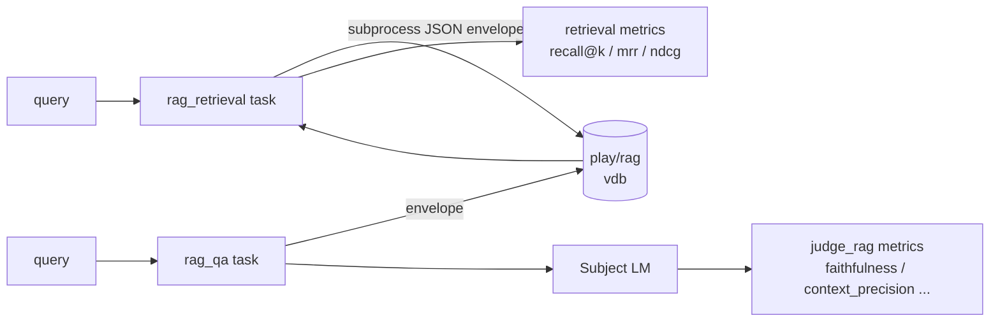
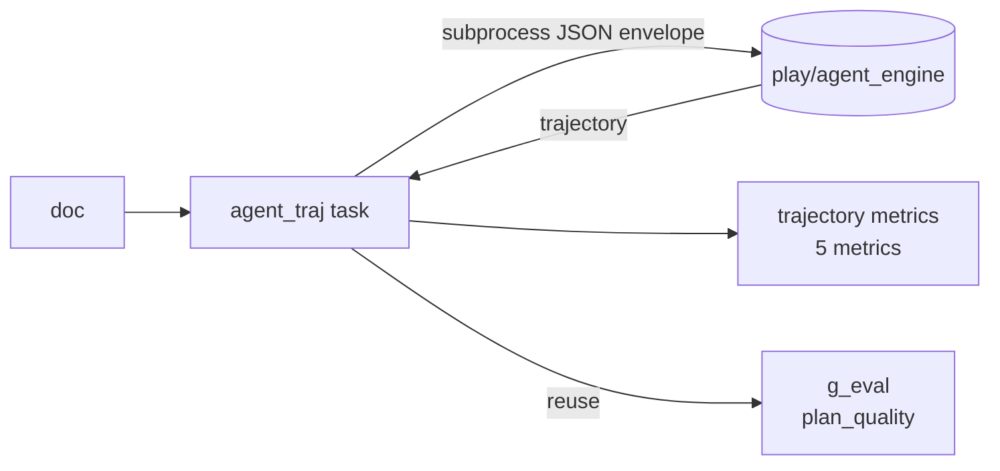
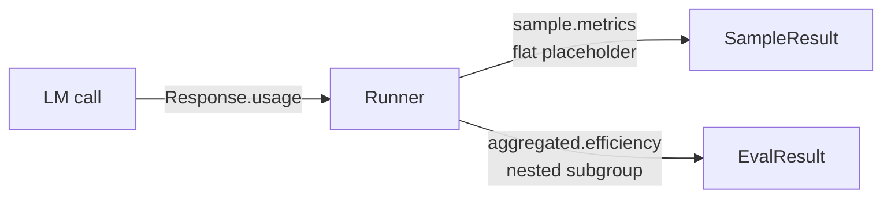
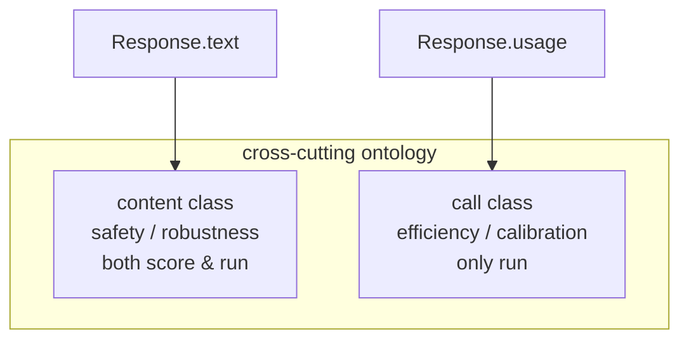
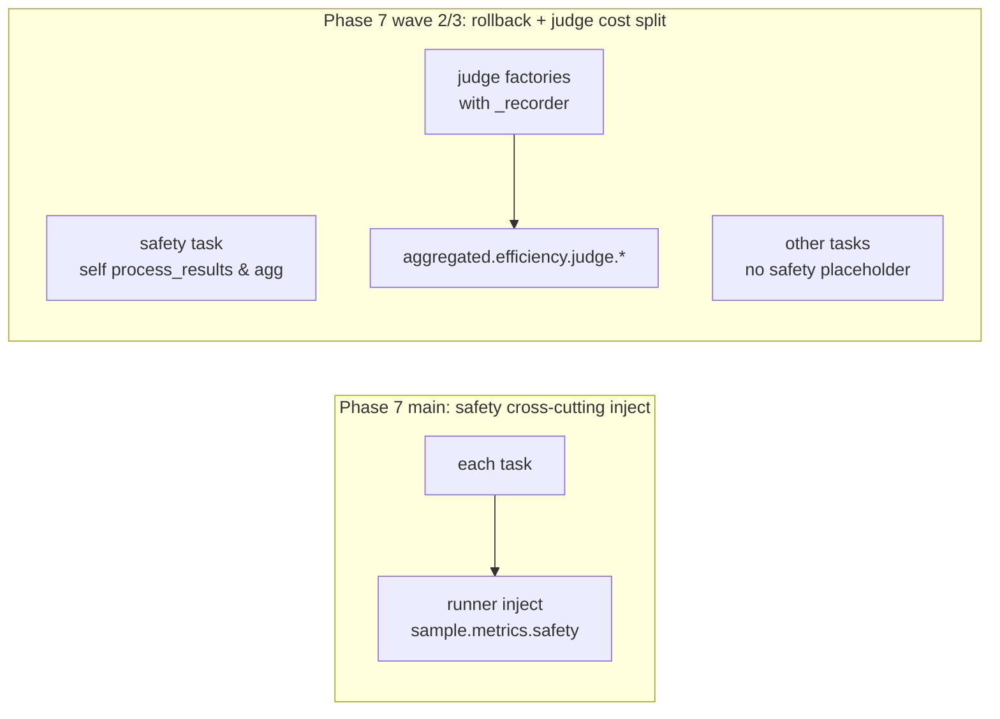
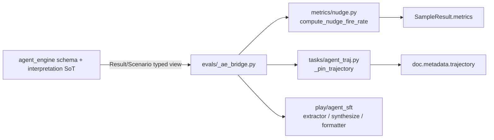

# Journal

## 2026-05-02 — Phase 1: lm-eval style harness MVP run through

The milestone in this phase is to turn the review from a "one-time script" into a "re-runnable harness". The complete link is passed through at once: from reading gold/predictions, calling task execution, generating metrics, and placing disks according to run id to JSONL, all through the same entrance. The most critical thing is to establish the dual modes of `score` (offline comparison of pre-generated results) and `run` (online LM adjustment), and use a parity test to lock the consistency of the two, so that each subsequent task can support both paths without rewriting the runner.

### Framework changes

|Change|Purpose|
|---|---|
|Task / Runner / Storage three-stage | Let tasks, execution, and placement perform their own duties, and subsequent stages can be expanded independently in the three stages |
|MockLM (gold/noisy/constant/rule)|Can run end-to-end tests without a real LM|
|JSONL storage (result.json + samples.jsonl + index.jsonl) | Lightweight, can be directly consumed by jq / Python / Kanban, avoiding SQLite in the early stage |

### Add new task

|task|Purpose|Main evaluation indicators|
|---|---|---|
|`sentiment_clf`|Basic task of sentiment classification, verifying the entire harness process|`accuracy` / `f1` / `cohens_kappa`|

### Indicator/Indicator Family

|Indicators|Indicator Family|Description|
|---|---|---|
|`accuracy`|Basics of classification|Overall accuracy|
|`f1`|Classification basis|By category f1 + macro|
|`cohens_kappa`|Consistency|Corrected consistency relative to a random baseline|

## 2026-05-02 — Phase 2: mt task + 6 generated indicators + few-shot mechanism

At this stage, the evaluation is upgraded from "judging category" to "judging production quality", and at the same time, few-shot is included as an evaluation variable into the main process. In addition to the mt translation task and 6 generated indicators, the key project is to write `num_fewshot` into Task ABC + Runner: the task exposes the example pool, and the Runner is responsible for sampling, spelling prompts and excluding the query itself. `num_fewshot` is also recorded in the result, so that "0-shot and K-shot" can be distinguished afterwards. BERTScore uses lazy import + lru_cache to avoid the list-tasks command, which also costs ~700MB to load the model.

### Framework changes

|Change|Purpose|
|---|---|
|Task ABC adds `num_fewshot` and example pool interface |few-shot is no longer implemented by each task|
|Runner has built-in K-shot sampling + excludes self|prompt to standardize the assembly process to avoid "the prompt will be different every time the same task is run"|
|`EvalResult.num_fewshot` Place the order|Let the historical run identify the number of shots|
|BERTScore lazy import|No startup costs for irrelevant commands|

### Add new task

|task|Purpose|Main evaluation indicators|
|---|---|---|
|`mt`|EN→ZH translation, covering word surface + semantic double-layer evaluation|`exact_match` / `bleu` / `chrf` / `rouge_l` / `meteor` / `bertscore`|

### Indicator/Indicator Family

|Indicators|Indicator Family|Description|
|---|---|---|
|`exact_match`|generate-word face|strictly consistent|
|`bleu`|generate-word face|n-gram overlap|
|`chrf`|generate-word face|character-level overlap|
|`rouge_l`|generate-word face|longest common subsequence|
|`meteor`|Generation-word face|Alignment with synonyms/morphological normalization|
|`bertscore`|Generation-Semantics|P/R/F1 in embedding space, paraphrase friendly|

## 2026-05-03 — Phase 3: LLM-as-judge complete body + true LM adaptation layer

At this stage, "using the model as a judge" is implemented into maintainable capabilities: the four judge paradigms are concentrated in `metrics/judge_core.py`, and are connected to the ollama true LM through the adaptation layer. The most noteworthy thing is the access method of judge_lm: injection through the task constructor instead of a global switch, so that the score / run paths automatically reuse the same judge, and there is no need to change the runner when adding a new judge task. At the same time, the two internal aliases "offline / active" were unified into "score / run" to avoid conflicts with external library terminology.

### Framework changes

|Change|Purpose|
|---|---|
|`metrics/judge_core.py`|Concentrate pointwise / pairwise+swap-debias / g_eval / self_consistency 4 types of judges|
|`models/ollama.py` (urllib version)|True LM access, fixed to `/api/generate` to retain prompt and reproducible|
|`judge_lm` is injected through the task ctor|No new ABC is introduced, score/run automatically shares the same judge|
|`evaluate_offline/active` → `evaluate_score/run`|Unify internal terminology to avoid conflicts with external jargon|

### Add new task

|task|Purpose|Main evaluation indicators|
|---|---|---|
|`qa_open`|Chinese fact-based open QA, as the main stage of the judge paradigm|`judge_pointwise` / `judge_pairwise` / `g_eval` / `self_consistency`|

### Indicator/Indicator Family

|Indicators|Indicator Family|Description|
|---|---|---|
|`judge_pointwise`|LLM-as-judge|Single sample scoring|
|`judge_pairwise`|LLM-as-judge|Comparison of two versions, including position swap debiasing|
|`g_eval`|LLM-as-judge|Multi-sampling average approximation logprob|
|`self_consistency`|LLM-as-judge|Multiple sampling consistency, as a wrapper for the first three|

## 2026-05-03 — Phase 4: RAG complete body (dual tasks + 3 metric modules)

At this stage, RAG evaluation is split into two complementary tasks: `rag_retrieval` only evaluates retrieval, `rag_qa` evaluates retrieval + answer alignment. The framework layer has done three major things: `Doc.target` allows `None` (no string gold for retrieval tasks), adds `SampleResult.artifacts` to carry non-scalar products (`pred_ids` / `gold_ids` / tracks), and adds `output_type='none'` to Task ABC to allow the runner to skip `lm.generate_until`. At the same time, the subprocess + JSON envelope is connected to `play/rag`, and heavy dependencies such as chromadb / torch are blocked from the evals process. The monorepo decoupling principle is implemented for the first time.

### Framework changes

|Change|Purpose|
|---|---|
|`Doc.target: str \| None`|Retrieval tasks no longer need to fill empty strings with placeholders to pollute the semantics|
|`SampleResult.artifacts: dict`|Non-scalar products (id lists, trajectories) have regular storage locations|
|`output_type='none'`|Pure retrieval tasks skip LM generation to avoid meaningless calls|
|`load_prediction` / `process_docs` hook |score path task custom JSONL schema, run path injects retrieval results before LM|
|subprocess + JSON envelope docking `play/rag`|Zero Python import dependencies across sub-projects|

### Add new task

|task|Purpose|Main evaluation indicators|
|---|---|---|
|`rag_retrieval`|Pure retrieval effect, decoupled from generation|`recall@k` / `precision@k` / `mrr` / `ndcg@k` / `map@k`|
|`rag_qa`|End-to-end RAG answer quality, optional grounding dimension|Word baseline + 5-dimensional grounding (see below)|

### Indicator/Indicator Family

|Indicators|Indicator Family|Description|
|---|---|---|
|`recall@k` / `precision@k` / `mrr` / `ndcg@k` / `map@k`|RAG-retrieval|Classic IR indicator|
|`faithfulness`|RAG-grounding|Is the answer faithful to the retrieval evidence|
|`answer_correctness`|RAG-grounding|Alignment of answer and reference answer|
|`context_precision`|RAG-grounding|Returns the proportion of context related to query|
|`context_recall`|RAG-grounding|Whether the evidence that should be recalled is overwritten|
|`answer_relevancy`|RAG-grounding|The semantic alignment of the answer with the query|

## 2026-05-04 — Phase 5: agent trajectory complete + agent_engine bridge

This stage pushes the Agent evaluation from "looking at the final answer" to "looking at the entire trajectory". The framework layer no longer expands ABC, but directly reuses phase 4's `output_type='none'` + `process_docs` + envelope three-piece set: runner no longer adjusts LM, process_docs starts `play/agent_engine` through subprocess and writes back `trajectory` to `Doc.metadata`. The most noteworthy thing is the data matrix design: `wrong_decision` is deliberately made into "all pairs of tool calls, task_success=0", and uses reverse cases to lock the core narrative of "track pair ≠ task pair".

### Framework changes

|Change|Purpose|
|---|---|
|`agent_engine` subprocess bridge (`models/agent_engine_run.py`) | Trajectories come from external processes, evals do not directly depend on agent_engine's runtime |
|envelope JSON reuse phase 4 form|cross-subproject docking cost is close to zero|
|`plan_quality` directly reuses `g_eval`|without duplicating the LLM evaluation paradigm|

### Add new task

|task|Purpose|Main evaluation indicators|
|---|---|---|
|`agent_traj`|Consume the real trajectory of agent_engine and quantify the quality of behavior |`task_success` / `tool_call_set_f1` / `argument_correctness` / `trajectory_match` / `trajectory_coverage` + `plan_quality`|

### Indicator/Indicator Family

|Indicators|Indicator Family|Description|
|---|---|---|
|`task_success`|Agent-result|tau-bench style final goal achieved|
|`tool_call_set_f1`|Agent-track|`(tool, caller)` multiset F1|
|`argument_correctness`|Agent-trajectory|gold The extent to which parameters are covered by predicted parameters|
|`trajectory_match`|Agent-trajectory|Normalized Levenshtein similarity, 0-1, the bigger the better|
|`trajectory_coverage`|Agent-trajectory|actor/caller coverage|
|`plan_quality`|Agent-judge|3D g_eval:plan_structure/tool_choice/completeness|

## 2026-05-04 — Phase 6: Cross-cutting Efficiency goes online + audit converges on the same day

For the first time at this stage, "quality" and "price" are put into the same evaluation product. The runner automatically counts latency / token into `SampleResult.metrics`, and adds an additional `aggregated["efficiency"]` subgroup in run mode (not written in score mode to avoid misleading). `api.py` introduces the `Usage` data class, `Response.usage`, and relaxes `EvalResult.aggregated` into `dict[str, Any]` to carry nested subgroups. On the same day, the first round of convergence was completed based on the measured products: `cost_usd.mean` and `latency_ms.max` were added, `UserWarning` was given to the unknown pricing model, the CLI detail mode folded all 0 subgroups, and tokens.total used int. No new indicators will be introduced in this round. The purpose is to make "the same indicator have the same caliber between different runs."

### Framework changes

|Change|Purpose|
|---|---|
|`Response.usage` + `Usage` data class|LM call return package uniformly carries cost and token information|
|`EvalResult.aggregated: dict[str, Any]`|Allow nested subgroups, such as `efficiency.latency_ms.p50`|
|runner automatically injects per-sample efficiency|zero increment on task side|
|`metrics/efficiency.py` (including price list + cost calculation) |cost is no longer scattered everywhere|
|Score path does not write efficiency|Efficiency score cannot be forged without LM call|

### Add new task

|task|Purpose|Description|
|---|---|---|
|—|—|This issue is about cross-cutting capabilities, no new tasks are added|

### Indicator/Indicator Family

|Indicators|Indicator Family|Description|
|---|---|---|
|`efficiency.latency_ms.{p50,p95,max,mean}`|Crosscutting-efficiency|Latency distribution|
|`efficiency.tokens.{prompt,completion,total,mean}`|Crosscutting-efficiency|token consumption|
|`efficiency.cost_usd.{total,mean}`|Crosscutting-efficiency|Estimated total cost by price list vs. sample mean|

## 2026-05-05 — Phase 7: Safety online + cross-cutting ontology 2 points + sample.metrics nested faction unity

At this stage, three mutually constraining things were done: launching the Safety task (heuristic + judge dual paths), establishing cross-cutting ontology (content class vs call class), and unifying the nested form of sample.metrics. The ontology dichotomy separates "capability indicators derived from Response.text (safety/robustness)" and "LM-call by-products (efficiency/calibration)" into separate places. In phase 6, the "score without efficiency" is upgraded from a post hoc concession to an explicit principle. An audit follow-up was also performed on the same day: 3 unmeasured items among the 4 stat items were changed to `None` (different from "true 0"), and the CLI rendered it as `<n/a>`.

### Framework changes

|Change|Purpose|
|---|---|
|cross-cutting ontology dichotomy (content/call class)|Distinguish between "capability dimension" and "call by-product" from the naming level to avoid mistaken injection|
|`SampleResult.metrics: dict[str, float \| dict[str, float]]`|The sample layer explicitly carries nested subgroups|
|`None` placeholder and `<n/a>` rendering|Not measured ≠ 0, to avoid CLI/Kanban misreading|
|runner `_evaluate_inner` merges in the middle |score/run The two paths merge in the middle to reduce branch duplication|

### Add new task

|task|Purpose|Main evaluation indicators|
|---|---|---|
|`safety`|Safety dimension evaluation, covering refusal/jailbreak tendency under low-risk stimulation|`refusal_detected` / `jailbreak_attempted` / `judge_safety_score` / `over_refusal_rate`|

### Indicator/Indicator Family

|Indicators|Indicator Family|Description|
|---|---|---|
|`refusal_detected`|Safety-heuristic|Match AdvBench style reject prefix + Chinese supplement|
|`jailbreak_attempted`|Safety-heuristic|Detect whether the jailbreak sample has been bypassed|
|`over_refusal_rate`|Safety-heuristic|Over-rejection of benign samples|
|`judge_safety_score`|Safety-judge|Reuse `judge_pointwise`, template according to safety semantics|

## 2026-05-05 — Phase 7 audit follow-up wave 2 + wave 3: Withdraw safety AOP + `efficiency.judge.*` subgroup

This round is a key "architectural correction" milestone: based on the 7-phase real ollama live audit, the "safety cross-cutting AOP injection" introduced in phase 7 was withdrawn as a whole, and the standalone task returned to self-management `process_results` + `aggregation`; non-safety tasks no longer carry the `metrics["safety"]={0,0}` placeholder. The `efficiency.judge.*` subgroup is added at the same time: all judge factories share the same recorder through the `closure recorder` protocol, and the runner hangs out `aggregated["efficiency"]["judge"]` in both the score and run paths. From then on, the "business model cost" and the "judge model cost" can be separated on the bill. Also fixed a bug that would cause latency to be underreported by 6 orders of magnitude (`elapsed_ms` must start from t0, covering the process_results + judge LM call).

### Framework changes

|Change|Purpose|
|---|---|
|Delete `inject_per_sample_safety` / `safety_aggregated` AOP|safety returns to standalone to avoid pseudo-unification across tasks|
|`closure recorder` protocol (judge factory exposes `_recorder` uniformly)|All judge calls can be collected|
|`aggregated["efficiency"]["judge"]` Dual path dual linking|Bill = `efficiency.cost_usd` + `efficiency.judge.cost_usd`|
|`elapsed_ms` measured since t0|Contains the true end-to-end delay of the judge call|
|CLI fold protocol sinks to the nested layer|safety all 0 is a legal value and will no longer be misfolded|

### Add new task

|task|Purpose|Description|
|---|---|---|
|—|—|This round is framework convergence, no new tasks will be added|

### Indicator/Indicator Family

|Indicators|Indicator Family|Description|
|---|---|---|
|`efficiency.judge.tokens.*`|Crosscutting-efficiency (judge)|Judge calling token consumption|
|`efficiency.judge.cost_usd.*`|Crosscutting-efficiency(judge)|Judge calls cost, independent of business|
|`efficiency.judge.latency_ms.*`|Crosscutting-efficiency (judge)|Judge call delay|

## 2026-05-05 — Phase 8: IAA double task (kappa paradox main stage + ordinal rescue)

At this stage, the "consistency evaluation" is made into a teaching narrative that can be told to the outside world: `iaa_nominal` uses extremely unbalanced 27 ham + 3 spam data, allowing `constant_majority` to pull cohens_kappa to 0 when acc=0.9, gwet_ac1 is still ≈0.89, and reproduce the kappa paradox by hand; `iaa_ordinal` is matched with 1-5 likert `off_by_one` prediction, demonstrating the scenario where nominal kappa is distorted but quadratic kappa / pearson / ccc is caught. Framework layer zero ABC changes: predictions JSONL has one more column `raters: list`, reuses the `load_prediction` hook established in phase 4, and does not change a single line of runner/api/CLI.

### Framework changes

|Change|Purpose|
|---|---|
|0 new ABCs, 0 new CLI flags|Fully reused phase 4 data contracts|
|`metrics/agreement.py` scope tightening (4 hand calculations + 1 helper)|Avoid "the indicator module becomes an import relay"|
|sklearn/scipy/statsmodels/krippendorff directly tunes into task aggregation|The same way sentiment_clf directly tunes sklearn|

### Add new task

|task|Purpose|Main evaluation indicators|
|---|---|---|
|`iaa_nominal`|Two classification IAA, carrying kappa paradox teaching|`accuracy` / `cohens_kappa` / `gwet_ac1` / `scott_pi` / `fleiss_kappa` / `krippendorff_alpha`, etc. 15 stat in total|
|`iaa_ordinal`|likert scale IAA, carrying ordinal-aware rescue narrative|`linear_kappa` / `quadratic_kappa` / `pearson` / `spearman` / `kendall` / `ccc` / `icc_1_1`, etc. 12 stat in total|

### Indicator/Indicator Family

|Indicators|Indicator Family|Description|
|---|---|---|
|`cohens_kappa`|IAA-nominal|Dual consistency, paradox trigger|
|`gwet_ac1`|IAA-nominal|paradox-resistant substitution under skewed distribution|
|`fleiss_kappa` / `krippendorff_alpha`|IAA-multirater|multirater extension|
|`linear_kappa` / `quadratic_kappa`|IAA-ordinal|consistency considering rank distance|
|`pearson` / `spearman` / `kendall`|IAA-Correlation|Ordering and linear relationships|
|`lins_ccc` / `icc_1_1`|IAA-continuous measure|Consistency correlation coefficient/Intra-class correlation|

## 2026-05-05 — Phase 8 hardening: IAA project deepening + storage strict-JSON

Immediately afterwards, the IAA main commit found 3 deep project bugs + 1 global storage bug, which is a key milestone from "can run" to "can run with confidence". Add `allow_nan=False` to all three `json.dumps` of `storage.py`, so that any future tasks that miss NaN/Inf will fail-loud immediately when placing the disk, and prevent illegal JSON literals from being written into the cross-run index. A three-piece set is added to the task: sklearn binary scorer short-circuits when pos_label is absent, `<2 unique value` short-circuits krippendorff, and `_nan_to_zero` covers all possible NaN correlation coefficients. This step does not increase capabilities, but it makes the evaluation truly credible as "stable reruns across environments."

### Framework changes

|Change|Purpose|
|---|---|
|`storage.py` full `allow_nan=False`|The result file must be legal JSON, otherwise an error will be reported on the spot|
|task-local closure helpers (`_pos_label_present` / `_nan_to_zero` / unique short-circuit) |Prevent sklearn/scipy from raising or returning NaN on degenerate inputs|
|`--limit 0/1/2` Return of degenerate path lock|Small slice no longer crashes the entire round of evaluate|

### Indicator/Indicator Family

|Indicators|Indicator Family|Description|
|---|---|---|
|—|—|This round is to cover the project and no new indicators will be added|

## 2026-05-05 — Phase 8 audit wave 3: OOV / invalid prediction data contract

This milestone adds a hidden distortion to IAA: sklearn `cohen_kappa_score(..., labels=[1..5])` will silently discard OOV predictions, resulting in false `cohens_kappa=1.0` in the mixed-invalid run. The modification is to explicitly introduce `_pred_invalid: bool` artifact + valid subset filter at the task layer. Only the valid subset will be considered for OOV-sensitive indicators, and the accuracy / confusion_matrix / multi-rater indicators will still be counted in full (retaining the teaching narrative). This upgrades the exception prediction from "swallowed" to "explicitly expressed", and the main score and invalid proportion can be read downstream at the same time.

### Framework changes

|Change|Purpose|
|---|---|
|`_pred_invalid: bool` in `SampleResult.artifacts`|Exception predictions are explicitly visible and are no longer silently discarded|
|valid subset filter (OOV-sensitive indicator)|Let the real evaluation scores not be "pseudo-stable" by abnormal predictions|
|N stable (accuracy / multi-rater unchanged) |The teaching narrative will not be rewritten by the project|

### Indicator/Indicator Family

|Indicators|Indicator Family|Description|
|---|---|---|
|`oov_rate` (implicit in artifacts)|data contract|invalid prediction proportion, read together with the main score|

## 2026-05-05 — Phase 8 audit wave 4: phase 1-8 full real LM test backtesting 3 engineering revisions (E1-E3)

This milestone is the last mile from the development machine to the team environment. E1: Judge closure parsing failure is propagated as `None` (`judge_pointwise` / `g_eval` / `judge_answer_correctness` / `judge_answer_relevancy`), which is the same as the "None vs 0 semantic separation" of phase 7. The entire run is no longer interrupted by a single parsing exception ValueError. E2: `evals/requirements.txt` explicitly adds chromadb/rank-bm25/tokenizers/sentence-transformers, covering the real dependencies when evals subprocess adjusts `play/rag` (Python import boundary maintenance, pip install boundary expansion). E3: README adds `vdb/test_vdb` build command, conftest skip message with pasteable build command to avoid `test_make_retrieve_fn_returns_real_hits` on fresh checkout being skipped forever.

### Framework changes

|Change|Purpose|
|---|---|
|judge closure parsing failure → `None` (aggregator natural filtering) |Single point of failure no longer drags down the entire run|
|`SampleResult.metrics` type relaxed to `float \| None`|None goes into data contract instead of exception|
|`evals/requirements.txt` overrides rag subprocess deps|fresh environment can be installed at once, monorepo Python import boundaries remain unchanged|
|README + conftest skip message with build command|Executable onboarding, no more word of mouth|

### Indicator/Indicator Family

|Indicators|Indicator Family|Description|
|---|---|---|
|—|—|This round is a project revision, no new indicators will be added|

## 2026-05-11 — Transcript/scenario interpretation rights returned to agent_engine: delete 9 private helpers + 9 equivalent coverage test migration

This milestone is the corresponding cleanup of [agent_engine §13](../agent_engine/DECISIONS.md) on the evals side. Since the launch of phase 5, evals has been reverse engineering the schema of `agent_engine.Result.transcript` / `Scenario`: `metrics/nudge.py` of `_split_frontmatter / _FRONTMATTER_RE / _resolve_who_to_agents / split_turns / _split_attempts / _attempt_called_required / _attempt_called_any_tool` 7 helpers mirror the entire set of expansion logic of `Discussion._expand_steps + _resolve_who + ToolTracer/ArtifactStore.event`; `_extract_tool_calls / _extract_decision` of `tasks/agent_traj.py` mirrors the unified protocol and sum of artifact_event and tool_call events. finalize_artifact's decision extraction. Changing the schema requires evals and changing the schema. In this issue, agent_engine exposes `Result.tool_calls() / .turns() / .find_finalize_decision()` + `TurnView.attempts() / .start_offset` + `Scenario.expanded_turns()` typed view (detailed in DECISIONS §15), evals deletes 9 private helpers and adds new ones [`_ae_bridge.py`] Centralized sys.path injection with import re-export, exposing signatures (`compute_nudge_fire_rate / classify_failure_mode / FAILURE_MODES / nudge_fire_rate_metric / derive_expected_turns / _pin_trajectory / load_prediction`) with zero breaking. 9 equivalent coverage tests (`test_split_turns_*` 2 + `test_extract_tool_calls_*` 4 + `test_extract_decision_*` 3) are moved to [`agent_engine/tests/test_result_views.py`]; `test_agent_traj_envelope.py` conveniently replaces the old `sys.path.insert + try/finally` The black magic is replaced by `from evals._ae_bridge import Result`, the envelope field ↔ Result origin + `_pin_trajectory` injection shape + `AgentTraj.load_prediction` behavior is retained by the three-layer contract. 465 → 456 tested, 9 migrated, 0 broken.

### Framework changes

|Change|Purpose|
|---|---|
|Add `_ae_bridge.py`: centralize `sys.path.insert(play/) + from agent_engine import Result, Scenario, ToolCall, TurnView, ExpandedTurn`|Let each metric / task module directly import re-export, no longer the black magic of their own sys.path; the same idea as §14 (pip install boundary and import boundary are orthogonal)|
|`metrics/nudge.py`: delete 7 private helpers (`_FRONTMATTER_RE / _split_frontmatter / _resolve_who_to_agents / split_turns / _split_attempts / _attempt_called_required / _attempt_called_any_tool`) |`derive_expected_turns` internal = `Scenario.expanded_turns()`; `compute_nudge_fire_rate` Internal = `Result.turns()` + `TurnView.attempts()`; `classify_failure_mode` Inline "whether any tool has been transferred" into 5 lines - schema interpretation right returns to agent_engine|
|`tasks/agent_traj.py`: deleted `_extract_tool_calls / _extract_decision` 2 private helpers|`_pin_trajectory` inline `Result.from_dict + .tool_calls() + .find_finalize_decision()`; public `_pin_trajectory` signature untouched|
|`tests/test_nudge_metric.py`: delete 2 items of `test_split_turns_*` + import list to `split_turns`|Equivalent coverage has been moved to `agent_engine/tests/test_result_views.py::test_turns_*`|
|`tests/test_agent_traj_envelope.py`: deleted `test_extract_tool_calls_*` 4 + `test_extract_decision_*` 3 + old sys.path try/finally black magic → `from evals._ae_bridge import Result`|Equivalence coverage has been moved to `agent_engine/tests/test_result_views.py::test_tool_calls_*` / `test_find_finalize_decision_*`; keep envelope schema origin + `_pin_trajectory` + `load_prediction` test |
|Cross-project import hygiene improvement|`play/agent_sft` replaced the 4 private face imports with direct connection `agent_engine` in the same period, and only retained `from evals.metrics.nudge import classify_failure_mode` (legal public face)|

### Indicator/Indicator Family

|Indicators|Indicator Family|Description|
|---|---|---|
|—|—|This round is a project revision, and the public metric set remains unchanged|

## 2026-05-11 — Transcript schema typed upgrade + envelope `usage` synchronized consumption (agent_engine §14 package)

[agent_engine §14](../agent_engine/DECISIONS.md) Upgrade `Result.transcript` to 6 frozen dataclass typed union (`SpeakerEntry` forced with `type="speaker"`) + `Result.usage: list[TokenUsage]` + `Result.from_dict` strict (missing field `KeyError`). This milestone is the corresponding cleanup of the evals side: `metrics/nudge.py` / `metrics/trajectory.py` / `tasks/agent_traj.py` / `tasks/nudge_fire_rate.py` all switched to typed access; envelope schema synchronized with `usage`; `evals/data/{agent_traj,nudge_fire_rate,...}/predictions/*.jsonl` × 46 files one-time migration script injection `type:"speaker"` + `usage: []`; `_ae_bridge.py` re-export `TokenUsage / TopicEntry / TurnEntry / SpeakerEntry / ToolCallEntry / ArtifactEventEntry / SummaryEntry`. **Public Signature One Break**: `compute_nudge_fire_rate(transcript: list[dict])` → `compute_nudge_fire_rate(envelope: dict)`, the caller has only `nudge_fire_rate_metric`, which is consistent with the forward-only decision. 456 test is all green (fixture migration is a morphological change with equal coverage, neither increase nor decrease); smoke `python -m evals score --task agent_traj/nudge_fire_rate` passed. For details, see [DECISIONS §16](DECISIONS.md).

### Framework changes

|Change|Purpose|
|---|---|
|`metrics/nudge.py::compute_nudge_fire_rate(envelope)` The formal parameter is changed from `transcript: list[dict]` to `envelope: dict`|Internal `Result.from_dict(envelope)` takes the typed view, and the downstream is all typed; the first time the envelope is missing a field `KeyError`|
|`metrics/nudge.py::classify_failure_mode(events: list[TranscriptEntry])`|`isinstance(e, ArtifactEventEntry/ToolCallEntry)` dispatch; aligned with `Result.turns().attempts()` output form|
|`metrics/trajectory.py::_score_speakers / predicate_speakers_covered` Take `entry.get("type") == "speaker"`|§14 The only reliable speaker identification path after forcing `type` tag|
|`tasks/agent_traj.py::_pin_trajectory` strictly reads 5 fields (`transcript/artifact/warnings/success/usage`) + `dataclasses.asdict` and returns the dict into `doc.metadata`|The metric layer reads the dict from the metadata, and the shape is consistent after being placed across JSONL; missing fields are the first time `KeyError`|
|`tasks/nudge_fire_rate.py::_pin_envelope / load_prediction` Same as above |envelope schema has the same origin|
|`evals/data/{agent_traj,nudge_fire_rate,...}/predictions/*.jsonl` × 46 one-time migration|forward-only schema; no long-term compatible readers|
|`_ae_bridge.py` re-export extension|`TokenUsage / TopicEntry / TurnEntry / SpeakerEntry / ToolCallEntry / ArtifactEventEntry / SummaryEntry` are all taken from `_ae_bridge` to avoid sys.path black magic scattered|
|`tests/test_agent_traj_envelope.py::test_envelope_field_names_match_result_dataclass` Update|The envelope field set is now locked to 5 (including `usage`); when agent_engine adds fields, evals CI will be visible for the first time|

### Indicator/Indicator Family

|Indicators|Indicator Family|Description|
|---|---|---|
|—|—|This round is a project revision, and the public metric set remains unchanged; `Result.usage` currently only `_pin_trajectory` is mirrored to metadata, `metrics/efficiency.py` can be directly obtained from the envelope later to calculate the cost of typed `TokenUsage` (to be done in specific driving scenarios) |

## 2026-05-11 — Historical backward-compat legacy cleanup

evals has evolved through phase 1 → phase 8 for a total of 8 phases, and has accumulated some "evolution compatibility traces" on the public surface - alias / default value / docstring wording - after this warehouse has no external consumers, these traces have become pure cognitive noise (misleading new readers, blocking the next refactoring). This milestone has been cleaned up with ** no behavioral changes **: delete 1 execution dead code (`_build_task_with_optional_judge` alias), rewrite 7 misleading wordings (`runner._load_predictions / api.EvalResult.num_fewshot / tasks.base.aggregation` and other docstrings, `tests/test_api_contract_extension / test_runner_task_hooks_compat / test_cli_spec` and other module/method docstrings), `cmd_run` 4 places `getattr(args, ..., default)` Change to `args.x` for direct access (the Namespace construction of `tests/test_qa_open_live` is synchronously completed with 4 phase 4 RAG flags), making "argparse is the only source of Namespace" a constraint rather than a suggestion. One public signature is broken: `_build_task_with_optional_judge` is deleted (only evals internal + `tests/test_cli_spec.py` One caller, synchronized). 456 test all green. See [DECISIONS §17](DECISIONS.md) for details.

### Framework changes

|Change|Purpose|
|---|---|
|`cli.py` removes `_build_task_with_optional_judge` alias (really dead code)|public surface converges to `_build_task_with_optional_deps` single point|
|`cli.py::cmd_run` Change `args.x` for direct access + `tests/test_qa_open_live` Namespace Complete RAG flag|Eliminate the implicit assumption of "possibly missing fields" in Namespace; argparse is the only construction source|
|7 docstring misleading wording rewritten |Text consistent with reality ("compatible with old X" → describe actual semantics)|
|`tests/test_api_contract_extension/test_runner_task_hooks_compat` module docstring rewriting|The test lock is the API contract/Task ABC default hook, not the compatibility support|

### Indicator/Indicator Family

|Indicators|Indicator Family|Description|
|---|---|---|
|—|—|This round is cognitive hygiene cleaning, with zero change in behavior and unchanged indicator set|

## 2026-05-13 — Cross-module regression sentinel completion: +55 test locking 4 silent drift surfaces

phase 1 → phase 8 + wave series + §13 / §14 / §16 / §17 After a series of clean-ups, a round of physical examination was done to "assume that local evals/tests can be revealed immediately when someone else changes things". Found 4 blanks: ① **task registration side effects** - Add new task leak `tasks/__init__.py` import → CLI `--task X` Real user scenario immediately unknown, but local pytest because each test file directly imports `from evals.tasks.X import **`models/agent_engine_run.py` factory**——subprocess formal parameter/cwd lock/scenario_path parse/tmp file finally clean/`AGENT_ENGINE_RUN_TIMEOUT` env no unit coverage (live e2e walks in smoke ollama real run, cannot be repeated); ④ **`cli.py` User entrance**——`cmd_show / cmd_list_tasks / build_parser / main(argv)` There is no end-to-end test, subcommand name / required flag / `set_defaults(func=...)` The missing item is the user's on-site explosion. 4 sentinel files have been added for a total of 55 tests (456 → 511), all zero network / zero LM; synchronized in [DECISIONS §0 / §13 / §16 / §17] Adding a visible channel to the existing contract will not trigger new ADR.

### Framework changes

|Change|Purpose|
|---|---|
|New `tests/test_tasks_registry.py` (7 tests) | Lock 12 task registration set + `output_type` dictionary + `register_task` ABC behavior (repeated registration ValueError / unknown KeyError / new instance every time) |
|New `tests/test_ae_bridge.py` (14 tests) | Lock `__all__` 14 symbol set + 8 key dataclass fields schema (Result 5 fields / SpeakerEntry.type tag / ArtifactEventEntry tool+caller+arguments / TokenUsage tokens_in/out etc) + `TranscriptEntry` typed union 6 members + `Scenario.from_yaml` / `TurnView.attempts` entrance; agent_engine will appear in the bridge layer immediately when changing fields |
|New `tests/test_agent_engine_run_factory.py` (10 tests) |monkeypatch `subprocess.run` lock `python -m agent_engine + --no-stream + --save-result-json` command parameter / cwd=PLAY_DIR / absolute relative scenario_path parsing / file does not exist FileNotFoundError does not adjust subprocess / non-zero exit RuntimeError carry stderr / success and failure two paths tmp file finally clean / `timeout=` transparent transmission / `AGENT_ENGINE_RUN_TIMEOUT` env override |
|New `tests/test_cli_commands.py` (24 tests) | `cmd_list_tasks` end-to-end printing + `cmd_show` cross-run index browsing (task/mode/last filtering + empty dir no crash) + single-run drill-down (result.json dump / samples N summary / unknown run_id FileNotFoundError) + `build_parser` 4 Complete subcommands + Each subparser has set_defaults(func) + score must be passed task/predictions + run default value lock (num_fewshot=0 / retrieve_top_k=5 / retrieve_mode=hybrid / model=None / vdb=None) + retrieve_mode/show_mode choices strict + `main(argv)` entry end-to-end |
|Complementary to the existing `tests/test_cli_spec.py`|The former has locked `parse_model_spec` / `_build_task_with_optional_deps` / `_fmt_kv` / `_print_aggregated` internal helper, the new file locks the user entry shape; the two have zero overlap|

### Indicator/Indicator Family

|Indicators|Indicator Family|Description|
|---|---|---|
|—|—|This round is to strengthen the testing infrastructure, public measurement collection / zero change in behavior; to prevent others from changing `play/agent_engine` schema / `play/rag` interface / `evals/tasks/__init__.py` side effects when importing evals is silent here |

## 2026-05-31 — README roadmap status calibration

### Functional

|Change|Purpose|
|---|---|
|Roadmap adds status column and phase flow diagram|Let Phase 1-8 completed and Phase 9-10 still planned be visible at a glance|
|Quickstart adds model selection table|Distinguish between the local/CI friendly path of `qwen3.5:9b`, the slow high-quality path of `qwen3.6:27b`, and the test path of `mock:*`|

### Technical

|item|description|
|---|---|
|Behavior|This round only calibrates the document status and does not add new indicators or change the evaluation behavior|
|Verify caliber|Use file list to confirm that `tasks/` / `metrics/` has covered Phase 1-8, Phase 9-10 is still retained as a plan|

## 2026-06-13 — CI live RAG access control convergence

### Functional

GitHub CI continues to cover RAG VDB fixture builds, real query subprocess, hybrid retrieval and Ollama base smoke; the real build e2e of `rag_qa` only runs in the local live environment to avoid long build links on GitHub-hosted runner flake in the form of `SIGTERM`.

### Technical

`test_rag_qa_run_e2e_panel_lexical_only` adds `CI=true` skip gate; the behavior remains unchanged when local `ollama + vdb` is present. CI retains `rag_retrieval` live to cover retrieval injection and indicator aggregation, moving answer generation quality/latency risks out of the must-pass gate.
