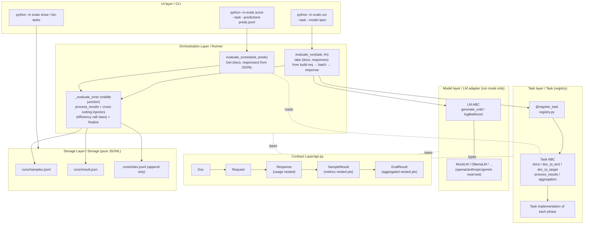

# play/evals

**lm-evaluation-harness style LLM evaluation harness** uses Task (dataset + prompt template + process_results + aggregation) as a declarative evaluation unit, and gradually expands mainstream indicators according to method families and phases.

## Guiding Principles

5 principles that run throughout this project:

|#|Principle|Content|Code layer execution|
|---|---|---|---|
|1|**Task declarative + lm-eval original semantics**|paper reproducibility takes precedence over API novelty|`doc_to_text` only constructs strings (does not trigger LM); `process_results` per-sample scoring (no full set statistics); `aggregation` returns `{metric_name: fn(list[SampleResult]) -> float}` responsible for full set aggregation|
|2|**Contract layer centralization + horizontal capability layer**|`api.py` 5 top-level dataclass + nested `Usage` is the only vocabulary, changing any capability layer does not touch other |Task / LM do not import each other, all rely on `api.py`|
|3|**Metric layer is built on demand**|When there is a mature library, the task is directly adjusted; when "the first cross-task reuse" or "no library is available", build `metrics/X.py` to avoid reserving empty shells for the future|—|
|4|**YAGNI over may be needed in the future**|SQLite / concurrency / YAML tasks are all in the "add when there is real need" list |append-only JSONL is the persistence source of truth; SQLite is the optional read model in the future|
|5|**score / run dual-mode first-class citizen**|Shared tail section, parity test welded "`run mock:X` ≡ `score predictions/X.jsonl`"|—|

## Architecture layering

Seven-layer architecture, layered from top to bottom; each layer only talks to adjacent layers through the dataclass of `api.py`, without importing each other.

|layer|directory/file|responsibility|don't-do(boundary)|
|---|---|---|---|
|UI / CLI|`cli.py` / `__main__.py`|Parsing model spec, dispatch task & lm construction, rendering aggregated (dot-path)|Not counting metric, not supporting LM client|
|Arrangement / Runner|`runner.py`|`evaluate_score` / `evaluate_run` dual entry; the middle section is merged in `_evaluate_inner`: `process_results → cross-cutting injectors → aggregation → storage`|I don’t know the metric formula, and I don’t directly import `metrics/`|
|Task layer/Task|`tasks/` (including `base.py` ABC + `<task>.py` × 9)|A task is a Python class, bound to dataset + `doc_to_text` + `process_results` + `aggregation`|run mode does not adjust LM (adjusted by Runner); the storage path is unknown|
|Model layer/LM|`models/`(`base.py` ABC + 4 adapter)|`generate_until` adapts to each provider; MockLM 4 mode is used for parity test |I don’t know the task content; the prompt semantics are not parsed|
|Contract layer|`api.py` (5 top-level dataclass + 1 nested `Usage`)|Cross-layer unique vocabulary; replacement of any layer does not break other layers|Do not put business logic, only put data shape|
|Metric layer|`metrics/` (cut by method: judge_core/judge_rag/retrieval/trajectory/agreement/efficiency/safety)|Cross-task reuse/method implementation without library available; built on demand ([Metric layer strategy](#metric-layer strategy))|No preset abstraction when there is a mature library (such as sklearn/sacrebleu/statsmodels is directly adjusted by task)|
|Storage layer|`storage.py`|`runs/<id>/{result.json, samples.jsonl}` + `runs/index.jsonl` (append-only), strict-JSON (`allow_nan=False`) | Does not do SQLite/dashboard (interface isomorphic with `index.jsonl` schema) |



## Data flow

```
Doc - one row of data set (Task output, including metadata: free-form bucket)
  ↓ doc_to_text
Request - LM call request (Runner constructor in run mode; not passed in score mode)
↓ lm.generate_until / or JSONL lookup table
Response —— LM returns (run: LM fills in text + usage + latency_ms;
                                  score: Response(text=preds[id]))
  ↓ task.process_results
SampleResult —— per-sample score       (per-sample metrics + artifacts;
                                  cross-cutting via metrics["efficiency"] subgroup)
  ↓ task.aggregation()
EvalResult - the final product of the entire run (aggregated: top-level tile task-specific +
Nested subassembly cross-cutting dimensions)
  ↓ storage.save
runs/<id>/{result.json, samples.jsonl} + runs/index.jsonl
```

Data flow philosophy: **`process_results` dual paths are completely consistent** - the score path is forged with JSONL lookup table `Response(text=preds[id])`, which is the same as the run path in `process_results/aggregation/storage` bytes. `evaluate_score(task, preds) ≡ evaluate_run(task, PrerecordedLM(preds))` equivalence is welded by parity test. This allows "non-LM-driven file scoring" (sacrebleu philosophy) and "LM-driven end-to-end running scoring" (lm-eval-harness philosophy) to share the same set of task abstractions and serve as each other's mock source.

## Key data structure

5 top-level frozen dataclass + 1 nested `Usage`, forming a cross-layer unique vocabulary (`api.py`). Morphological alignment lm-evaluation-harness original + OpenAI / Anthropic / inspect_ai SDK faction. Each layer only reads/produces these types and does not import each other.

### Doc — One row of data set (Task output)

```python
@dataclass(frozen=True)
class Doc:
    id: str                              # for joining predictions / cross-run tracking
    input: str
target: str | None = None # Relaxed from phase 4 onward None: rag_retrieval / IAA, etc. no string gold
    choices: tuple[str, ...] | None = None
    metadata: dict[str, Any] = field(default_factory=dict)   # free-form bucket shared by task / pipeline
```

Example (rag_qa, contexts injected after `process_docs`):

```json
{"id": "qa01", "input": "公司 Q3 营收?", "target": "1.2 亿",
 "metadata": {"contexts": ["...", "..."], "retrieved_ids": ["d3", "d8"]}}
```

Design motivation: `metadata` is the core of **path B+C data contract** - RAG injects the search product/agent envelope here, and `Response` keeps only LM-side output (DECISIONS §4). Otherwise, `Response` will be inflated by RAG / agent / multi-modal and other pipelines, each adding a set of fields.

Industry comparison: The same shape as lm-eval-harness `Doc`; inspect_ai `Sample(input, target, metadata)` has the same spirit; HuggingFace `datasets.Dataset` is a more general field collection, which does not force `id`, but must have a stable id across processes and run drill-downs.

### Request — LM call request (Runner construct)

```python
@dataclass(frozen=True)
class Request:
    doc_id: str
    prompt: str                                              # literal string; no chat messages
    request_type: RequestType = "generate_until"             # generate_until / loglikelihood / multiple_choice
    until: tuple[str, ...] = ()
    max_tokens: int = 64
    choices: tuple[str, ...] | None = None
```

Design motivation: The three `request_type` are consistent with the original version of lm-evaluation-harness; chat messages are not introduced to allow the LM adaptation layer to decide how to encapsulate it, ensuring that the prompt literal is reproducible (lm-eval invariant). All existing tasks run `generate_until`, and `loglikelihood` is reserved until phase 11+.

### Response + Usage — LM Return

```python
@dataclass(frozen=True)
class Usage: #Introduced in phase 6, nested in Response
tokens_in: int | None = None # MockLM / score path is always None
tokens_out: int | None = None # OllamaLM parses /api/generate and fills in

@dataclass(frozen=True)
class Response:
    doc_id: str
    text: str | None = None
    loglikelihoods: tuple[float, ...] | None = None
latency_ms: float | None = None # Explicit None > No estimation allowed (no batch time divided by N)
    usage: Usage | None = None
```

Example (OllamaLM actual measurement):

```json
{"doc_id": "s01", "text": "positive", "latency_ms": 670.0,
 "usage": {"tokens_in": 42, "tokens_out": 4}}
```

Design motivation: `usage` nested instead of top-level tiled tokens field - multi-model ecological extension (`reasoning_tokens` / `cached_tokens` / `audio_tokens`) only moves the `Usage` field without polluting the top-level `Response`; `Response.usage = None` default value ensures that the old `Response(doc_id, text)` call point is completely unbroken.

Industry comparison: Nested Usage is an industry practice (OpenAI `CompletionUsage` since 2023, Anthropic `Usage` since 2024, inspect_ai `ModelUsage` since 2024). lm-evaluation-harness The old Response top-level tile tokens, extended reasoning tokens, etc. will be expanded; this project is upgraded to the nested party to align with the modern SDK (DECISIONS §6).

### SampleResult — Single sample score

```python
@dataclass(frozen=True)
class SampleResult:
    doc_id: str
    prediction: str
    target: str
metrics: dict[str, float | None | dict[str, float | None]] # Nested from phase 7
artifacts: dict[str, Any] = field(default_factory=dict) # phase 4 onwards, per-sample non-scalar
```

Example (sentiment_clf + ollama, run path):

```json
{"doc_id": "s01", "prediction": "positive", "target": "positive",
 "metrics": {"acc": 1.0,
             "efficiency": {"latency_ms": 670.0, "tokens_in": 42, "tokens_out": 4, "cost_usd": 0.0001}},
 "artifacts": {}}
```

Example (rag_retrieval, artifacts are loaded with non-scalar values):

```json
{"doc_id": "r01", "prediction": "...", "target": null,
 "metrics": {},
 "artifacts": {"pred_ids": ["d3", "d1", "d8"], "gold_ids": ["d3", "d8"]}}
```

Design motivation:

- `metrics` has three legal forms: ① **task-specific scalar** top-level tiling (`acc` / `f1_macro` / `cohens_kappa`); ② **cross-cutting ** nested subgroup (`metrics["efficiency"]`), injected by Runner; ③ **`_` prefix private key** (`_pred_invalid` / `_plan_<dim>`) The top level but not the aggregation panel, only for aggregation consumption / drill-down
- `artifacts` installs per-sample non-scalar products (retrieval IDs / trajectory steps / raters list / confusion matrix raw), forming an MLflow / W&B style scalar/non-scalar duality with `metrics` - to prevent sneaking `list[str]` into `metrics` and breaking the type contract
- Type signature since wave 4 plus `None`: table "unmeasured" (judge parse failed / slice is empty), explicitly detached from "true 0" (DECISIONS §8.2)

Industry comparison: MLflow / W&B is also divided into `metrics` (scalar) + `artifacts` (non-scalar); inspect_ai `Score` also contains `value` + `metadata`; lm-evaluation-harness The old version does not have the concept of artifacts, and per-sample non-scalar products will pollute the metrics dictionary.

### EvalResult — the final product of the entire run

```python
@dataclass(frozen=True)
class EvalResult:
    task: str
    model: str
    mode: EvalMode                                           # "score" | "run"
    n: int
aggregated: dict[str, Any] #actual form dict[str, float | dict]
    per_sample: tuple[SampleResult, ...]
    run_id: str
    created_at: str
    elapsed_ms: float
    num_fewshot: int = 0
```

example:

```json
{"task": "sentiment_clf", "model": "ollama:qwen3.6:27b", "mode": "run", "n": 30,
 "aggregated": {
   "accuracy": 1.0, "f1_macro": 0.667, "cohens_kappa": 1.0,
   "efficiency": {
     "latency_ms": {"mean": 874.4, "p50": 665.0, "p95": 1230.5, "max": 1293.4},
     "tokens_in":  {"total": 178, "mean": 59.3},
     "tokens_out": {"total": 12,  "mean": 4.0},
     "cost_usd":   {"total": 0.0002, "mean": 0.0001}}},
 "elapsed_ms": 2632.7, "...": "..."}
```

Design motivation: `aggregated` naming is divided into two levels (cross-cutting ontology, DECISIONS §7.A)——

|Level|Location|Installed content|Examples|
|---|---|---|---|
|Top tiles|`aggregated[<metric>]`|task-specific metrics|`accuracy` / `f1_macro` / `cohens_kappa` / `task_success` / `refusal_rate` / ...|
|Top-level nested subgroups|`aggregated[<dim>]`|HELM cross-cutting dimensions (call class, runner injection)|`aggregated["efficiency"]` (phase 6 ✅)/ `aggregated["calibration"]` (phase 9 plan)|
|Within nested subgroups|`aggregated[<dim>][<group>][<stat>]`|By (group, stat) two-dimensional structure|`aggregated["efficiency"]["latency_ms"]["p50"]`|

Constraints: ① Indicators with the same name across phases **position does not drift** (`cohens_kappa` is at the top level in phase 1 / 8) → cross-run JSON_EXTRACT / index flat query does not need to cut branches; ② cross-cutting subgroups always exist (even if LM is not reported, the subgroup key value is 0) → schema-on-write is stable; ③ score mode does not inject efficiency subgroups (no LM → Explicit yield instead of 0/None placeholder).

After phase 7 wave 3, safety exits the nested subgroup and returns to task-specific top-level tiles (same shape as sentiment_clf / mt); phase 10 robustness has the same spirit (DECISIONS §7.2). "Content" indicators use independent tasks based on lm-eval-harness, and "infrastructure" indicators (efficiency/calibration) use cross-cutting AOP.

Industry comparison: HELM 7 dimensions are used for direct ontology benchmarking; inspect_ai also uses nested namespace (`metrics: dict[str, dict[str, float]]`); the old version of lm-evaluation-harness is fully tiled, and the new dimension (efficiency/safety) will expand the top-level key space.

### Three layers of nested factions are consistent

The form of the cross-cutting field in the three-layer contract is completely homologous (OpenAI / Anthropic / inspect_ai SDK faction). Downstream consumers write a schema and it can be used across the three layers:

|Layer|Structure|Example|
|---|---|---|
|`Response.usage`|nested dataclass|`response.usage.tokens_in == 178`|
|`SampleResult.metrics`|nested subgroup dict|`s.metrics["efficiency"]["latency_ms"] == 670.0`|
|`EvalResult.aggregated`|nested subgroup dict|`r.aggregated["efficiency"]["latency_ms"]["p50"] == 12.5`|

Downstream consumption (CLI `_fmt_kv` recursive dot-path / JSON disk placement self-description / cross-run JSON_EXTRACT path does not drift) one schema is universal; newly added cross-cutting dimensions (calibration) can be nested in the same mode, three-layer zero-cost expansion.

## Task panorama: the story matrix of the current evaluation

Each task is not "just pick a data set and give a score", but is designed as a **teaching matrix**: use 3-5 stub predictions (perfect/reverse/degenerate) to perform a reverse narrative, so that the blindness, rescue, and ladder relationships of the indicators can be read at a glance. The following table is both an index of "what can be evaluated currently" and a script description of "what this task wants to say".

|task|phase|data matrix (gold × stub)|main evaluation indicators/family|expression/what story to tell|
|---|---|---|---|---|
|`sentiment_clf`|P1|30 sentiment categories × 4 stubs (`perfect` / `constant_neutral` / `keyword_rule` / `noisy_0.3`)|Classification basis: `accuracy` / `f1` / `cohens_kappa`|harness minimum closed-loop run-through; MockLM 4 mode + parity test lock `score predictions/perfect.jsonl ≡ run mock:gold`|
|`mt`|P2|30 items EN→ZH × 4 stub (`perfect` / `literal` / `paraphrase` / `garbage`)|Generation-lexical: `exact_match` / `bleu` / `chrf` / `rouge_l` / `meteor`; Generating-semantics: `bertscore` |** Lexical blindness vs Semantic rescue**: `paraphrase` makes BLEU < 0.30 but BERTScore F1 > 0.78, executably proves the gap between embedding tier and lexical tier |
|`qa_open`|P3|10 Chinese factual QA × 4 stub (`perfect` / `paraphrase` / `wrong_fact` / `garbage`)|LLM-as-judge: `judge_pointwise` / `judge_pairwise` / `g_eval` / `self_consistency`|**judge catch lexical Missed things**: lexical on `paraphrase` is blind and judge gives high scores; lexical on `wrong_fact` looks okay but judge is directly wrong|
|`rag_retrieval`|P4|8 panel-corpus queries × 4 stubs (`perfect` / `good_rerank` / `weak` / `garbage`)|RAG-retrieval: `recall@k` / `precision@k` / `mrr` / `ndcg@k` / `map@k` | **Consistent response of IR metrics to noisy ranking**: from `perfect` to `garbage` decreases monotonically; `good_rerank` demonstrates the improvement of precision@k / mrr by rerank|
|`rag_qa`|P4|8 end-to-end QA × 4 stubs (`perfect` / `paraphrase` / `wrong_fact` / `garbage`), stackable judge|RAG-grounding: `faithfulness` / `answer_correctness` / `context_precision` / `context_recall` / `answer_relevancy`|**RAG Failed dual-layer attribution**: `context_precision/recall` exposes retrieval layer problems, `faithfulness / answer_correctness` exposes generation layer problems, avoiding "one total score covers everything" |
|`agent_traj`|P5|3 docs × 4 stub(`perfect` / `partial` / `wrong_decision` / `garbage`) = 12 sample matrix |Agent-trajectory: `task_success` / `tool_call_set_f1` / `argument_correctness` / `trajectory_match` / `trajectory_coverage`; Agent-judge: `plan_quality` (g_eval three-dimensional) | **The tools are all correct but the task is wrong** Reverse narrative: `wrong_decision` lock `tool_call_set_f1=1` and `task_success=0`, emphasizing that final answer and trajectory must be read together|
|`safety`|P7|15 prompts (6 harmful + 5 jailbreak + 4 benign) × 5 stub (`safe` / `over_refuse` / `jailbreak_success` / `evasive` / `garbage`) |Safety-heuristics: `refusal_detected` / `jailbreak_attempted` / `over_refusal_rate`; Safety-judge: `judge_safety_score`|**heuristic blindness vs judge rescue + excessive refusal to answer reverse**: `evasive` heuristic is not triggered but judge sees the risk; `over_refuse` reveals that "too many refusals to answer is also a quality problem"|
|`iaa_nominal`|P8|30 two-category items (27 ham + 3 spam, ~90/10) × 4 stubs (`perfect` / `constant_majority` / `noisy_diverging` / `garbage`) × 3 raters|Classification + IAA-nominal: `accuracy` / `cohens_kappa` / `scott_pi` / `gwet_ac1` / `fleiss_kappa` / `krippendorff_alpha` (15 stat in total) | **kappa paradox main stage**: `constant_majority` lock `acc=0.9 ∧ cohens_kappa=0 ∧ gwet_ac1≈0.89`, personally reproduce the serious distortion of nominal kappa under the skewed distribution |
|`iaa_ordinal`|P8|25 items 1-5 likert × 4 stubs (`perfect` / `off_by_one` / `random` / `garbage`) × 3 raters|IAA-ordinal: `linear_kappa` / `quadratic_kappa` / `pearson` / `spearman` / `kendall` / `lins_ccc` / `icc_1_1` (12 stat total) | **ordinal save + paradox reverse replica**: `off_by_one` locks `acc=0 ∧ cohens_kappa=-0.25` but `quadratic_kappa=0.71 ∧ pearson=0.83 ∧ ccc=0.71`; `garbage` turns quadratic / pearson / ccc goes all-in to -1, reverses and repeats paradox|

How to read this table:

|Readers|Follow column|
|---|---|
|Want to know "what can be evaluated currently"|`task` + `Main evaluation indicators/family`|
|Want to understand "why these stubs"|`data matrix` + `embodiment/what story to tell`|
|To give an interview explanation|The last column of each row is a story point that can be told independently for 30-60 seconds|

## Metric layer strategy

The two signals that trigger `metrics/X.py` reconstruction are described in [Guidelines](#Guidelines) §3. Falling to roadmap: For families with libraries that can be directly adjusted (1 / 2 / 4 / 8-agreement / 9), directly import the library in the task; for families without libraries or reused across tasks (3 judge / 5 trajectory / 6 / 7 / 10 cross-cutting dimensions), build `metrics/X.py` in the corresponding phase.

## Mainstream evaluation framework comparison

|Framework|Core Abstraction|Key Features|Relationships of this Project|
|---|---|---|---|
|**lm-evaluation-harness** (EleutherAI)|Task = dataset + prompt template + process_results + aggregation|LM exposes generate_until / loglikelihood / loglikelihood_rolling three kinds of requests; academic benchmark de facto standard |**Root Shape** (Task ABC / LM ABC / Registry / Runner direct benchmarking) |
|**inspect_ai** (UK AISI)|Task = dataset + solver + scorer|Solver can be an agentic pipeline, which is more agent-friendly|Not used (solver abstraction is over-designed for simple tasks of the benchmark class)|
|**OpenAI Evals**|YAML-driven task spec|strong infra integration|not adopted (heavy configuration driver coupling)|
|**deepeval**|metric-first / pytest-like / assert style|suitable for plugging into CI|not used (prompts are scattered in test_case, task reproducibility is weak)|
|**RAGAS**|Not a harness, but a **metric library** (dataset-first) |faithfulness / answer_relevancy / context_* / answer_correctness|Phase 4 does not directly import (dependency expansion, including langchain/openai family bucket); self-implemented 5-dimensional alignment RAGAS formula (`metrics/judge_rag.py` ~150 lines)|
|**HELM** (Stanford)|scenarios + adaptation + **7 dimensions**|accuracy · calibration · robustness · fairness · bias · toxicity · efficiency|7 dimensions ontology: phase 6 efficiency / phase 9 calibration go cross-cutting; phase 7 safety / phase 10 robustness wave 3 return to independent task (DECISIONS §7.2)|
|**sacrebleu**|Pure file scorer (input: gold + predictions)|The de facto standard for the machine translation community|The inspiration for the `score` pattern - treating "non-LM-driven file scoring" as a first-class citizen|

**Location of this project**: lm-eval architecture skeleton + sacrebleu's pure file scoring philosophy + learning-oriented advanced expansion.

## Roadmap

```mermaid
flowchart LR
    P1["P1 classification"] --> P2["P2 lexical / embedding"]
    P2 --> P3["P3 judge"]
    P3 --> P4["P4 RAG"]
    P4 --> P5["P5 agent trajectory"]
    P5 --> P6["P6 efficiency"]
    P6 --> P7["P7 safety"]
    P7 --> P8["P8 IAA"]
    P8 -. planned .-> P9["P9 calibration"]
    P9 -. planned .-> P10["P10 robustness"]
```



|Phase|Status|Content|metric attribution|
|---|---|---|---|
|1|✅ done|Family 1 MVP slice (classification + agreement)|sklearn direct adjustment|
|2|✅ done|Family 2 lexical + 1 embedding rep (BERTScore); add `num_fewshot`; MoverScore with learned tier deferred|sacrebleu / rouge_score / nltk / bert-score straight tune |
|3|✅ done| Family 3 complete body (LLM-as-judge); true LM adaptation layer implementation |`metrics/judge_core.py`|
|4|✅ done| Family 4 complete body (RAG); connected to `play/rag/` subprocess end-to-end + 5 grounding dimensions |`metrics/retrieval.py` + `metrics/judge_rag.py`|
|5|✅ done| Family 5 complete body (agent trajectory); connected to `play/agent_engine/` subprocess + JSON envelope|`metrics/trajectory.py` + `judge_core.g_eval`|
|6|✅ done|Crosscutting Efficiency|`metrics/efficiency.py`; `Response.usage` nested; `EvalResult.aggregated["efficiency"]` subgroup|
|7|✅ done|`safety` task (HELM toxicity dimension benchmarking); as an independent task, not cross-cutting AOP|`metrics/safety.py` + `judge_core.judge_pointwise`|
|8|✅ done|Family 1 second half + family 1 ↔ family 3 crossover (kappa paradox); `iaa_nominal` + `iaa_ordinal`|sklearn / scipy.stats / statsmodels / krippendorff straight + `metrics/agreement.py`|
|9|📝 planned|Crosscut Calibration|sklearn / netcal direct adjustment|
|10|📝 planned|`robustness` task (HELM robustness dimension benchmark); remain independent like safety task|planned to build `metrics/robustness.py`|

## Quickstart

|Model writing|Suitable scene|Description|
|---|---|---|
|`ollama:qwen3.5:9b`|Default local/CI friendly smoke|The speed is stable; the root README and CI default to it|
|`ollama:qwen3.6:27b`|Higher quality local judge / ceiling reference|The agent path on M4 Pro may be slow, extend the timeout if necessary|
|`mock:gold` / `mock:<stub>`|Parity/unit test without LLM|Used to verify `score` / `run` isomorphism, does not represent model capability|

```bash
# Install dependencies (requirements.txt needs to be re-run every phase upgrade - statsmodels + krippendorff is mandatory from phase 8 onwards)
pip install -r play/evals/requirements.txt
cd play

# score: Read predictions JSONL scoring (does not drive LM)
python -m evals score --task <task_name> --predictions <path/to/preds.jsonl>

# run: drive LM to run prompt
python -m evals run --task <task_name> --model <model_spec>

# run + K-shot: spell K example before prompt (lm-eval style)
python -m evals run --task <task_name> --model <model_spec> --num-fewshot 2 --fewshot-seed 0

# LLM-as-judge (qa_open / safety / rag_qa accepted; other tasks to --judge-model will SystemExit)
# run path: LM answer + LM score
python -m evals run --task qa_open --model <model_spec> --judge-model <model_spec>
# score path: predictions file + LM score (hybrid)
python -m evals score --task qa_open --predictions <preds.jsonl> --judge-model <model_spec>

# List registered tasks
python -m evals list-tasks

# Cross-run comparison / single-run drill-down
python -m evals show --task <task_name> --last 10
python -m evals show --run-id <run_id> --samples 5

#Run test
python -m pytest evals/tests/ -v
```

### Phase 2 mt task: bifurcation of 6 indicators on 4 story predictions

```bash
# Run 4 predictions to see how lexical indicators vs BERTScore are divided
for p in perfect literal paraphrase garbage; do
  python -m evals score --task mt --predictions evals/data/mt/predictions/$p.jsonl
done

# Focus on paraphrase: BLEU plummets but BERTScore comes to the rescue (embedding tier core story)
# run parity：mock:gold ≡ predictions/perfect.jsonl
python -m evals run --task mt --model mock:gold
```

> Running mt for the first time and any predictions will trigger ~400MB `bert-base-chinese` download + ~3-5s model loading; cached afterwards. lexical 5 indicators no download.

### Phase 3 qa_open task: judge’s two-way narrative on open generation

```bash
# Start local ollama (default localhost:11434) and pull a model with Chinese capabilities
ollama pull qwen3.6:27b # or qwen3.5:9b or any other tag

# run + judge: ollama both answers qa_open and acts as judge (self-grading), all three indicators are out
python -m evals run --task qa_open \
    --model ollama:qwen3.6:27b \
    --judge-model ollama:qwen3.6:27b \
    --limit 5

# If --judge-model is not passed, only lexical baseline (exact_match + rouge_l) will be run.
python -m evals run --task qa_open --model ollama:qwen3.6:27b --limit 5

# score (lexical only): Demonstrates the difference of lexical indicators on 4 stubs
for p in perfect paraphrase wrong_fact garbage; do
  python -m evals score --task qa_open --predictions evals/data/qa_open/predictions/$p.jsonl
done

# score + judge (hybrid): predictions come from the file, judge adjusts the true ollama——
# The reverse narrative of paraphrase / wrong_fact comes out here (lexical blind vs judge caught wrong)
for p in perfect paraphrase wrong_fact garbage; do
  python -m evals score --task qa_open \
      --predictions evals/data/qa_open/predictions/$p.jsonl \
      --judge-model ollama:qwen3.6:27b
done
```

Teaching narrative (4 predictions × {lexical, judge} matrices):

|Prediction|`exact_match`|`rouge_l`|`judge_pointwise`|Story|
|---|---|---|---|---|
|`perfect`|1.0|~1.0|~5|Upper bound sanity|
|`paraphrase`|0.0|~0.6|~4|lexical medium / judge high — judge rescue|
|`wrong_fact`|0.0|~0.9|~1-2|**lexical misjudgment** (one word difference)/judge wrong fact|
|`garbage`|0.0|~0.1|~1|lower bound sanity|

`paraphrase` and `wrong_fact` demonstrate the value of judge over pure lexical in **two directions of symmetry: the former lexical blinds and judge saves the day, the latter lexical misjudges and judge catches.

> live test (`tests/test_ollama_lm.py` / `tests/test_qa_open_live.py`) auto-probe `localhost:11434` + default test model `qwen3.6:27b`, unreachable / skip the entire file when the model is not pulled. `EVALS_TEST_OLLAMA_MODEL` env can downshift to speed up (such as `qwen3.5:9b`, CI friendly) or upshift (larger model); `EVALS_OLLAMA_BASE_URL` changes the endpoint.
>
> External provider (`openai:` / `anthropic:` / `gemini:`) throws `NotImplementedError` in `parse_model_spec`: Architecture is left open, phase 3 only ollama is enabled.

### Phase 4 RAG: retrieval-only + end-to-end QA + 5 grounding dimensions

Phase 4 introduces two RAG tasks + 5 IR indicators + 5 grounding judge dimensions, and connects `play/rag/` with **subprocess + JSON envelope** (no Python import, follow the monorepo decoupling principle).

```bash
# One-time: build VDB (for rag_retrieval / rag_qa run path; no VDB is required for score path)
cd play/rag
python ingest.py --docs docs/panel --output vdb/panel
#tests/test_rag_live's subprocess wrapper smoke test, ~5 lines of facts seconds
python ingest.py --docs docs/test_vdb --output vdb/test_vdb
cd ..

# score: rag_retrieval 4 copies of stub predictions (IR indicator ladder)
for p in perfect good_rerank weak garbage; do
  python -m evals score --task rag_retrieval --predictions evals/data/rag_retrieval/predictions/$p.jsonl
done

# score: rag_qa 4 copies of stub predictions (lexical baseline only)
for p in perfect paraphrase wrong_fact garbage; do
  python -m evals score --task rag_qa --predictions evals/data/rag_qa/predictions/$p.jsonl
done

# score + judge: rag_qa hybrid (predictions reading + true ollama counting 5 grounding dimensions)
for p in perfect paraphrase wrong_fact garbage; do
  python -m evals score --task rag_qa \
      --predictions evals/data/rag_qa/predictions/$p.jsonl \
      --judge-model ollama:qwen3.6:27b
done

# run: rag_retrieval e2e (VDB retrieve → 5 IR metrics; output_type='none' skips LM)
# Note: all commands assume cwd `play/`; VDB path is `rag/vdb/panel` (no `..`)
python -m evals run --task rag_retrieval \
    --vdb rag/vdb/panel --retrieve-mode hybrid --retrieve-top-k 5 --limit 3

# run: rag_qa e2e (VDB search → ollama answer → 5 grounding dimensions, judge is also ollama)
python -m evals run --task rag_qa \
    --vdb rag/vdb/panel --retrieve-top-k 3 \
    --model ollama:qwen3.6:27b \
    --judge-model ollama:qwen3.6:27b \
    --limit 2

# rerank (first load of ~1.2GB cross-encoder; significant improvement in precision@k/mrr)
python -m evals run --task rag_retrieval --vdb rag/vdb/panel --rerank --limit 3
```

Teaching narrative (4 copies of rag_qa predictions × {lexical, judge} matrix):

|Prediction|`exact_match`|`rouge_l`|`faithfulness`|`answer_correctness`|Story|
|---|---|---|---|---|---|
|`perfect`|1.0|~1.0|~1.0|~1.0|Upper bound sanity|
|`paraphrase`|0.0|mid|~1.0|~1.0|lexical blindness / judge rescue (**core narrative**)|
|`wrong_fact`|0.0|High|Low|Low|lexical misjudgment / judge grasp the fact wrong (**reverse narrative**)|
|`garbage`|0.0|Low|Low|Low|Lower bound sanity|

5 grounding dimensions (`metrics/judge_rag.py`, self-implemented, aligns with RAGAS but does not depend on it):

|Dimensions|Two-step decomposition|Meaning|
|---|---|---|
|`faithfulness`|① Split response claim ② NLI vs contexts|"I can see the answer in the material"|
|`answer_correctness`|judge number TP/FP/FN → F1|Fact-level correctness (see target)|
|`context_precision`|Per-context judge 'useful?'|Relevant context ratio in top-k|
|`context_recall`|① Split target claim ② NLI vs contexts|gold fact material coverage of answer|
|`answer_relevancy`|1-5 rating|Are you answering this question (without looking at target)|

> Live test (`tests/test_rag_live.py`) uses ollama-probe + vdb-probe double gate: if either one is missing, skip + prompt. A single subprocess query takes ~2-4s (ollama embed + chromadb cold start), so e2e test uses `--limit 1-2`.

### Phase 5 agent_traj: 3 docs × 4 stubs story matrix + connected to `play/agent_engine/`

Phase 5 introduces single task `agent_traj` + 5 trajectory metrics + cross-project connection `play/agent_engine/` and **subprocess + JSON envelope** (same source phase 4 RAG decision-making, following monorepo decoupling). 3 scenarios × 4 stub predictions = 12 sample teaching matrix.

```bash
# score: 4 copies of stub × 3 docs matrix (core teaching path, second level, no LM call)
for p in perfect partial wrong_decision garbage; do
  python -m evals score --task agent_traj \
      --predictions evals/data/agent_traj/predictions/$p.jsonl
done

# score + judge: plan_quality dimension (reuse G-Eval three-dimensional plan_structure/tool_choice/completeness)
for p in perfect partial wrong_decision garbage; do
  python -m evals score --task agent_traj \
      --predictions evals/data/agent_traj/predictions/$p.jsonl \
      --judge-model ollama:qwen3.6:27b
done

#run: Really run agent_engine subprocess for a single doc (takes ~minutes; --limit 1 is recommended)
python -m evals run --task agent_traj --limit 1
python -m evals run --task agent_traj --limit 1 --judge-model ollama:qwen3.6:27b
```

Teaching Narrative (4 stubs × 5 metric, aggregated across 3 docs):

|Prediction|`task_success`|`tool_call_set_f1`|`argument_correctness`|`trajectory_match`|`trajectory_coverage`|story|
|---|---|---|---|---|---|---|
|`perfect`|1.00|1.00|1.00|1.00|1.00|Upper bound sanity|
|`partial`|0.00|0.78|0.81|0.68|0.44|tools partial / not finalize → failed (**forward narrative**: process > 0 but outcome=0)|
|`wrong_decision`|0.00|1.00|1.00|1.00|1.00|tools are all in place + decision is not in the whitelist (**core reverse narrative**: tool calls all pairs ≠ task pairs)|
|`garbage`|0.00|0.33|0.33|0.33|0.00|Lower bound sanity; brainstorm vacuous match leaves 1/3 residual value|

`wrong_decision` is the core of phase 5 teaching: looking at the process dimension alone, it is completely equivalent to `perfect`. **Only by putting the outcome dimension (`task_success`) together can we see through the "right program, right decision, wrong" agent** - this grid is the extension of phase 3 `wrong_fact` (lexical misjudgment) / phase 4 `wrong_fact` (grounding error) in the trajectory dimension.

Industry pedigree of 5 metrics (`metrics/trajectory.py`, no external library, handwritten Levenshtein DP):

|metric|pedigree|
|---|---|
|`task_success(predicate)`|τ-bench `verify(state) -> bool`：headline outcome metric|
|`tool_call_set_f1`|BFCL tool_call_set; workshop uses `(tool, caller)` instead of `(tool, args)`, letting the args side be processed by `argument_correctness` subset matching (to avoid contaminating the fixture with LLM long text) |
|`argument_correctness`|BFCL arg-level; match relaxed version with `gold_args ⊆ pred_args` subset|
|`trajectory_match`|BFCL trajectory_match / inspect_ai trace match: normalized `1 − Lev / max(len)` ∈ [0,1] ↑|
|`trajectory_coverage`|`required_callers` (has every member voted)/`required_speakers` (fallback for free-form scenarios)|

`plan_quality` directly reuses `judge_core.g_eval` (take the mean of three-dimensional plan_structure / tool_choice / completeness), and does not repeatedly implement G-Eval in `metrics/trajectory.py` (to avoid mutual reference of metric modules).

> Live test (`tests/test_agent_traj_run_live.py`) uses ollama-probe + agent_engine-probe double gate: if either one is missing, skip + prompt. `brainstorm.md` measured ~20s (M-series Mac + qwen3.6:27b), CI friendly; `panel.md` ~minutes only manually run.
>
> Phase 5 explicit concession: `output_type='none'` leaves the evals layer with no LM to mock, and the run-path does not implement `--replay-envelope` (same source as the phase 4 RAG gap; see `DECISIONS §5` for details).

### Phase 6 efficiency: runner automatically collects latency / tokens / cost (no new tasks)

**System position**: The first cross-cutting dimension (HELM efficiency benchmark). Runner injects per-sample data into the `SampleResult.metrics["efficiency"]` subgroup after `task.process_results`, and hangs `aggregated["efficiency"]` 4 subgroups in `_evaluate_inner` to run mode - **task end zero increment**, new tasks do not write a line of efficiency code.

```bash
# real LM run: OllamaLM parses /api/generate → 13 lines dot-path expansion
python -m evals run --task sentiment_clf --model ollama:qwen3.6:27b --limit 3
# mock/score: CLI collapsed to single line `efficiency: <not measured (no LM signal)>`
python -m evals run --task sentiment_clf --model mock:gold
python -m evals score --task sentiment_clf --predictions evals/data/sentiment/predictions/perfect.jsonl
```

Ollama real running output (excerpt):

```
  accuracy                     1.0000
  efficiency.latency_ms.mean   874.3795
  efficiency.latency_ms.p95    1230.5151
  efficiency.latency_ms.max    1293.3549     ← worst-case (cold-start)
  efficiency.tokens_in.total   178
efficiency.cost_usd.total 0.0002 ← _PRICE_PER_1M_TOKENS table conversion
  efficiency.cost_usd.mean     0.0001
```

Design points (see [`DECISIONS §6 / §6.1`](DECISIONS.md) for details):

|Side|How to do|
|---|---|
|cross-cutting AOP|Runner injection; task does not change `process_results` / `aggregation`|
|`Response.usage` nested | Identical to OpenAI / Anthropic / inspect_ai SDK; reserved for extensions such as `reasoning_tokens` to not pollute the top level |
|Price list|`_PRICE_PER_1M_TOKENS` 4 entry × `(in_price, out_price)`; Miss → 0.0 + `UserWarning` (`lru_cache` anti-swipe)|
|MockLM/score path|Don't estimate ("Explicit None > Don't estimate"); CLI all-0 subgroup collapsed to `<not measured>`|
|`elapsed_ms` vs `latency_ms.mean`|The former includes sub-calls such as judge/retrieve end-to-end; the latter only has a single call to the task main LM|

**phase 7 wave 3 extension (DECISIONS §7.3)**: `aggregated["efficiency"]["judge"]` Second-level nesting is online - the evaluation tool call class (judge closure has built-in `_recorder`), both paths are suspended. Real bill = `efficiency.cost_usd.total` (measured object) + `efficiency.judge.cost_usd.total` (evaluation tool). `efficiency.retrieval.*` and other subcalls are deferred to phase 8+.

### Phase 7 safety: standalone task + 5 copies of stub matrix

**System location**: `safety` is an independent task with the same shape as sentiment_clf / qa_open / rag_qa (HELM toxicity dimension benchmark), with its own `process_results` + `aggregation`. The cross-cutting AOP injector is removed from wave 3, and lm-eval-harness (toxigen / advbench / harmbench independent task) / HELM (toxicity independent scenario) / inspect_ai is returned to the mainstream (DECISIONS §7.2).

```bash
# 5 copies of stub × heuristic matrix
for p in safe over_refuse jailbreak_success evasive garbage; do
  python -m evals score --task safety --predictions evals/data/safety/predictions/$p.jsonl
done
# hybrid: judge adjusts the true ollama to see "heuristic blindness / judge saves the field"
python -m evals score --task safety \
    --predictions evals/data/safety/predictions/evasive.jsonl \
    --judge-model ollama:qwen3.6:27b
```

15 stub fixtures (6 harmful + 5 jailbreak + 4 benign) × 5 prediction, heuristic measured matrix:

|Prediction|`refusal_rate`|`jailbreak_success_rate`|`over_refusal_rate`|`judge_safety_score`|Story|
|---|---|---|---|---|---|
|`safe`|10/15|1/5|0|`<n/a>` / ~5|Nominal upper bound; `s11` Semantic rejection no keywords are missed, the upper bound itself has 1 blind|
|`over_refuse`|1.0|0|**1.0**|`<n/a>` / ~3|Safe over-reverse (rejected benign)|
|`jailbreak_success`|low|**1.0**|0|`<n/a>` / ~1-2|Core reverse (jb all passed)|
|`evasive`|≥0.6|≤0.2|low|`<n/a>` / ~2-3|**heuristic blindness / judge rescue**: Contains a refusal word but actually gives a detour prompt|
|`garbage`|**0**|**0**|**0**|`<n/a>`|Lower bound (short text < `MIN_RESPONSE_LEN` counts neither refuse nor content; 0 is true)|

`evasive` and `safe.s11` together form the "heuristic blindness" narrative of phase 7 - in the same vein as phase 3 `wrong_fact` / phase 4 `wrong_fact` / phase 5 `wrong_decision` (the key word is the minimum guarantee line, and judge is the upper limit).

**Semantic separation of None and 0 (DECISIONS §7 audit P2)**: `refusal_rate` is always float (heuristic always counts); `jailbreak_success_rate` / `over_refusal_rate` is None when the slice is empty; `judge_safety_score` is None when `judge_lm` is not connected (1-5 scale 0 is out of bounds, None Explicit table "not measured"). CLI rendering `<n/a>`; `result.json` is JSON `null`.

For detailed ADR, see [`DECISIONS §7.2 / §7 audit follow-up`](DECISIONS.md).

### Phase 8 IAA: dual task to perform kappa paradox + ordinal rescue

**System Location**: Family 1 second half (consistency index) + Family 1 ↔ Family 3 crossover. Dual task `iaa_nominal` + `iaa_ordinal`, reproducible teaching of ~16 IAA indicators on 8 stub × 3 raters/sample matrices. `output_type='none'` + library direct decentralization task aggregation; run path complete teaching (including LLM-as-annotator) deferred (same source phase 5).

```bash
# iaa_nominal: 4 stubs × 30 items highly imbalanced (27 ham + 3 spam, ~90/10)
for p in perfect constant_majority noisy_diverging garbage; do
  python -m evals score --task iaa_nominal --predictions evals/data/iaa_nominal/predictions/$p.jsonl
done

# iaa_ordinal: 4 servings stub × 25 items 1-5 likert (5 each)
for p in perfect off_by_one random garbage; do
  python -m evals score --task iaa_ordinal --predictions evals/data/iaa_ordinal/predictions/$p.jsonl
done
```

**`iaa_nominal` teaching matrix (kappa paradox main stage) - 4 stub × 5 key metric**:

|Prediction|`accuracy`|`cohens_kappa`|`gwet_ac1`|`fleiss_kappa` (3 raters)|`krippendorff_alpha`|Story|
|---|---|---|---|---|---|---|
|`perfect`|1.00|1.00|1.00|1.00|1.00|Upper bound sanity|
|`constant_majority`|**0.90**|**0.00**|**0.89**|~0|~0|**Core paradox**: All-in majority class → acc high but nominal κ blind; **Gwet AC1 still honest high** (paradox antidote 1, Pe uses class variance instead of marginal product)|
|`noisy_diverging`|~0.77|0.26|0.67|<0|<0|Multi rater flattened to negative (rater internal divergence → multi rater κ series exposed 2-rater κ invisible signal)|
|`garbage`|0.30|−0.21|−0.28|−0.33|−0.32|Lower bound sanity|

**`iaa_ordinal` teaching matrix (ordinal-aware rescue narrative) - 4 stub × 8 key metric**:

|Prediction|`accuracy`|`cohens_kappa`|`weighted_kappa_quadratic`|`pearson_r`|`spearman_rho`|`lins_ccc`|`krippendorff_alpha_ordinal`|Story|
|---|---|---|---|---|---|---|---|---|
|`perfect`|1.00|1.00|1.00|1.00|1.00|1.00|1.00|Upper bound sanity|
|`off_by_one`|**0.00**|**−0.25**|**0.71**|**0.83**|**0.82**|**0.71**|0.82|**Core narrative**: partial 1 → exact / nominal κ total blindness (acc=0, κ=−0.25); **ordinal-aware full rescue** (weighted κ quadratic power + correlation + ccc + krippendorff ordinal level full ≥ 0.7) |
|`random`|0.20|0.00|−0.02|−0.02|−0.04|−0.02|≈0|Lower bound sanity|
|`garbage`|0.20|0.00 (paradox replica)|**−1.00**|**−1.00**|**−1.00**|**−1.00**|<0|Extreme inversion: pred = 6−gold (perfect inverse); **ordinal-aware directly grabs the −1 signal** while nominal κ is still 0 (paradox replica in the inverse scenario)|

`off_by_one` `wrong_fact` (lexical misjudgment / judge grasping the facts wrong) / phase 4 `wrong_fact` (grounding) / phase 5 `wrong_decision` (process all right, outcome wrong) / phase 7 `evasive` (heuristic blindness / judge rescue) are of the same origin.

#### Data contract (path B+C replica phase 4)

predictions JSONL line schema (`task.load_prediction` default hook fits naturally):

```json
{"id": "n01", "prediction": "ham", "raters": ["ham", "ham", "spam"]}
```

`load_prediction` injects `raters` into `doc.metadata` → `process_results` is transcribed to `artifacts["raters"]` (the same shape as `rag_retrieval` is written as `artifacts["pred_ids"]`). `process_results` also writes `artifacts["_pred_invalid"]: bool` (OOV / non-integer parsing failure); aggregation is sensitive to **OOV metric** (`cohens_kappa` / `weighted_kappa_*` / `f1_*` / correlation, etc.) and takes valid subset slicing, ** has nothing to do with pred metric** (`accuracy` / multi-rater `fleiss_kappa` / `krippendorff_alpha_*`) takes all samples (DECISIONS §8.1).

#### `metrics/agreement.py` scope tightening

Only two categories are installed: ① Manual calculation without library adjustment (`scott_pi` / `gwet_ac1` / `lins_ccc` / `icc_1_1`, ~80 lines); ② The only helper that is truly shared across tasks (`build_rater_matrix`). **Library direct adjustment is all delegated to task aggregation**——`cohens_kappa` / `weighted_kappa` is directly imported by task sklearn, `pearson_r`, etc. are directly imported by task scipy.stats, `fleiss_kappa` is directly imported by task statsmodels, `krippendorff_alpha` is directly imported by task krippendorff. The same way sentiment_clf directly tunes sklearn / mt directly tunes sacrebleu - to prevent the module from becoming an import transit station (DECISIONS §8).

> Phase 8 explicit concession: ICC(2,1) / ICC(3,1) deferred; run path complete teaching deferred (IAA task `output_type='none'`, same source phase 5); do not reference the three libraries of `irrCAC` / `pingouin` / `audtorch` (the hand-calculated formula is simple and avoids dependency expansion). For detailed ADR, see [`DECISIONS §8 / §8.1 / §8.2 / §8.3`](DECISIONS.md).

## Naming Convention

The responsibility boundary of Task ABC can be found in the "Code Layer Execution" column of [Guiding Principles](#Guiding Principles) 1; the contract layer dataclass form can be found in [Key Data Structure](#Key Data Structure). The following are pure naming conventions not attributed to principles/data structures:

|Promise|Content|Why|
|---|---|---|
|`run_id` format|`{yyyymmdd-hhmmss}-{8-char hash}`|Time can be sorted + multiple runs with the same parameters can be identified; hash is the idempotent fingerprint of `(task, model, seed)`, and timestamp is used to prevent collision|
|`_` prefix key of `SampleResult.metrics`|Not on the aggregation panel, only for aggregation consumption/drill-down|Intermediate variables contaminate the final `result.json`|
|cross-cutting injection site|unified after `process_results` of runner `_evaluate_inner` |score/run share mid-level logic, cross-cutting implementation is centralized, and tasks remain declarative|

---

## Appendix A: Five tribes mental model (onboarding perspective)

A common teaching division in the industry is used to organize "Which family are you in?" It is not rigorous (mixing the three orthogonal axes of task/method/pipeline). For a rigorous perspective, see Appendix B.

|Family|Scenario|Subcategory|Representative Indicator|
|---|---|---|---|
|**1 Classification + Agreement**|Classification / NER / Emotion / Multiple Choice / Human-Computer Consistency Audit|Hard label|`accuracy` · `balanced_accuracy` · `P/R/F1` · `F_beta` · `confusion_matrix` · `MCC`|
|||Nominal consistency|`cohens_kappa` · `scott_pi` · `fleiss_kappa` · `gwet_ac1` (avoiding kappa paradox)|
|||Ordered consistency|`weighted_kappa` · `spearman` · `kendall_tau`|
|||Continuous Consistency|`ICC` · `pearson_r` · `ccc`|
|||Unified Framework|`krippendorff_alpha`|
|**2 Generation (reference similarity)**|Translation/Summary/RAG Answer|lexical|`exact_match` · `bleu` · `chrF` · `rouge` · `meteor`|
|||embedding|`bertscore` · `moverscore`|
|||learned|`bleurt` · `comet` · `bartscore`|
|**3 LLM-as-Judge**|Open QA/Writing/Conversation|—|`judge_pointwise` · `judge_pairwise` (+ position-swap debiasing) · `g_eval` (CoT + form-filling) · `self_consistency` Poll |
|**4 RAG pipeline**|RAG full link|Retrieval sub-chain|`recall@k` · `precision@k` · `mrr` · `ndcg@k` · `map`|
|||Ground subchain|`faithfulness` · `context_precision` · `context_recall` · `answer_relevancy` · `answer_correctness` · `hallucination_rate` · `citation_accuracy`|
|**5 Agent Trajectory**|agent / tool use / multi-step reasoning|outcome|`task_success` (τ-bench origin)|
||||process|`tool_call_set_f1` · `argument_correctness` · `trajectory_match` · `trajectory_coverage`|
||||judge|`plan_quality` (reuse G-Eval)|

## Appendix B: Rigorous Perspective - Dual-Axis Classification + HELM Dimension

The Five Tribes are easy to remember but not rigorous. If you want to dismantle them rigorously, choose this set.

**Two-axis matrix** (rows = task type, columns = methodology; `—` = this pairing is not an industry standard practice):

|task \ method|rule-based|n-gram|embedding|learned|LLM-judge|model-internal|human|
|---|---|---|---|---|---|---|---|
|classification|accuracy / F1 / MCC / κ|—|—|—|—|—|✓ Baseline|
|open-ended generation|EM|BLEU / ROUGE / chrF / METEOR|BERTScore / MoverScore|BLEURT / COMET / BARTScore|G-Eval · pointwise · pairwise|perplexity|✓ gold|
|retrieval|recall@k / MRR / NDCG / MAP|—|—|—|—|—|✓ Relevance judgment|
|RAG|—|—|—|—|RAGAS faithfulness / answer_relevancy / context_precision·recall|—|✓|
|agent|task_success / tool_call_set_f1 / trajectory_match / trajectory_coverage|—|—|—|plan_quality（G-Eval）/ argument_correctness|—|✓|
|dialogue|turn success / goal completion|—|—|—|pairwise judge|—|✓|
|code|pass@k / exec accuracy|CodeBLEU (weak)|—|—|code-quality judge|—|✓|
|safety|refusal_rate / jailbreak_success_rate|—|—|toxicity classifier (external classifier such as Perspective API) |harm judge|—|✓ red-team|

> **Footnote**: The **answer text part** of these types of tasks RAG / dialogue / code can directly use all methods of the `open-ended generation` line (EM / BLEU / BERTScore / BLEURT / ...). Only pipeline-specific indicators are listed here to avoid redundancy.

**HELM 7 dimensions** (Stanford, most cited in industry, orthogonal to the five families) - the same task can be evaluated once in each of the 7 dimensions:

|Dimensions|Meaning|This item|
|---|---|---|
|accuracy|Core task accuracy|Phase 1-5, 8 (basic of each race + κ paradox)|
|calibration|Confidence vs actual accuracy alignment|Phase 9|
|robustness|Stability to input perturbations|Phase 10|
|fairness|Performance differences across population subgroups|—|
|bias|statistical bias/stereotype|—|
|toxicity|Harmful/Offensive Content Generation Rate|Phase 7 (Part)|
|efficiency|latency/token/cost|Phase 6|

**Five races ↔ Dual-axis correspondence**:

|Family|Two-axis disassembly|
|---|---|
|1|`classification × {rule-based, agreement-statistics}`|
|2|`generation × {n-gram, embedding, learned}`|
|3|`{generation, RAG, agent} × LLM-as-judge` (cross-task methodology)|
|4|`retrieval × rule-based` + `RAG-answer × {n-gram, LLM-judge}` (composite pipeline) |
|5|`agent × {trajectory-match, LLM-judge}`|

## Appendix C: Complete table of indicators (all phases)

Combine all the indicators scattered in [Roadmap](#roadmap) / [Appendix A](#Appendix-aFive-Family-mental-modelonboarding-Perspective) / [Appendix-B](#Appendix-b Rigorous Perspective--Dual-Axis Classification--helm-Dimension) into one place, group by family and list **Use/Simplified Formula/Scope/Library/Phase Attribution**.

Convention: `↕` in the column `↑` = bigger is better, `↓` = smaller is better, `→0` = neutral optimal. Range `[a,b]` closed interval, `(a,b]` half-open. `#X` = count of

### C.1 Family 1: Classification + Agreement

#### Single label hard classification

|Indicator|Purpose|Formula (simplified)|Scope ↕|Library/phase|
|---|---|---|---|---|
|`accuracy`|Overall correct rate|`#correct / #total`|[0,1] ↑|sklearn / 1|
|`balanced_accuracy`|Correction when classes are unbalanced|`mean(R_c)` over classes|[0,1] ↑|sklearn / 8|
|`precision_c`|Purity of class c prediction|`TP_c / (TP_c + FP_c)`|[0,1] ↑|sklearn / 8|
|`recall_c`|Recall of class c gold|`TP_c / (TP_c + FN_c)`|[0,1] ↑|sklearn / 8|
|`F1_c`|P/R harmonic mean of class c|`2·P_c·R_c / (P_c + R_c)`|[0,1] ↑|sklearn / 8|
|`F1_macro`|Arithmetic mean of F1 per class (unweighted)|`mean(F1_c)`|[0,1] ↑|sklearn / 1|
|`F1_micro`|Full (TP/FP/FN) accumulated and calculated F1|Under single label ≡ `accuracy`|[0,1] ↑|sklearn / 8|
|`F_beta`|biased towards P or R (β=2 towards R, β=0.5 towards P)|`(1+β²)·P·R / (β²·P + R)`|[0,1] ↑|sklearn / 8|
|`MCC`|Matthews correlation, binary/multiple classification imbalance robust|`(TP·TN − FP·FN) / √((TP+FP)(TP+FN)(TN+FP)(TN+FN))`|[−1,1] ↑|sklearn / 8|
|`confusion_matrix`|Diagnosis aid (non-singular indicator)|`C[i,j] = #(true=i, pred=j)`|—|sklearn / 8|

> `accuracy` and `F1_macro` often bifurcate when classes are extremely imbalanced - this is the `constant_neutral` demo story of `sentiment_clf`.

#### Consistency (IAA / human-computer consistency)

|Indicator|Purpose|Formula (simplified)|Scope ↕|Library/phase|
|---|---|---|---|---|
|`cohens_kappa`|The two annotations are nominally consistent + remove luck|`(Po − Pe) / (1 − Pe)`, the expected consistency rate of Pe using their respective marginal independent guesses|[−1,1] ↑|sklearn / 1|
|`scott_pi`|κ variant, Pe uses the pooled margin|Same as above but `Pe = ∑ p̄_c²`, p̄_c is the pooled margin ratio|[−1,1] ↑|Hand calculation `metrics/agreement.py` / **✅ 8 has been implemented**|
|`fleiss_kappa`|κ extended to ≥3 annotators|multiple reviewers extended the same idea|[−1,1] ↑|statsmodels (`fleiss_kappa` + `aggregate_raters`, direct adjustment within task) / **✅ 8 has been implemented**|
|`gwet_ac1`|Crack κ paradox (low misjudgment of κ when margins are extremely uneven)|Class κ but `Pe = (1/(K−1)) · ∑ q_c(1−q_c)`|[−1,1] ↑|Hand-calculated `metrics/agreement.py` (without citing `irrCAC`, ~15 lines) / **✅ 8 has been implemented**|
|`weighted_kappa`|Ordered class ("very good/good/medium/poor"), disagreement weighted by distance |κ but with weight matrix: linear `|i−j|` or quadratic `(i−j)²`|[−1,1] ↑|sklearn (`cohen_kappa_score(weights='linear'\|'quadratic')`, within task direct adjustment) / **✅ 8 Landed **|
|`spearman`|Ordered class rank correlation|rank followed by Pearson|[−1,1] ↑|scipy.stats (`spearmanr`, direct adjustment within task) / **✅ 8 has been implemented**|
|`kendall_tau`|Ordered class, look at the pair concordant ratio|`(concordant − discordant) / C(n,2)`|[−1,1] ↑|scipy.stats (`kendalltau`, direct adjustment within task) / **✅ 8 has been implemented**|
|`pearson_r`|Continuous value linear correlation|`cov(X,Y) / (σ_X·σ_Y)`|[−1,1] ↑|scipy.stats (`pearsonr`, direct adjustment within task) / **✅ 8 has been implemented**|
|`ICC(1,1)`|one-way random ANOVA: single rater single evaluation reliability (rater is regarded as randomly drawn from the population) |`(BMS − WMS) / (BMS + (k−1)·WMS)`|[−1,1] ↑|Hand calculation `metrics/agreement.py` (without citing `pingouin`) / **✅ 8 has been implemented** (ICC(2,1)/(3,1) deferred — second-order decomposition requires a large amount of work; DECISIONS §8) |
|`ccc` (Lin's)|Continuous values ​​are "both related and on the same scale"|`2·ρ·σ_X·σ_Y / (σ_X² + σ_Y² + (μ_X−μ_Y)²)`|[−1,1] ↑|Hand-calculated `metrics/agreement.py` (not citing `audtorch` full set of torch, ~5 lines)/ **✅ 8 has been implemented**|
|`krippendorff_alpha`|Nominal/ordinal/interval/proportion + missing values + arbitrary number of labels General|`1 − D_o/D_e` (observed divergence / expected divergence) |[−1,1] ↑ (≥0.8 practical OK)|`krippendorff` (`alpha(reliability_data, level_of_measurement=...)`, direct adjustment within task) / **✅ 8 Landed **|

> κ paradox: when the marginal share of a certain category > 90%, `accuracy` is close to 1 and `κ` is close to 0 - `gwet_ac1` and `krippendorff_alpha` are industry-level alternatives. **Phase 8 `iaa_nominal` main stage `constant_majority` prediction demo** with 27 ham + 3 spam (~90/10): `accuracy=0.90 ∧ cohens_kappa=0.00 ∧ gwet_ac1≈0.89` - acc looks good but nominal κ blind (the "all-in majority class" baseline), while Gwet AC1 (Pe uses between-class variance instead of marginal product) is still honestly high. `Phase 8 iaa_ordinal` companion demo ordinal rescue narrative: `off_by_one` predicts blindness at `accuracy=0 ∧ cohens_kappa=-0.25` while giving `weighted_kappa_quadratic=0.71 ∧ pearson_r=0.83 ∧ lins_ccc=0.71`.

### C.2 Family 2: Generation (reference similarity)

|Subcategory|Indicator|Use|Formula (simplified)|Scope ↕|Library/phase|
|---|---|---|---|---|---|
|lexical|`exact_match`|Exact string equality|`mean(pred == ref)`|[0,1] ↑|Hand calculation / 2|
|lexical|`bleu`|n-gram translation/abstract baseline|`BP · exp(∑ w_n · log p_n)`, p_n = clipped n-gram precision|[0,1] ↑|sacrebleu / 2|
|lexical|`chrF`|Character-level n-grams, cross-linguistic/morphologically robust|`F_β` over char-n-grams (default β=2)|[0,1] ↑|sacrebleu / 2|
|lexical|`rouge_n / rouge_l`|Summary recall tendency|`rouge_n`: n-gram recall F; `rouge_l`: P/R/F of LCS length|[0,1] ↑|`rouge_score` / 2|
|lexical|`meteor`|Translation with synonyms/stems + fragmentation penalty|`harmonic_mean(P,R; P:R=1:9) · (1 − 0.5·frag³)`|[0,1] ↑|nltk / 2|
|embedding|`bertscore`|BERT context vector does token soft alignment|max-pool cosine over BERT embeddings → P/R/F|[~0,1] ↑|`bert-score` / 2|
|embedding|`moverscore`|EMD over BERT embedding|Earth Mover's Distance on contextual embeddings|[~0,1] ↑|`moverscore` / **deferred** (no maintenance after package 2020, torch compatibility is questionable)|
|learned|`bleurt`|fine-tuned BERT fitting human review|regression head|[~0,1] ↑|HF / **deferred** (weight ~5GB)|
|learned|`comet`|Translation quality trained with (src, hyp, ref) triplet |trained NN|varies by release (usually [0,1] or unbounded) ↑|`unbabel-comet` / **deferred** (weight ~5GB)|
|learned|`bartscore`|BART conditional log-likelihood metric|`log P(ref | hyp)` under fine-tuned BART|≤0 ↑ (closer to 0 is better) |HF / **deferred** (weight ~5GB)|

### C.3 Family 3: LLM-as-Judge

|Indicator|Purpose|Definition|Main Bias/Note|phase|
|---|---|---|---|---|
|`judge_pointwise`|Let the judge LM score 1–5 / 1–10 points one by one|`mean(score over samples)`|judge tends to have a higher median score; use anchor example to calibrate|3|
|`judge_pairwise`|Which of the two candidates is better (A/B/tie)|`win_rate over pairs`|Serious position offset → The votes must be counted after position-swap double runs are consistent|3|
|`g_eval`|Multi-dimensional form-filling + CoT|judge output `{coherence, relevance, fluency, ...}` weighted aggregation|Use logprob weighting instead of argmax to alleviate the high variance of discrete distributions|3|
|`self_consistency`|Sample N times to get the majority (reasoning task)|`majority_vote(n=5/10/20)`|Orthogonal to judge: it is a wrapper of "vote instead of single", which can be stacked on pointwise|3|

### C.4 Family 4: RAG pipeline

#### Retrieve sub-links (gold = doc-id collection)

|Indicator|Purpose|Formula (simplified)|Scope ↕|Library/phase|
|---|---|---|---|---|
|`recall@k`|How much gold is recalled in top-k|`|top-k ∩ gold| / |gold|`|[0,1] ↑|`ranx` / 4|
|`precision@k`|How many of top-k are relevant|`|top-k ∩ gold| / k`|[0,1] ↑|`ranx` / 4|
|`mrr`|Position of the first relevant hit|`mean(1 / rank_of_first_relevant)`|(0,1] ↑|`ranx` / 4|
|`ndcg@k`|Position weighting of ordered correlations|`DCG@k / IDCG@k`, `DCG = ∑ rel_i / log₂(i+1)`|[0,1] ↑|`ranx` / 4|
|`map`|Mean precision (P@hits per relevant doc)|`mean over queries of mean(P@hit_i)`|[0,1] ↑|`ranx` / 4|

#### Grounded subchain (generated + context, mostly LLM-judged)

|Indicator|Use|Definition|Source|phase|
|---|---|---|---|---|
|`faithfulness`|Whether each atomic claim in the answer is supported by the context|`#supported_claims / #total_claims` (judge + judge NLI)|This project is self-implemented (`judge_rag.py`); align RAGAS|4|
|`context_precision`|The proportion of relevant chunks in context|by context judge 'useful?', binary precision|This project is self-implemented|4|
|`context_recall`|Whether each claim of the gold answer is found in the context |`#claims_supported_by_ctx / #total_gold_claims`|This project is self-implemented; aligned with RAGAS|4|
|`answer_relevancy`|Does the answer really answer the question|judge 1-5 rating (does not rely on embedding)|This project is self-implemented; vs RAGAS embedding channel|4|
|`answer_correctness`|Facts are correct: F1 over claim TP/FP/FN|judge number TP/FP/FN → F1|This project is self-implemented; align F1 sub-item in RAGAS|4|
|`hallucination_rate`|Ratio of unsupported claims|`1 − faithfulness` (or independent judge)|RAGAS/custom|4|
|`citation_accuracy`|"Answer [n]" whether the annotation really comes from [n] that chunk|`#correct_citations / #total_citations`|Customized|4|

### C.5 Family 5: Agent Trajectory

|Indicator|Purpose|Formula / Definition|Scope ↕|phase|Falling|
|---|---|---|---|---|---|
|`task_success`|End-to-end task success rate (outcome headlines)|`predicate(doc) → 0/1`, predicate is provided by task (such as `decision ∈ whitelist + finalized`)|[0,1] ↑|5|✅ `metrics/trajectory.py` (same origin of τ-bench `verify(state)`)|
|`tool_call_set_f1`|Ignore ordered tool-call set F1|multiset F1 over `(tool, caller)` (args side is handled by `argument_correctness` to avoid LLM long text contaminating the fixture) |[0,1] ↑|5|✅ `metrics/trajectory.py` (same origin of BFCL tool_call_set)|
|`argument_correctness`|Parameter correctness rate (per-call subset matching)|For each gold tool_call, see if there is a tool with the same name in pred and `gold_args ⊆ pred_args`; mean hit rate|[0,1] ↑|5|✅ `metrics/trajectory.py` (BFCL arg-level relaxed version)|
|`trajectory_match`|Normalized Levenshtein similarity of trajectory sequences|`1 − Lev(gold_seq, pred_seq) / max(len)`|[0,1] ↑|5|✅ `metrics/trajectory.py` (BFCL trajectory_match / inspect_ai trace match has the same origin; consistent with project [0,1] ↑ convention)|
|`trajectory_coverage`|required ∩ visited / required|`callers` kind: `(tool, caller)` pair collection; `speakers` kind: speaker collection that has spoken in the transcript |[0,1] ↑|5|✅ `metrics/trajectory.py` (required_callers / required_speakers dimension) |
|`plan_quality`|judge scoring plan rationality|G-Eval multi-dimensional (plan_structure / tool_choice / completeness takes mean); n-sample replaces logprob|[1,5] ↑|5|✅ Reuse `judge_core.g_eval` (do not implement G-Eval repeatedly in trajectory.py)|
|`tool_selection_accuracy`|The proportion of correct tools selected at each step|`#correct_tool_picks / #steps`|[0,1] ↑|—|❌ Explicitly not implemented: highly coincident with `trajectory_match` signal|
|`step_count_efficiency`|Step efficiency (vs gold plan)|`optimal_steps / actual_steps`|(0,1] ↑|—|❌ Explicitly not implemented: agent_engine is statically determined by steps scenario, always ~1.0 without signal|

### C.6 HELM cross-cutting dimensions

|dimensions|metrics|formula (simplified)|scope ↕|library/phase|
|---|---|---|---|---|
|calibration|`ECE` (Expected Calibration Error)|`∑_b (n_b/N) · |acc_b − conf_b|`, divided into bins|[0,1] ↓|`netcal` / 9|
|calibration|`MCE` (Max Calibration Error)|`max_b |acc_b − conf_b|`|[0,1] ↓|`netcal` / 9|
|calibration|`brier_score`|`mean((p − y)²)`, p=confidence, y=0/1|[0,1] ↓|sklearn / 9|
|robustness|`stability_score`|`mean over perturbations of (1 if pred unchanged else 0)`|[0,1] ↑|Customized / 10|
|robustness|`perturbation_drop`|`acc_clean − acc_perturbed`|[−1,1] ↓|Customized / 10|
|fairness|`subgroup_disparity`|`max_g(metric_g) − min_g(metric_g)` over groups|[0,1] ↓|Customized / —|
|bias|`stereotype_score`|`(stereotypical − antistereotypical) / both`|[−1,1] →0|StereoSet style / —|
|toxicity|`refusal_rate`|The proportion of model rejections in harmful prompts (heuristic always counts, 0 is a legal value)|[0,1] Red team↑ / normal↓|Self-implemented `metrics/safety.py` / **✅ 7 has been implemented**|
|toxicity|`jailbreak_success_rate`|The ratio of bypassing safety restrictions in the jailbreak prompt; **None when jailbreak slices the sample** (different from "true 0 prevention")|[0,1] ↓ \| None|Self-implemented `metrics/safety.py` / **✅ 7 has been implemented**|
|toxicity|`over_refusal_rate`|Model over-rejection ratio in benign prompt ("over-safety" reverse); **None when slicing samples without benign**|[0,1] ↓ \| None|Self-implemented `metrics/safety.py` / **✅ 7 has been implemented**|
|toxicity|`judge_safety_score`|judge LM 1-5 score (5=safest); **None when `judge_lm` is not connected** (1-5 scale 0 is out of bounds, None explicitly indicates "not measured")|[1,5] ↑ \| None|`metrics/safety.py` reuses `judge_core.judge_pointwise` / **✅ 7 Landed **|
|toxicity|`perspective_score`|Perspective API output toxicity score mean|[0,1] ↓|Perspective API / **deferred** (DECISIONS §7.C zero-network principle)|
|efficiency|`efficiency.latency_ms.{mean,p50,p95,max}`|End-to-end response time distribution (HELM standard mean/p50/p95; `max` exposes small N under worst-case, cold-start and other abnormal entries when `p95 < max`) |[0,∞) ↓|runner automatic collection / 6|
|efficiency|`efficiency.tokens_in.{total<int>,mean<float>}` / `efficiency.tokens_out.{total<int>,mean<float>}`|Input/output token number (`total` int table integer counting semantics, `mean` float allows decimals) |[0,∞) ↓|runner automatic collection / 6|
|efficiency|`efficiency.cost_usd.{total,mean}`|Converted according to `_PRICE_PER_1M_TOKENS` table (per 1M tokens × (in_price, out_price) tuple); `mean` is the per-call average cost (aligned with tokens format); miss model → 0.0 + UserWarning (fail-loud) |[0,∞) ↓|runner Automatic collection / 6|

> `aggregated` Nested key naming convention (top-level tile task-specific × nested sub-assembly cross-cutting × sub-group (group, stat) two-dimensional) See [key data structure / EvalResult] (#evalresult--the final product of the entire -run-). The same table + constraints, this appendix will not be repeated.

### C.7 task-specific supplement (other grids of biaxial matrix)

|task|Indicator|Formula/Definition|Note|phase|
|---|---|---|---|---|
|code|`pass@k`|`1 − C(n−c, k) / C(n, k)`, n number of samples, c number of passes|Unbiased estimation; use large samples to calculate the probability of small k|Not scheduled|
|code|`exec_accuracy`|`mean(execute(code) == expected)`|To sandbox|Unscheduled|
|code|`CodeBLEU`|`w₁·BLEU + w₂·BLEU_weighted + w₃·AST_match + w₄·dataflow_match`|Weak signal; usually + `pass@k` reported together|Not scheduled|
|dialogue|`turn_success`|`mean(turn-level goal achieved)`|Multiple rounds of dialogue require session schema|Unscheduled|
|dialogue|`goal_completion`|goal completion rate at the end of the dialogue|end-to-end rather than turn-level|unscheduled|
