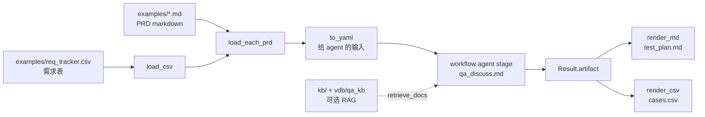

# play/qa_assets

QA 测试方案 agent 项目的**资产层**——配置、scenario、hooks、模板、示例数据。**没有业务代码**（hooks 是薄 deterministic 函数，无业务逻辑）。

把这一层与 [play/agent_engine/](../agent_engine/) (LLM 推理引擎) 和 [play/workflow/](../workflow/) (pipeline runner) 解耦：领域东西全在这里，引擎与 runner 完全 domain-agnostic。

## 端到端流程



## 项目布局

```
play/qa_assets/
├── workflows/
│   └── qa_supervisor.yaml          # 顶层 pipeline: CSV → discuss → test_plan.md + cases.csv
├── scenarios/
│   └── qa_discuss.md               # 6 agent；retrieve_docs → vdb/qa_kb
├── hooks/
│   ├── load_csv.py                 # CSV → list[dict], 最小校验
│   ├── load_each_prd.py            # 对有 prd_doc_path 的行: Path.read_text() → prd_md
│   ├── to_yaml.py                  # 序列化助手（替代 workflow 模板 filter）
│   ├── render_md.py                # Jinja: artifact + 元数据 → test_plan.md
│   └── render_csv.py               # 测试用例节 → cases.csv
├── templates/
│   └── test_plan.md.j2             # 测试方案 markdown 模板
├── examples/
│   ├── req_tracker.csv           # 示例需求跟踪表 CSV，2 行 (REQ-001 引用 PRD .md, REQ-002 inline)
│   └── prd_signup.md               # 示例 PRD markdown（workflow 直接读入，非 kb/）
├── kb/                             # RAG 语料（短文档，减 retrieve 返回 token）
├── vdb/qa_kb/                      # ingest 产物；与 kb/ 内容同步，改 kb 后须重建
└── README.md                       # 本文件
```

### `kb/` 与 `vdb/qa_kb`

跑 `qa_supervisor` **不依赖** `kb/`：默认只读 `examples/req_tracker.csv` + 行内 PRD。`kb/` 仅在 agent 调用 `retrieve_docs` 且存在已建好的 `vdb/qa_kb` 时参与检索。缩短 `kb/` 可略减检索 chunk 与后续 prompt 体积；**Wall-clock 仍主要由多 agent 轮次决定**。

改 `kb/` 后在本机重建向量库（在 `play/rag` 目录、已起 Ollama）：

```bash
cd play/rag
python ingest.py --docs ../qa_assets/kb --output ../qa_assets/vdb/qa_kb
```

## 端到端跑通

```bash
cd play/
python -m workflow run qa_assets/workflows/qa_supervisor.yaml \
    --vars csv_path=qa_assets/examples/req_tracker.csv \
    --vars output_dir=/tmp/qa_out
```

成功跑完 `qa_supervisor` 后，`output_dir` 下典型产物：

|文件|来源|用途|
|---|---|---|
|`transcript.json`|agent_engine|多 agent 完整 history：topic / turn / speaker / artifact_event / tool_call|
|`test_plan_artifact.md`|agent_engine artifact|引擎内 artifact 快照（六节：Requirements / 原子需求 / 风险等级 / 测试用例 / 非功能 / Critic 反馈）|
|`test_plan.md`|`render_md` hook|对外测试方案 markdown（含范围与排期表）|
|`cases.csv`|`render_csv` hook|从「测试用例」节解析出的平铺用例行|

## 输入契约 (CSV schema)

列定义：

|列|必填|含义|
|---|---|---|
|`req_id`|✓|需求 id (自由格式, 如 `REQ-001`)|
|`title`|✓|一句话标题|
|`description`|二选一|行内简短描述 (与 `prd_doc_path` 至少有一个)|
|`prd_doc_path`|二选一|PRD .md 路径（相对**运行时的当前工作目录**，如 `cd play/` 时常写 `qa_assets/examples/...`；**仅 markdown**）|
|`priority`|否|P0~P3, 留空时由 risk_grader agent 推断|
|`assignee`|✓|负责测试的人|
|`sprint_start`|否|ISO date, 元数据透传到输出|
|`sprint_end`|否|同上|

> 不接入 docx/xlsx/pdf 等二进制格式。要喂 PRD 必须先转 markdown.

## 多 agent 角色分工 (qa_discuss.md)

|Agent|role|职责|产出节|
|---|---|---|---|
|`supervisor`|moderator|开场 + 协调 + finalize_artifact|—|
|`decomposer`|member|把每个需求拆为原子 feature + 验收标准|原子需求|
|`risk_grader`|member|给每个需求打 P0~P3 + 一句话理由|风险等级|
|`case_generator`|member|产出 functional + boundary/edge 用例|测试用例|
|`nfr_planner`|member|性能/安全/a11y/i18n 非功能测试点|非功能|
|`critic`|member|多轮反馈: 覆盖空白 / 优先级矛盾 / 互相冲突|Critic 反馈 (append)|

step 流: `open → produce (4 specialist 并行) → critic_r1 → revise → critic_r2 → finalize`. 单次 run 把整张 CSV 的全部需求一次性塞进同一份讨论；≤ ~10 行需求时 context 够用。

## 当前阶段

|阶段|状态|说明|
|---|---|---|
|6 段线性 workflow|✅ 已落地|`load` → `load_prds` → `serialize_for_agent` → `discuss` → `render_md` → `render_csv`|
|多 agent scenario|✅ 已落地|`qa_discuss.md`、`req_tracker.csv` 示例、Jinja 模板与落盘产物已串在同一 YAML|
|RAG 深度结合|📝 计划中|工具与 ingest 已具备；主要剩 scenario / prompt 稳定性与评测|

## 显式不做项

|不做项|原因|
|---|---|
|真 Confluence / Jira / Figma / TestRail connector|本目录是资产层示例，不接真实 SaaS|
|独立 Gantt / Schedule 输出|当前 `test_plan.md` 已覆盖排期表达|
|pytest harness|scenario 仍是 `.md` 业务工件，不把它包装成测试框架|
|per-row run-loop|当前边界是整批一次塞；逐行跑会放大 LLM 成本和编排复杂度|
