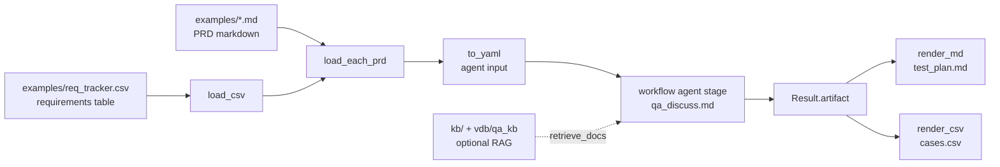

# play/qa_assets

**Asset layer** for the QA test-plan agent project — config, scenarios, hooks, templates, sample data. **No business logic** (hooks are thin deterministic functions).

Decouples domain content from [play/agent_engine/](../agent_engine/) (LLM reasoning engine) and [play/workflow/](../workflow/) (pipeline runner): domain lives here; engine and runner stay domain-agnostic.

## End-to-end flow



## Layout

```
play/qa_assets/
├── workflows/
│   └── qa_supervisor.yaml          # top pipeline: CSV → discuss → test_plan.md + cases.csv
├── scenarios/
│   └── qa_discuss.md               # 6 agents; retrieve_docs → vdb/qa_kb
├── hooks/
│   ├── load_csv.py                 # CSV → list[dict], minimal validation
│   ├── load_each_prd.py            # rows with prd_doc_path: Path.read_text() → prd_md
│   ├── to_yaml.py                  # serialization helper (replaces workflow template filters)
│   ├── render_md.py                # Jinja: artifact + metadata → test_plan.md
│   └── render_csv.py               # Test Cases section → cases.csv
├── templates/
│   └── test_plan.md.j2             # test plan markdown template
├── examples/
│   ├── req_tracker.csv           # sample requirements CSV, 2 rows (REQ-001 PRD .md, REQ-002 inline)
│   └── prd_signup.md               # sample PRD markdown (read by workflow, not kb/)
├── kb/                             # RAG corpus (short docs to reduce retrieve token)
├── vdb/qa_kb/                      # ingest output; sync with kb/ — rebuild after kb changes
└── README.md                       # this file
```

### `kb/` and `vdb/qa_kb`

Running `qa_supervisor` **does not require** `kb/`: by default it only reads `examples/req_tracker.csv` + inline PRDs. `kb/` participates only when an agent calls `retrieve_docs` and `vdb/qa_kb` exists. Shorter `kb/` slightly reduces retrieve chunks and prompt size; **wall-clock is still dominated by multi-agent turns**.

Rebuild the vector store locally after changing `kb/` (from `play/rag`, Ollama running):

```bash
cd play/rag
python ingest.py --docs ../qa_assets/kb --output ../qa_assets/vdb/qa_kb
```

## Run end-to-end

```bash
cd play/
python -m workflow run qa_assets/workflows/qa_supervisor.yaml \
    --vars csv_path=qa_assets/examples/req_tracker.csv \
    --vars output_dir=/tmp/qa_out
```

Typical artifacts under `output_dir` after a successful `qa_supervisor` run:

|File|Source|Purpose|
|---|---|---|
|`transcript.json`|agent_engine|Full multi-agent history: topic / turn / speaker / artifact_event / tool_call|
|`test_plan_artifact.md`|agent_engine artifact|In-engine artifact snapshot (six sections: Requirements / Atomic Requirements / Risk Levels / Test Cases / Non-functional / Critic Feedback)|
|`test_plan.md`|`render_md` hook|External test plan markdown (scope & schedule table)|
|`cases.csv`|`render_csv` hook|Flat test-case rows parsed from Test Cases section|

## Input contract (CSV schema)

Column definitions:

|Column|Required|Meaning|
|---|---|---|
|`req_id`|✓|Requirement id (free form, e.g. `REQ-001`)|
|`title`|✓|One-line title|
|`description`|one of two|Inline short description (at least one of this or `prd_doc_path`)|
|`prd_doc_path`|one of two|PRD .md path (relative to **runtime cwd**, e.g. under `cd play/` write `qa_assets/examples/...`; **markdown only**)|
|`priority`|optional|P0~P3; inferred by risk_grader agent if empty|
|`assignee`|✓|Tester owner|
|`sprint_start`|optional|ISO date, metadata passed through to output|
|`sprint_end`|optional|same|

> No docx/xlsx/pdf binary formats. Convert PRDs to markdown first.

## Multi-agent roles (qa_discuss.md)

|Agent|role|Responsibility|Output section|
|---|---|---|---|
|`supervisor`|moderator|Open + coordinate + finalize_artifact|—|
|`decomposer`|member|Split each req into atomic features + acceptance criteria|Atomic Requirements|
|`risk_grader`|member|P0~P3 + one-line rationale per req|Risk Levels|
|`case_generator`|member|Functional + boundary/edge cases|Test Cases|
|`nfr_planner`|member|Perf/security/a11y/i18n non-functional points|Non-functional|
|`critic`|member|Multi-round feedback: gaps / priority mismatch / conflicts|Critic Feedback (append)|

Step flow: `open → produce (4 specialists in parallel) → critic_r1 → revise → critic_r2 → finalize`. One run loads the entire CSV into one discussion; context fits for ≤ ~10 requirement rows.

## Current phase

|Phase|Status|Notes|
|---|---|---|
|6-stage linear workflow|✅ done|`load` → `load_prds` → `serialize_for_agent` → `discuss` → `render_md` → `render_csv`|
|Multi-agent scenario|✅ done|`qa_discuss.md`, `req_tracker.csv` sample, Jinja template, outputs wired in one YAML|
|Deep RAG integration|📝 planned|Tools and ingest exist; mainly scenario/prompt stability and eval left|

## Explicit non-goals

|Non-goal|Reason|
|---|---|
|Real Confluence / Jira / Figma / TestRail connectors|Asset-layer demo, no real SaaS|
|Standalone Gantt / schedule output|`test_plan.md` already covers scheduling|
|pytest harness|Scenarios remain `.md` business artifacts, not a test framework|
|Per-row run loop|Current boundary is one batch; per-row runs amplify LLM cost and orchestration|
