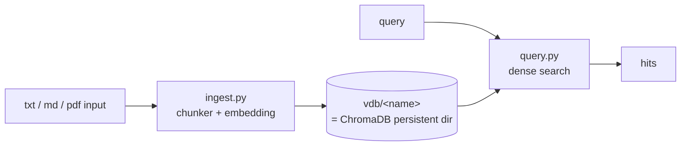
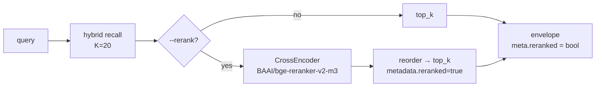

# Journal

> Dates follow actual commit history. Each milestone is a 100–300 word narrative on why it mattered and what it implies, plus framework change table, mermaid when needed, and new/changed modules, CLI, and data/demo scenarios.

## 2026-04-15 — First RAG PoC: ChromaDB + Ollama + paragraph-aware chunker

This milestone made a minimal RAG runnable locally, with long-term payoff at the tech-stack decision. Two CLIs `ingest.py` / `query.py`; `upsert` not `add` for idempotent re-ingest; collection name = `basename(--output)` so authors need not think two names. Two decisions stand out: **embedded ChromaDB (`PersistentClient(path=...)`)** over Qdrant / Weaviate / pgvector — VDB is one directory, `cp -r` migratable, git-ignorable, workshop-friendly; **Ollama embedding** over OpenAI API / sentence-transformers direct — shares runtime with multiagent main inference, avoiding dual LLM backend key/billing/rate-limit maintenance.

### Framework changes

|Change|Purpose|
|---|---|
|Two CLIs (`ingest.py` / `query.py`)|drop-in usable; zero extra services|
|embedded ChromaDB (`PersistentClient`)|VDB is directory; `cp -r` / single-file migration|
|Ollama embedding (default `qwen3-embedding:8b`)|shared runtime with main inference; no dual backend|
|`upsert` replaces `add`|idempotent re-ingest; dev not blocked by dirty data|
|collection name = `basename(--output)`|directory name is collection name; no "two names" burden|



### New / changed modules

|Module|Description|
|---|---|
|`ingest.py`|mixed input (file / dir `nargs="+"`); `.txt / .md / .pdf`|
|`query.py`|first version pure dense retrieval; CLI pretty-print|
|`chunker.py`|paragraph-aware: `\n\n` split, greedy pack, char hard-cut, overlap via full trailing paragraphs|
|`ollama_embedding.py`|wraps ChromaDB `EmbeddingFunction` to Ollama `/api/embed`|

### New data / demo scenarios

|Purpose|Content|
|---|---|
|First knowledge base|6 panel character profiles as private background for `play/agent_engine` (then `play/multiagent`)|

## 2026-04-16 — Structured search API + `--json` subprocess contract

This milestone upgraded RAG from "CLI for humans" to "programmatic capability for other subprojects". `query.py` `--json`: stdout JSON envelope only, warnings/progress on stderr; subprocess consumers `json.loads(stdout)`. API layered: `search()` pure function → `query()` thin pretty-print → CLI thinnest. Key design: `SearchResult` TypedDict **de-chromatized** — not `document` / `distance`; `score = 1.0/(1.0+distance)` so callers see "higher = more similar" without knowing L2 vs cosine. Subprocess + JSON envelope later reused by `play/agent_engine` `retrieve_docs` and `play/evals` phases 4/5.

### Framework changes

|Change|Purpose|
|---|---|
|`query.py --json` mode|stdout machine-only; warnings/progress on stderr|
|API layers: `search()` + `query()` + CLI|clear responsibilities; unit tests separable|
|`SearchResult` TypedDict (de-chromatized)|not bound to ChromaDB vocabulary; future Qdrant/pgvector safe|
|`score = 1.0/(1.0+distance)`|similarity convention for callers|
|`OLLAMA_BASE_URL` unified cross-subproject|shared local LLM across subprojects|

```mermaid
flowchart LR
    HOST[(consumer process<br/>play/agent_engine etc.)]
    HOST -->|subprocess.run<br/>[python, query.py, --json]| CLI[query.py --json]
    CLI --> S[search pure function]
    S --> VDB[(vdb)]
    S --> ENV[JSON envelope<br/>list[SearchResult]]
    ENV -->|stdout| HOST
    CLI -. stderr warnings .- HOST
```

### New / changed modules

|Module|Description|
|---|---|
|`query.py`|split `search()` + `query()`; `--json` envelope output|
|`SearchResult` TypedDict|`content / score / source / metadata` four fields; cross-provider stable contract|

### New data / demo scenarios

|Purpose|Content|
|---|---|
|Docs grouped by scenario|`docs/panel/` / `docs/test_vdb/` subdirectories|

## 2026-04-25 — Hybrid retrieval: dense + BM25 + RRF default on

Rare proper nouns / IDs (`ZX-7492` / `SRV-8831`) hurt pure dense recall — a hard gate for "production-usable" RAG. This milestone adds BM25 + RRF; hybrid becomes default (`dense` / `bm25` diagnostic). Key engineering pairing: BM25 tokenizer reuses embedding model BPE (Qwen3-Embedding-8B), aligned with dense tokenization; cross-language (CJK / Latin / code / emoji) consistent. Fusion: **RRF (Reciprocal Rank Fusion, k=60, Cormack et al. 2009)** — rank-only, no normalize; matches Elasticsearch 8.8+ official hybrid. CLI envelope breaking upgrade bare array → `{query, data, meta}` aligned with OpenAI Vector Store / Pinecone / Cohere; `search()` Python API unchanged.

### Framework changes

|Change|Purpose|
|---|---|
|`mode={dense, bm25, hybrid}`, hybrid default|production default; dense/bm25 diagnostic only|
|BM25 tokenizer same BPE as dense embedding|cross-language tokenization aligned; no hybrid internal drift|
|RRF (k=60) fusion|rank-only fusion; industry default|
|`top_k * HYBRID_OVERSAMPLE` (=4) recall oversample|enough candidates before fusion|
|`bm25.pkl` alongside chroma|VDB still single directory `cp -r` migratable|
|`metadata.json` adds `tokenizer` sentinel|self-describing VDB; ingest/query tokenizer consistency|
|envelope upgrade `{query, data, meta}` (BREAKING)|OpenAI/Pinecone/Cohere subset; solo project no compat tax once|

```mermaid
flowchart LR
    Q[query] --> D[dense_search<br/>top_k * 4]
    Q --> B[bm25_search<br/>top_k * 4]
    D --> RRF[rrf_fuse<br/>k=60]
    B --> RRF
    RRF --> TOP[top_k]
    TOP --> ENV[envelope<br/>{query, data, meta}]
```

### New / changed modules

|Module|Description|
|---|---|
|`bm25.py`|`dense_search` / `bm25_search` / `rrf_fuse` three pure functions|
|`tokenizer.py`|HF tokenizer wrapper + `lru_cache`|
|`prefetch.py`|one-time HF asset cache fetch; avoids runtime download in tests|
|`ingest.py` / `query.py`|read/write `bm25.pkl`; `metadata.json` tokenizer sentinel read/validate|
|envelope schema|bare array → `{query, data, meta}` (breaking)|

### New data / demo scenarios

|Purpose|Content|
|---|---|
|Rare proper noun / ID scenarios|counter-narrative samples where pure dense fails|

## 2026-04-25 — Cross-encoder reranker (two-stage retrieval)

Retrieval upgraded from single-stage to two-stage: recall (hybrid, K=20 candidates) → rerank (cross-encoder to top_k). Rerank default off (`--rerank` explicit) to avoid loading ~1.2GB every start; `lru_cache(1)` zero cost after first ~5s load. Model `BAAI/bge-reranker-v2-m3` (multilingual + CJK/EN/code/emoji friendly). Pool K=20 from BEIR / MS MARCO experience; cross-encoder cost negligible on M-series Mac. Core caveat: **rerank cannot recover recall misses** — if hybrid ranks correct doc outside K=20, reranker cannot help; it reorders, not retrieves. Same commit: agent_engine exposes `mode` + `rerank` via OpenAI tool schema for LLM-adaptive rerank on ambiguous queries.

### Framework changes

|Change|Purpose|
|---|---|
|`--rerank` flag (default off)|avoid ~1.2GB model load every startup|
|`lru_cache(1)` singleton lazy load|~5s first time, then zero startup cost|
|K=20 candidate pool|BEIR/MS MARCO experience; rerank time negligible|
|per-hit `metadata.reranked = True` + envelope `meta.reranked = True`|dual-path provenance labeling|
|agent_engine slim envelope unwrap|HTTP envelope ↔ SDK list two-layer split; OpenAI SDK style|



### New / changed modules

|Module|Description|
|---|---|
|`reranker.py`|`sentence-transformers.CrossEncoder` + `lru_cache(1)` singleton lazy load|
|`query.py`|add `--rerank`; envelope annotates `meta.reranked`|
|`agent_engine/tools/retrieve_docs.py` (same commit)|unwrap rag CLI envelope to slim `{data, meta:{mode, reranked, top_k}}` for LLM; ToolTracer preview upgrade|

### New data / demo scenarios

|Purpose|Content|
|---|---|
|Ambiguous query adaptive rerank|`agent_engine` `scenarios/test_vdb.md` nudges LLM `rerank=true` on ambiguous query|

## 2026-06-13 — CI VDB fixture ingest stabilization

### Functional

GitHub CI building `vdb/test_vdb` / `vdb/panel` fixtures no longer re-triggers Ollama embedding during Chroma `upsert`, avoiding CI failure from bulk request timeout even on small corpora.

### Technical

`ingest.py` computes Ollama embeddings in explicit batches, then passes `embeddings` with `documents` / `metadatas` to Chroma `upsert`; new static contract test pins "precomputed vectors written" path against regression to Chroma implicit embedding.

## 2026-06-13 — Ollama embedding timeout convergence

### Functional

CI building `docs/panel` VDB completes fixture generation even when embedding model cold-starts or single requests are slow on GitHub runners, via smaller batches, long timeout, and automatic retry.

### Technical

`ingest.py` switches from Chroma `OllamaEmbeddingFunction` to direct `ollama.Client(timeout=...)` vector computation; defaults `RAG_EMBED_BATCH_SIZE=1`, `RAG_OLLAMA_TIMEOUT=300`, `RAG_EMBED_RETRIES=3`; Chroma collection no longer holds embedding function, only receives precomputed vectors.
