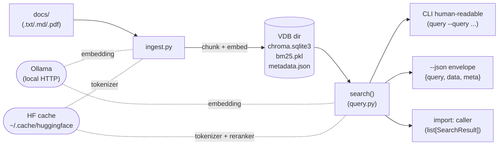
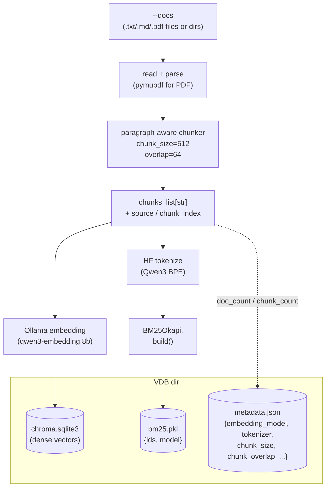
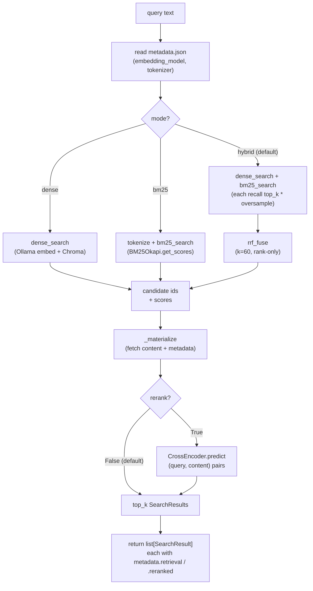

# play/rag

Local-first two-stage RAG toolkit: **dense (Ollama embedding) + BM25 + RRF fusion** for recall, optional **cross-encoder (`bge-reranker-v2-m3`)** reranking. Dual CLI and programmatic API; consumable by external tools (e.g. [`play/agent_engine/`](../agent_engine/) `retrieve_docs`, [`play/evals/`](../evals/) RAG eval tasks) via subprocess + JSON envelope.

## Features

- **Local zero-ops**: embedded ChromaDB; VDB is one directory; `cp -r` to migrate
- **Self-describing VDB**: `metadata.json` sentinel travels with VDB; query side defaults to ingest-time model / chunker / tokenizer — see [§VDB directory anatomy](#vdb-directory-anatomy)
- **Paragraph-aware chunker**: split on `\n\n`, greedy pack, overlap via full trailing paragraphs to preserve semantics
- **Hybrid recall (default)**: dense + BM25 dual path → **RRF** (`k=60`, rank-only); BM25 tokenizer same Qwen3 BPE as embedding; cross-language (CJK / Latin / code / emoji) tokenization aligned
- **Cross-encoder reranker (optional)**: `BAAI/bge-reranker-v2-m3` lazy-load + `lru_cache(1)` singleton; `--rerank` explicit opt-in
- **Provider-agnostic return values**: `SearchResult` uses `content / score / source / metadata`; each hit tagged `metadata.retrieval` / `metadata.reranked`
- **`--json` envelope contract**: stdout `{query, data, meta}` aligned with OpenAI Vector Store / Pinecone / Cohere common subset; warnings/progress on stderr
- **Multi-format input**: `.txt / .md / .pdf` (PDF via pymupdf)

## Guiding principles

Four principles throughout this project:

|#|Principle|Notes|
|---|---|---|
|1|**Self-describing VDB**|embedding-model / chunk params / tokenizer travel with data; eliminates silent "wrong model, right index" failures|
|2|**Library API before CLI**|design programmatic functions first; CLI is thin wrapper|
|3|**Abstraction lags second consumer**|single backend → no `if/elif` branches|
|4|**Prefer library capabilities, don't reinvent**|use what ChromaDB officially provides|

## Architecture overview



## Ingest data flow

`ingest.py` turns documents into a searchable VDB directory: dense vectors in ChromaDB, BM25 inverted index serialized to `bm25.pkl`, self-describing sentinel in `metadata.json`.



## Query data flow

Default hybrid recall; `--rerank` adds cross-encoder reranking on the candidate pool. Both retrieval paths oversample within `RERANK_CANDIDATES * HYBRID_OVERSAMPLE` so RRF / rerank have enough candidates.



## Environment setup

- Python 3.12+
- `pip install -r requirements.txt` (`chromadb / pymupdf / ollama / rank-bm25 / tokenizers / sentence-transformers / torch`)
- Install and run [Ollama](https://ollama.com), pull embedding model:

```bash
ollama pull qwen3-embedding:8b   # default, Chinese-friendly
# or lighter alternative:
ollama pull nomic-embed-text
```

## Quick start

Minimal dataset included: [`docs/test_vdb/`](docs/test_vdb). From `play/rag/`:

```bash
# 0. (optional, first run or new machine) one-time HF assets: BM25 tokenizer (~10MB) + reranker (~1.2GB)
#    skip OK — ingest/query auto-download on first use, but tests may pause briefly
python prefetch.py

# 1. Build index (hybrid generates chroma vectors + bm25.pkl)
python ingest.py --docs docs/test_vdb --output vdb/test_vdb

# 2. Query (default hybrid, human-readable)
python query.py --vdb vdb/test_vdb --query "项目代号"

# 3. High-precision path (cross-encoder rerank on candidate pool)
python query.py --vdb vdb/test_vdb --query "项目代号" --rerank

# 4. Diagnostic modes (single-path retrieval for comparison)
python query.py --vdb vdb/test_vdb --query "项目代号" --mode dense
python query.py --vdb vdb/test_vdb --query "项目代号" --mode bm25
```

Expected output fragment:

```
Query: 项目代号
Top 5 results (mode=hybrid)

--- [1] source=项目事实.txt  chunk=0  score=0.0328 ---
项目事实清单
- 项目代号：ZX-7492
...
```

Machine consumption (stdout JSON envelope only; warnings on stderr):

```bash
python query.py --vdb vdb/test_vdb --query "项目代号" --json --rerank
```

## CLI quick reference

> Full help and defaults: `python ingest.py --help` / `python query.py --help`.

### `ingest.py`

|Arg|Required|Default|Description|
|---|---|---|---|
|`--docs`|yes|—|one or more files/dirs; recursively collects `.txt/.md/.pdf`|
|`--output`|yes|—|VDB output directory (created if needed)|
|`--chunk-size`|no|`512`|target characters per chunk|
|`--overlap`|no|`64`|max paragraph-level overlap between adjacent chunks|
|`--model`|no|`qwen3-embedding:8b`|Ollama embedding model; written to metadata sentinel|
|`--collection`|no|`basename(--output)`|ChromaDB collection name|

### `query.py`

|Arg|Required|Default|Description|
|---|---|---|---|
|`--vdb`|yes|—|VDB directory (`ingest --output` artifact; must contain `bm25.pkl`)|
|`--query`|yes|—|query text|
|`--top-k`|no|`5`|return top N similar chunks|
|`--mode`|no|`hybrid`|retrieval strategy: `dense` / `bm25` / `hybrid`; latter two diagnostic only|
|`--rerank`|flag|`False`|enable cross-encoder rerank (first run ~5s loads ~1.2GB)|
|`--model`|no|stored model in metadata|explicit embedding override; mismatch → stderr WARNING only|
|`--collection`|no|first collection|multi-collection VDB requires explicit name|
|`--json`|flag|`False`|stdout `{query, data, meta}` envelope|

### `prefetch.py`

No arguments. One-time fetch of HF tokenizer + reranker to `~/.cache/huggingface/`.

## Programmatic API

```python
from query import search

hits = search(
    vdb_dir="vdb/test_vdb",
    query_text="项目代号",
    top_k=3,
    mode="hybrid",   # "dense" / "bm25" / "hybrid" (default)
    rerank=False,    # True adds cross-encoder rerank
)
for h in hits:
    print(h["source"], h["score"], h["metadata"]["retrieval"], h["content"][:60])
```

Returns `list[SearchResult]`:

|Field|Type|Description|
|---|---|---|
|`content`|`str`|chunk text|
|`score`|`float`|similarity score; **not comparable across modes** (dense=`1/(1+dist)`, bm25=raw, hybrid=RRF, rerank=CE logit)|
|`source`|`str`|relative file path|
|`metadata`|`dict`|includes `chunk_index / retrieval / reranked`, etc.|

Three thin layers: `search()` pure function → `query()` pretty-print wrapper → CLI wraps envelope and `print`s to stdout.

## `--json` envelope contract

```jsonc
{
  "query": "项目代号",
  "data": [
    {
      "content": "项目事实清单\n- 项目代号：ZX-7492\n...",
      "score": 0.9847580194473267,
      "source": "项目事实.txt",
      "metadata": {
        "source": "项目事实.txt",
        "chunk_index": 0,
        "retrieval": "hybrid",
        "reranked": true
      }
    }
  ],
  "meta": {
    "vdb": "vdb/test_vdb",
    "mode": "hybrid",
    "reranked": true,
    "top_k": 5,
    "embedding_model": "qwen3-embedding:8b"
  }
}
```

Design follows OpenAI Vector Store search / Pinecone query / Cohere rerank common subset — `data` holds business objects, `meta` holds request-level info; future pagination / timing / version fields are additive evolution without breaking contract.

## VDB directory anatomy

```
vdb/test_vdb/
├── chroma.sqlite3              # ChromaDB primary storage (dense vectors)
├── bm25.pkl                    # BM25 inverted index ({ids, model} pickle)
├── metadata.json               # self-describing sentinel (written by this repo)
└── <uuid>/                     # ChromaDB internal data
```

`metadata.json` fields:

|Field|Meaning|
|---|---|
|`embedding_model`|model used at ingest; query defaults to this|
|`tokenizer`|HF tokenizer for BM25; query defaults to this|
|`chunk_size` / `chunk_overlap`|chunking parameters|
|`doc_count` / `chunk_count`|ingest statistics|
|`created_at`|UTC ISO timestamp|

> Missing `bm25.pkl` → `query.py` raises `FileNotFoundError` with re-ingest hint — solo project pays no compatibility tax for nonexistent "old VDB".

## Project structure

```
play/rag/
├── README.md                   # this file
├── DECISIONS.md                # ADR archive (Status / Date / trade-offs per entry)
├── JOURNAL.md                  # milestone progress (≤2/day, Functional + Technical, cross-link DECISIONS §N)
├── requirements.txt            # chromadb + pymupdf + ollama + rank-bm25 + tokenizers + sentence-transformers + torch
├── config.py                   # EMBED_MODEL / CHUNK_SIZE / RRF_K / RERANKER_MODEL defaults
├── chunker.py                  # paragraph-aware split (split_text)
├── tokenizer.py                # HF tokenizer wrapper (lru_cache + special-token filter)
├── bm25.py                     # dense_search / bm25_search / rrf_fuse pure functions
├── reranker.py                 # CrossEncoder lazy singleton + rerank()
├── ingest.py                   # build-index CLI + ingest(): embed → chroma + bm25.pkl + metadata.json
├── query.py                    # query CLI + search() / query() API
├── prefetch.py                 # one-time HF tokenizer + reranker cache fetch
├── docs/                       # sample documents
└── vdb/                        # sample VDB output
```
