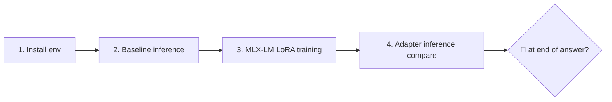

# play/sft_hello

**One-time hello-world fine-tuning experiment**: Use MLX-LM LoRA on M4 Pro 48GB to train Qwen2.5-0.5B-Instruct to "must add 🦊 at the end of each answer" to verify that the entire fine-tuning pipeline (environment → data → training → inference comparison) can run on my machine. **Don’t care about the effect or generalization**——As long as you don’t add 🦊 before training and add 🦊 after training, this project will be considered a success.

## Difference from `play/agent_sft/`

|Dimensions|`play/sft_hello` (this project)|[`play/agent_sft`](../agent_sft/)|
|---|---|---|
|Goal|Run through the process|Produce differentiated training results|
|Base|Qwen2.5-0.5B-Instruct|v1 uses Qwen2.5-7B; currently moved to qwen3.5:9b|
|Data|30 toys (each answer must 🦊)|Triples mined from `agent_engine` trace; currently recommended qwen3 clean-data|
|Measurement|Judging by naked eye whether 🦊 appears|nudge-fire rate / trajectory score / BFCL slice|
|Deployment|None (adapter is the end point)|v1 fuse → GGUF → `ollama create` runs through; qwen3.5 GGUF is still blocked|
|Life cycle|One-time, run and archive|Multi-phase roadmap, long-term evolution|

The separation is intentional so that "try it out" doesn't taint the differentiated promise of `agent_sft` (see its README §"v1 non-goals").

## Four steps to get through



|Step|What to do|Time|
|---|---|---|
|1|Installation environment|2 min|
|2| Reasoning before running training (baseline) |30 sec|
|3|Training LoRA|5-15 min|
|4|Reasoning after running training (contrast whether 🦊 appears or not)|30 sec|

The data has been handwritten in `data/train.jsonl` (30 lines) + `data/valid.jsonl` (10 lines), in chat format. Assistant always adds `🦊` at the end of each answer, no generation step is required.

### 1. Install environment

```bash
cd play/sft_hello
python -m venv .venv && source .venv/bin/activate
pip install -r requirements.txt
```

`mlx-lm` only works on Apple Silicon; automatically pulls the `mlx` kernel.

### 2. Pre-training baseline

```bash
python infer_compare.py --before
```

Run 5 test questions to confirm that the original model **doesn't** spontaneously add 🦊.

### 3. Training

```bash
mlx_lm.lora \
  --model Qwen/Qwen2.5-0.5B-Instruct \
  --train \
  --data ./data \
  --config ./lora_config.yaml \
  --iters 200 \
  --batch-size 4 \
  --num-layers 8 \
  --learning-rate 1e-4 \
  --adapter-path ./adapters
```

Only LoRA structure knobs (`rank` / `scale` / `dropout` / `keys`) are placed in `lora_config.yaml` - these four items in MLX-LM design do not accept CLI flag, only YAML. `iters` / `batch-size` / `learning-rate` / `num-layers` that can be adjusted daily stay on the command line.

Expected loss drops from ~3 to < 1 (toy mode overfitting is the goal).

### 4. Comparison after training

```bash
python infer_compare.py --after
```

Answers to at least 4 out of 5 questions with 🦊 at the end are considered successful. You can also add `--both` to print them side by side in the same script.

## Further: controlled-variable method sweep

`sweep.py` pulls the 5 knobs `iters` / `learning-rate` / `num-layers` / `batch-size` / `rank` to different orders of magnitude in turn, keeping the other Baseline values ​​unchanged, and automatically generates `runs/sweeps/REPORT.md` (including value-by-value plain language interpretation, proper nouns with English).

```bash
python sweep.py all              # all 5 sweeps, ~30-40 min
python sweep.py iters lr         # run only selected sweeps
python sweep.py report           # skip re-run; regenerate report from existing results
```

Reports are located in `runs/sweeps/REPORT.md`; each (sweep, value) subdirectory of `runs/sweeps/<sweep>/<value>/` stores adapter + training log + 5 prompt inference output.

## Project structure

```
play/sft_hello/
├── README.md             # this file
├── JOURNAL.md            # kickoff entry
├── requirements.txt      # mlx-lm
├── lora_config.yaml      # LoRA structure knobs: rank / scale / dropout / keys
├── .gitignore            # adapters / .venv / __pycache__
├── data/
│   ├── train.jsonl       # 30 chat rows, 🦊 at end of each answer
│   └── valid.jsonl       # 10 rows, same structure
├── infer_compare.py      # pre/post training inference + compare
└── sweep.py              # controlled-variable sweep + auto report generation
```

## What to do after running through?

`play/sft_hello/` will be archived after finishing (it’s okay not to enter `_archive/`, but stay in `play/` for reference). Next go to [`play/agent_sft/`](../agent_sft/): the training pipeline there is also based on MLX-LM LoRA, but the base, data, evaluation and deployment issues are all upgraded.

## refer to

- [MLX-LM LoRA Documentation](https://github.com/ml-explore/mlx-lm/blob/main/mlx_lm/LORA.md)
- [Qwen2.5-0.5B-Instruct on HF](https://huggingface.co/Qwen/Qwen2.5-0.5B-Instruct)
