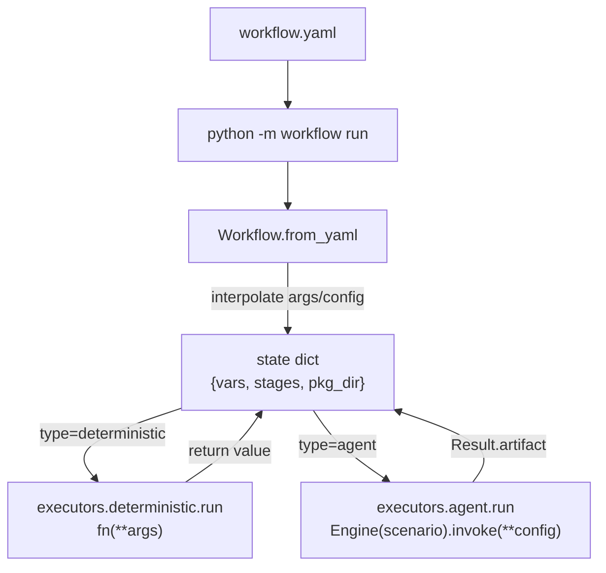

# play/workflow

Declarative pipeline runner — sequentially chains **deterministic stages** (Python functions) and **agent stages** (calling [play/agent_engine/](../agent_engine/) `Engine.invoke()`). workflow embeds **no LLM logic** itself; `executors/agent.py` is its **only** LLM coupling point (see [`DECISIONS §2`](DECISIONS.md)).

## Boundaries (still in effect)

> **Intentional** — this play stays at a few hundred lines; for retry / UI / durability and other mature capabilities, migrate to Prefect / Temporal / Argo ([`DECISIONS §1`](DECISIONS.md) describes migration strategy).

|Dimension|We do not|Instead|
|---|---|---|
|Reliability|retry / timeout / circuit-breaker|hooks use `tenacity` / `signal` themselves|
|Flow control|DAG / conditionals / loops / parallelism|stages are a linear list; branch needs hook or multiple yaml files|
|Lifecycle|cron / scheduling / persistence / resume|runner is one-shot; scheduling is outer layer (cron / GitHub Actions)|
|Templating|filters / expressions / inline Python (`code:` blocks)|`{{ x.y.z }}` path access; data transforms go in hooks (see kitchen_sink `to_yaml` stage)|
|Plugins|stdlib / auto-register decorators|explicit `import`, visible in debugging; YAGNI until a second real consumer|
|CLI|multiple subcommands (`validate` / `list` / `inspect`)|only `run`, to avoid scope creep|
|trace_id|not implemented|reserve W3C `traceparent` env var name + JSON field name for future zero-cost adoption (see [`DECISIONS §1`](DECISIONS.md))|

Error philosophy ([`DECISIONS §3`](DECISIONS.md)): missing required fields → `sys.exit("Error: ...")`, **no** "you probably meant X" hints; referencing nonexistent stage / wrong type → `KeyError` at template interpolation, traceback speaks directly; runtime errors (hook raise / scenario assembly failure) → propagate unwrapped; no "legacy user guidance", no "schema migration".

When new needs arise: first see if a hook function can solve it internally (`tenacity` for retry, `subprocess` for external calls, `Path.read_text()` for files…), then consider changing the workflow library itself.

## Public API

### Python

Paths below assume current working directory is **`play/`** (same as `python -m workflow run ...`).

```python
from workflow import Workflow

wf = Workflow.from_yaml("qa_assets/workflows/qa_supervisor.yaml")
state = wf.run(
    {
        "csv_path": "qa_assets/examples/req_tracker.csv",
        "output_dir": "/tmp/qa_out",
    }
)
# state["stages"]["render_csv"]["output"]  # last stage output
```

### CLI

```bash
cd play/
python -m workflow run workflow/examples/kitchen_sink.yaml \
    --vars greeting=Hello \
    --vars n_lines=3
```

## Field quick reference (normative SoT)

> [examples/kitchen_sink.yaml](examples/kitchen_sink.yaml) is the **sole authority** for field quick reference + mental model — each field used once + inline `#` comments + trailing "runtime mental model" section. New authors start here; this README is overview only.

```text
play/workflow/
├── runner.py             Workflow.from_yaml + .run; per-stage start/done + duration_ms
├── schema.py             minimal validation (missing required → sys.exit; no backward compat/friendly hints)
├── state.py              path interpolation (~50 lines; whole string preserves type, inline forces str)
├── executors/
│   ├── deterministic.py  fn string → callable, invoke and return value
│   └── agent.py          Engine(scenario).invoke(**config) → Result.artifact
├── cli.py                argparse + --vars k=v + Workflow.run
├── examples/
│   ├── kitchen_sink.yaml + kitchen_sink_hooks.py    field reference (runnable)
│   └── chat.yaml                                     pure agent single stage
├── __init__.py           exports Workflow
├── __main__.py           python -m workflow
├── DECISIONS.md          ADR archive (one entry per architecture decision; evals-style: Date / Context / Options / Decision / Consequences / Examples / Interview Q&A)
├── JOURNAL.md            milestone progress (≤2/day, Functional + Technical, cross-link DECISIONS §N when needed)
└── README.md             this file
```

## Runtime mental model



## Which example to use

|Example|Purpose|When to read|
|---|---|---|
|`workflow/examples/kitchen_sink.yaml`|field reference (schema reference) + mental model|writing a new workflow|
|`workflow/examples/chat.yaml`|minimal agent stage|confirm workflow can call agent_engine|
|`qa_assets/workflows/qa_supervisor.yaml`|real vertical slice|deterministic hook + agent + render output chained|
